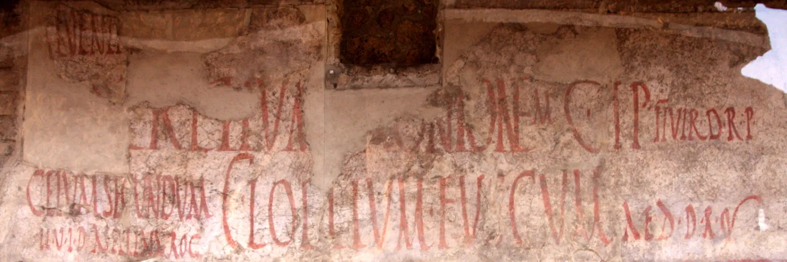
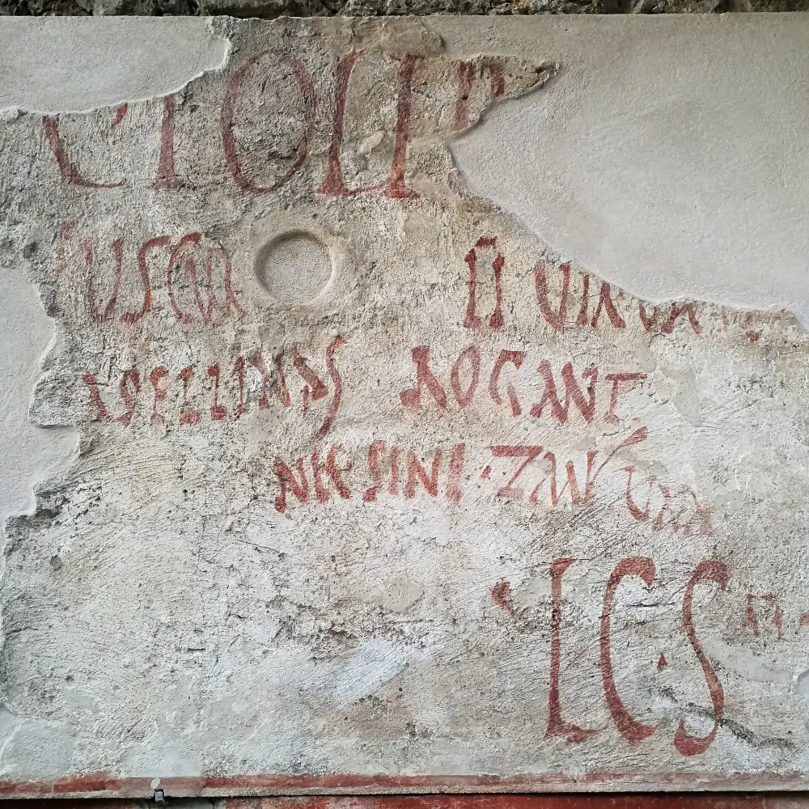

# Pompeii election notices

Ordinary political speech almost never survives from the ancient world. Pompeii is the exception. Every year the town elected its magistrates, and candidates campaigned on its walls: sign-writers painted notices in red letters asking passers-by to vote for a candidate, on behalf of his neighbours, his friends or a whole trade. When the next campaign began, the old notices were whitewashed and painted over. Then in AD 79 Vesuvius erupted and buried the town under several metres of ash, and the last campaign stayed on the walls, unchanged, until excavation began in 1748.

This demo ingests 127 of those notices, each a painted "vote for X" message, and asks SurrealDB Agent Memory questions that no single notice answers. Each notice names a candidate, the office, and whoever asks for the vote, which is often a trade acting as a body: the bakers, the fruitsellers, the muleteers. The answers below are shown as chat returned them, with every citation linked to the notice it points to and a note on how each answer was checked.



*Campaign notices on the Via dell'Abbondanza (CIL IV 7870-7874). At upper right, `C·I·P IIVIR·D·R·P` asks for Gaius Iulius Polybius as duumvir, "worthy of public office", and he is one of the candidates in this demo. Photo by [Amadalvarez](https://commons.wikimedia.org/wiki/File:Pompeia-ViaAbundancia-propagandaElectoral-5445.jpg), [CC BY 3.0](https://creativecommons.org/licenses/by/3.0/).*

## As you go through the answers, note the following

- **Every claim carries a citation.** Select a marker such as `S15` to read the notice it points to, Latin included. The notices were ingested as short prose, so the memory did the work of connecting the same candidate across notices.
- **The answers combine many notices.** "Who backs whom" draws on 33 notices, and "Joint tickets" finds candidates who stand together, which no notice states as a list.
- **Each answer was checked against the records.** The panel beside an answer says what was right, what was missed and what was wrong, counted against the full set of notices.
- **The last question is a control.** It asks about a candidate who is not in the corpus, and the answer declines rather than inventing a backer.

<DemoEmbed title="Pompeii election notices" height={720} pages={[{ "label": "Questions and answers", "src": "/docs/showcase/pompeii/answers.html" }]} />

## Reading a notice

A notice is painted in capitals and shortened as far as a reader of the time could follow. The candidate's name is in the accusative, because the notice asks the voters for him with *rogat* or *rogant* ("asks" or "ask"), and the office and any stock phrase are cut to their initials. Three notices from this corpus show the pattern:

| As painted | Expanded | In English |
| --- | --- | --- |
| C IVLIVM POLYBIVM IIVIR MVLIONES ROG | Caium Iulium Polybium duumvirum muliones rogant | The muleteers ask you to elect Gaius Iulius Polybius as duumvir |
| C CVSPIVM PANSAM AED D R P O V F SATVRNINVS CVM DISCENTES ROG | Caium Cuspium Pansam aedilem dignum rei publicae oro vos faciatis, Saturninus cum discentes rogat | Saturninus and his pupils ask you to elect Gaius Cuspius Pansa as aedile, worthy of public office |
| M HOLCONIVM PRISCVM IIVIR I D POMARI VNIVERSI CVM HELVIO VESTALE ROG | Marcum Holconium Priscum duumvirum iure dicundo pomarii universi cum Helvio Vestale rogant | All the fruitsellers, with Helvius Vestalis, ask you to elect Marcus Holconius Priscus as duumvir with judicial power |

A duumvir was one of the two chief magistrates of the town, and an aedile one of the two officials in charge of streets, markets and public buildings. Two of each were elected every year, and candidates often campaigned in pairs, which is why some notices name two.



*Outside Asellina's tavern, the women who worked there ask for Gaius Lollius Fuscus as one of the officials for roads, temples and public buildings (`IIVIR V A S P P`, the aediles' title at Pompeii): `Asellinas rogant nec sine Zmyrina`, "Asellina's women ask, and not without Zmyrina" (CIL IV 7863). This notice is not in the demo's corpus, which takes its notices from the first thousand numbers of CIL IV. Photo by [Marco Ebreo](https://commons.wikimedia.org/wiki/File:Propaganda_Pompei.jpg), [CC BY-SA 4.0](https://creativecommons.org/licenses/by-sa/4.0/).*

## What went in

The notices come from the *Corpus Inscriptionum Latinarum* (CIL IV), taking those that say outright who asks for the vote. Each was written as a short prose record with the Latin beside an English gloss, and with names put into one citation form, so that `Caium Iulium Polybium` and `Caius Iulius Polybius` read the same:

```text
A campaign notice painted on a street wall at Pompeii.

The muleteers ask the voters to elect Gaius Iulius Polybius as duumvir.

The Latin reads: caium iulium polybium iivirum muliones rogant.

CIL 04, 00113.
```

Nothing else was supplied: no list of candidates, no table of supporters, and no links between records.

## What came back

| Question | Result |
| --- | --- |
| Who backs whom | Every pair named is in a notice. 10 of the 14 groups that endorse as a body are named. |
| The fruitsellers | All 4 of their notices, with the right office for each. |
| Joint tickets | All 4 pairs that a notice promotes together. |
| An invented candidate | Declined, with no citations. |

The first answer shows the limit that matters most for this kind of corpus. A question about the whole corpus is answered from the records retrieval returns for it, here 33 of 127, so the four groups named only in the others are left out. [Set breadth to match the question](../../patterns/historical-and-archaeological-data.md#set-breadth-to-match-the-question) describes how to ask a question like that completely.

## From answers to a draft

Answers with citations are the material for a first draft of a paper or a report: each claim arrives with the record that supports it, so a reader can check it before it goes any further. [Reflection](https://surrealdb.com/docs/agent-memory/operations/reflect) writes that kind of synthesis across many records. Treat the result as a draft for someone who knows the period to check, not as a finding.

## Query the records yourself

The embed below loads what the Agent Memory API returned for this demo into a SurrealDB instance in your browser, as three tables: `entity`, `attribute` and `relation`. This is the API's response shape, not the data Agent Memory holds internally, which also includes embeddings, source chunks and indexes. Each attribute and relation names the document it was extracted from in `source`. Edit the query and run it again, or download the file from [datasets.surrealdb.com](https://datasets.surrealdb.com/datasets/agent-memory/pompeii.surql).

The graph holds less than the answers above. Chat also reads the text of the notices, so an answer can name a supporter the graph has no relation for: the bakers and the muleteers back Polybius in the answers, and have no entity in the graph. Extraction also used two labels for the same kind of relation, `asks_voters_to_elect` and `asks_to_elect`, so the query below asks for both.

[▶ Open in Surrealist](https://app.surrealdb.com/mini?query=--%20Everyone%20the%20graph%20records%20as%20backing%20Gaius%20Iulius%20Polybius%0ASELECT%20in.name%20AS%20supporter%2C%20label%2C%20source%20FROM%20relation%20WHERE%20out%20%3D%20entity%3A%5B%27person%27%2C%20%27caius_iulius_polybius%27%5D%20AND%20label%20IN%20%5B%27asks_voters_to_elect%27%2C%20%27asks_to_elect%27%5D%3B%0A)

## Related pages

- [Historical and archaeological data](../../patterns/historical-and-archaeological-data.md): the method behind this demo, from preparing records to proving an answer came from the corpus.
- [The Domesday Book, 1086](../domesday/index.md): the same approach on a land survey, where allegiance is implied rather than stated.
