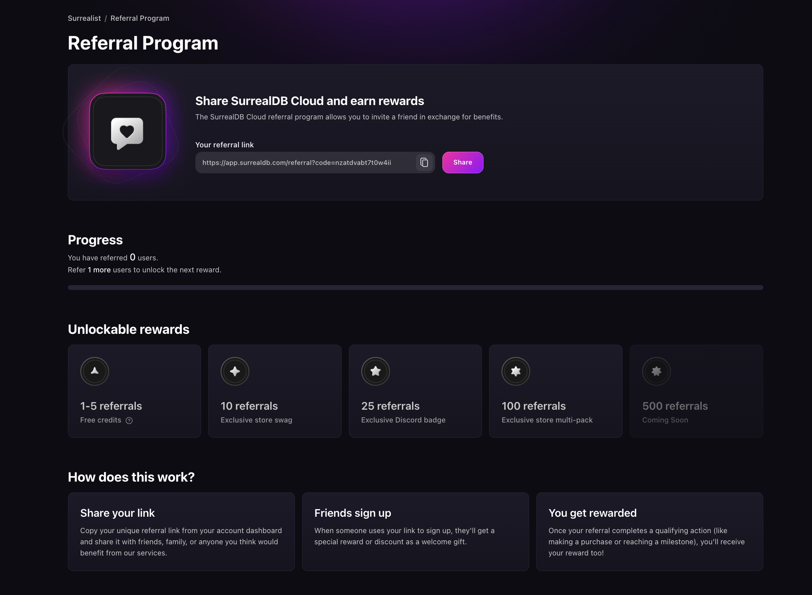

# Referrals

SurrealDB Cloud offers a referral program that allows you to earn rewards for referring new users to the platform.

## How it works

1. Refer a friend by sharing your personalised referral link. You can find your personalised referral link [in the referral section](https://app.surrealdb.com/referrals).
2. After your friend signs up, you will receive the rewards ranging from free credits to exclusive store multi-packs.

