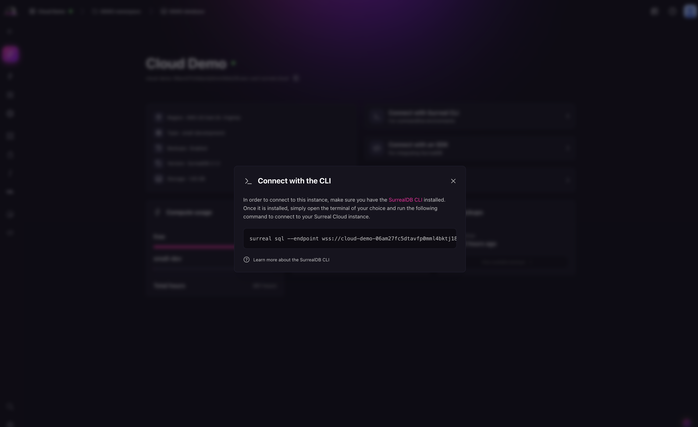

# Connect via CLI

Once you have created a SurrealDB Cloud Instance, you can connect to it via CLI. The SurrealDB CLI lets you interact with your SurrealDB Cloud Instance from the command line.

## Prerequisites

Before connecting to your SurrealDB Cloud Instance using the CLI, you need to install the [SurrealDB CLI](../../../../running/installation/index.md).

## Connect to your SurrealDB Cloud instance

Once it is installed, you can connect to your SurrealDB Cloud Instance using the [`surreal sql`](../../../../reference/cli/surrealdb-cli/commands/sql.md) command. This command connects to your SurrealDB Cloud Instance using the specified endpoint and token. 

```bash
surreal sql --endpoint <endpoint> --ns <namespace> --db <database> --token <token>
```



The `token` is a JSON Web Token (JWT) that is used to authenticate your connection to the SurrealDB Cloud Instance. You can find the token in the Instance details page in the SurrealDB Cloud console.

## Next steps

Learn more about the [SurrealDB CLI](../../../../reference/cli/surrealdb-cli/overview.md) in the SurrealDB documentation.
