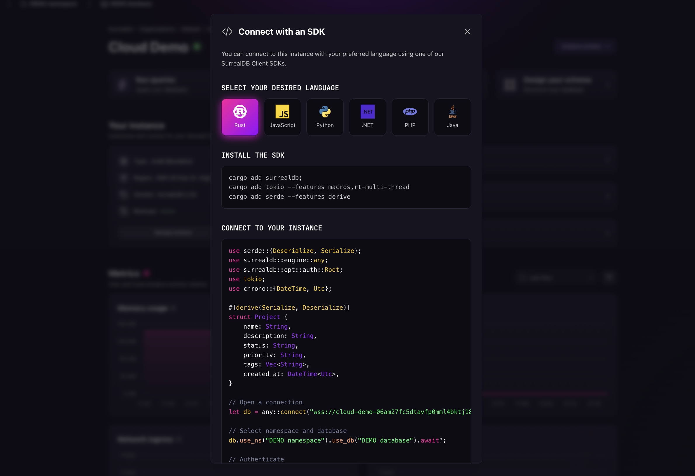
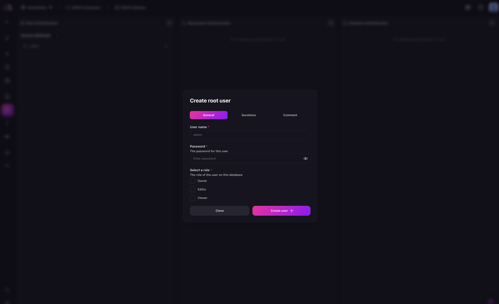

# Connect via SDK

Once you have created a SurrealDB Cloud Instance, you can connect to it using any of the [available SDKs](https://surrealdb.com/docs/start). This allows you to interact with your SurrealDB Cloud Instance programmatically.


 
After you have selected your SDK, you will need to provide your connection details which will populate the code snippet to your SurrealDB Cloud Instance.

## Enter connection details

When using any of the SurrealDB SDKs, before you can start querying your SurrealDB Cloud Instance, you will need to provide your connection details. SurrealDB requires **namespace** and **database** details so that it knows where to run and store your data. On the top of the dashboard, you can find the prompt to create a namespace and database.

Learn more about [namespaces and databases](../../../../concepts.md#system-structure) in the SurrealDB documentation.

### Create a root authentication

> [!NOTE]
> This step is only required if you are authenticating using the `signin` method on your initial connection. Learn more about [access methods](../../../../reference/query-language/statements/define/access/index.md) and [system Users](../../../../reference/query-language/statements/define/user.md) in the SurrealDB documentation.

First navigate to the Authentication panel of Surrealist. There, you can create a root user by clicking on the **+** button in the **Root Authentication** section. 

In the dialog that appears, select either:

- **new system user**: create a root user by entering a username, password, and selecting a role to define their access level to Instance resources and permissions
- **new access method**: create an access method by entering a name and selecting the type to define its access level to Instance resources and permissions

For both options, you can configure the Token duration and session duration.



After creating your root authentication, you will be able to authenticate with your SurrealDB Cloud Instance using any of the available SDKs.

If you want to create a Namespace and Database authentication for record-level access, you will need to first create a Namespace and Database. Learn more about [namespaces and databases](../../../../concepts.md#system-structure) in the SurrealDB documentation.

## Connect to your SurrealDB Cloud instance

After you have created your root authentication for root-level access, you can use the credentials to sign in to your SurrealDB Cloud Instance. 

The `connect` method takes your SurrealDB Cloud connection string as an argument to connect to your SurrealDB Cloud Instance. You can then fill in the **namespace** and **database** details to select the specific namespace and database you want to use. 

If you are using a system user option of the root authentication, you can also fill in the **username** and **password** details to sign in to your SurrealDB Cloud Instance.

> [!NOTE]
>If you are using a non-root user, depending on the access method you have created, you will need to fill in the `access` details to sign in to your SurrealDB Cloud Instance. Please refer to the [documentation for your specific SDK](https://surrealdb.com/docs/start) for more information.

Below are examples of how you can connect to your Instance using the SurrealDB SDK:

  
**Rust**

```rust
use serde::{Deserialize, Serialize};
use surrealdb::engine::any;
use surrealdb::opt::auth::Root;
use tokio;
use chrono::{DateTime, Utc};

#[derive(Serialize, Deserialize)]
struct Project {
	name: String,
	description: String,
	status: String,
	priority: String,
	tags: Vec<String>,
	created_at: DateTime<Utc>,
}

// Open a connection
let db = any::connect("wss://<INSTANCE_ENDPOINT>").await?;

// Select namespace and database
db.use_ns("DEMO namespace").use_db("DEMO database").await?;

// Authenticate
db.signin(Root {
	username: "",
	password: "",
}).await?;

// Create a record
let project = Project {
	name: "SurrealDB Dashboard".to_string(),
	description: "A modern admin interface for SurrealDB".to_string(),
	status: "in_progress".to_string(),
	priority: "high".to_string(),
	tags: vec!["typescript".to_string(), "react".to_string(), "database".to_string()],
	created_at: Utc::now(),
};

db.create("project").content(project).await?;
```

**JavaScript**

```js

const db = new Surreal();

// Open a connection and authenticate
await db.connect("wss://<INSTANCE_ENDPOINT", {
	namespace: "DEMO namespace",
	database: "DEMO database",
	auth: {
		username: "",
		password: "",
	}
});

// Create record
await db.create(new Table("project"), {
	name: "SurrealDB Dashboard",
	description: "A modern admin interface for SurrealDB",
	status: "in_progress",
	priority: "high",
	tags: ["typescript", "react", "database"],
	created_at: new Date(),
});

// Select all records in project table
console.log(await db.select(new Table("project")));

await db.close();
```

  
**Python**

```py

from surrealdb import Surreal, RecordID
from datetime import datetime

# Open a connection
with Surreal(url="wss://<INSTANCE_ENDPOINT") as db:

	# Select namespace and database
	await db.use("DEMO namespace", "DEMO database")

	# Authenticate
	await db.sign_in(username="", password="")

	# Create a record
	db.create(RecordID("project", "1"), {
		"name": "SurrealDB Dashboard",
		"description": "A modern admin interface for SurrealDB",
		"status": "in_progress",
		"priority": "high",
		"tags": ["typescript", "react", "database"],
		"created_at": datetime.utcnow(),
	})

	# Select a specific record
	print(db.select(RecordID("project", "1")))
```

**.NET**

```csharp

using SurrealDb.Net;
using SurrealDb.Net.Models;
using SurrealDb.Net.Models.Auth;
using System.Text.Json;

const string TABLE = "project";

using var db = new SurrealDbClient("wss://<INSTANCE_ENDPOINT/rpc");

// Select namespace and database
await db.Use("DEMO namespace", "DEMO database");

// Create record
var project = new Project
{
	Name = "SurrealDB Dashboard",
	Description = "A modern admin interface for SurrealDB",
	Status = "in_progress",
	Priority = "high",
	Tags = new[] { "typescript", "react", "database" },
	CreatedAt = DateTime.UtcNow,
};

await db.Create(TABLE, project);
// Run 
dotnet run
```

**PHP**

```php
$db = new \Surreal\Surreal();

// Open a connection
$db->connect("wss://<INSTANCE_ENDPOINT", [
	"namespace" => "DEMO namespace",
	"database" => "DEMO database",
]);

// Authenticate
$db->signin([
	"username" => "",
	"password" => "",
]);

// Create a record
$db->create("project", [
	"name" => "SurrealDB Dashboard",
	"description" => "A modern admin interface for SurrealDB",
	"status" => "in_progress",
	"priority" => "high",
	"tags" => ["typescript", "react", "database"],
	"created_at" => new DateTime(),
]);
```

</abs>

## Next steps

Learn more about the [SurrealDB SDKs](https://surrealdb.com/docs/start) in the SurrealDB documentation.
