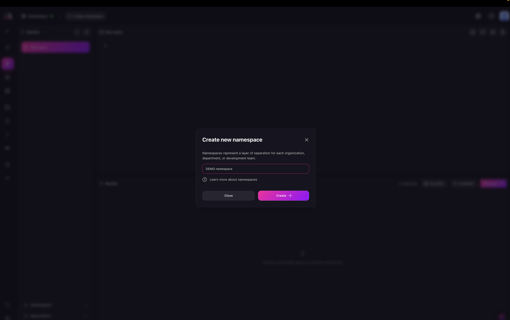
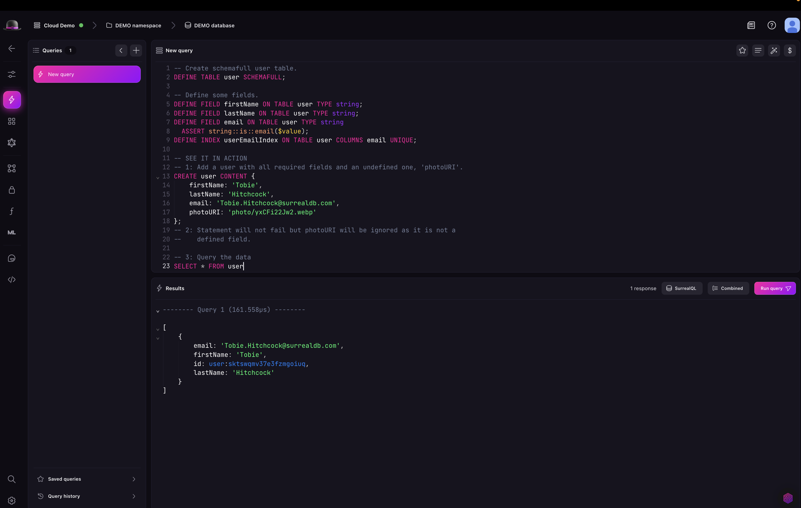

# Querying in SurrealDB Studio

Once you have created a SurrealDB Cloud Instance, you can start querying it in SurrealDB Studio in the [query view](../../../../explore/studio/index.md).

In the query view, and before you can run queries in SurrealDB Studio, you need to select a [Namespace](../../../../concepts.md) and a [Database](../../../../concepts.md) to work in.

First click on the **Namespace** button and select the namespace you want to work in (if you have not created a namespace, you will see an option to create one). Then click on the **Database** button and select the database you want to work in (if you have not created a namespace, you will see an option to create one).

Once you have selected a namespace and database, you can start running queries in SurrealDB Studio. You can run queries to create, read, update, and delete data in your SurrealDB Cloud Instance.

You can now see your queries and results in the SurrealDB Studio query view. You can also see the created records in the explore view.

## Next steps

Learn more about [SurrealDB Studio](../../../../explore/studio/index.md) and SurrealQL in the [SurrealDB documentation](../../../../reference/query-language/index.md).
