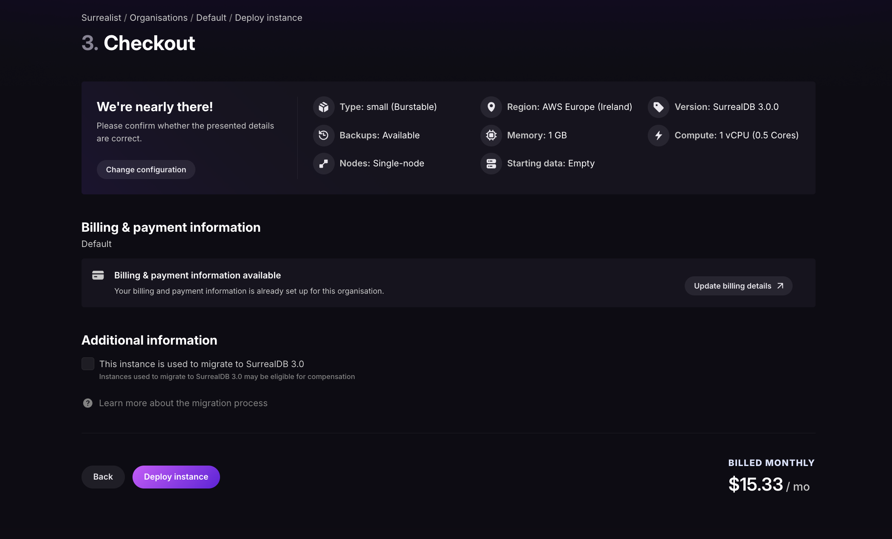

# Upgrading from `2.x` to `3.x` 

This guide consolidates all breaking changes when upgrading from SurrealDB `2.x` to `3.x`, organised by severity level. If you are using Surrealist, you can use the [migration diagnostics](../../../explore/surrealist/index.md) to automatically see your data. This will also provide you with a list of actions you need to take to migrate your data.

## Migration diagnostics in Surrealist

Surrealist provides a built-in migration diagnostics tool that can be used to automatically see your data and provide you with a list of actions you need to take to migrate your data.

>[!NOTE]
>The migration diagnostics tool is only available for SurrealDB version `2.6.1` and above.


Select your `2.x` database and click on the **Migration** option in the sidebar. This will open the migration diagnostics tool. First you'll need to start the checks by clicking on the **Start Checks** button. This will return a migration report with a list of actions you need to take to migrate your data (If any).


After resolving the issue, click on the **Mark as resolved** button to mark the issue as resolved. This will remove the issue from the migration report.

Once all issues have been resolved, the migration diagnostics tool will allow you to export a [V3 Compatible Export](https://surrealdb.com/docs/running/installation/upgrading/migrating-data-to-3x#using-the-v3-compatible-export) that can be imported into your updated SurrealDB `3.x` instance.

## V3 compatible export

Starting with SurrealDB `2.6.0`, you can export your database in a format that is compatible with version `3.x`. This export automatically performs several transformations to ensure your data and schema work correctly in version `3.x`.

The V3 Compatible Export automatically handles the following transformations:

1. Function name updates: All deprecated function names are automatically renamed to their new versions.

- `duration::from::*` → `duration::from_*`
- `string::is::*` → `string::is_*`
- `type::is::*` → `type::is_*`
- `time::is::*` → `time::is_*`
- `time::from::*` → `time::from_*`
- `rand::guid()` → `rand::id()`
- `type::thing` → `type::record`

>[!NOTE]
> See the [complete function mapping table](https://surrealdb.com/docs/running/installation/upgrading/migrating-data-to-3x#2-function-name-changes) below for the full list of function name updates.

2. `SEARCH ANALYZER` → `FULLTEXT ANALYZER`: Index definitions using `SEARCH ANALYZER` are automatically converted to `FULLTEXT ANALYZER`.
3. Parameter declarations: Automatically adds `LET` keyword where required for parameter declarations
4. `MTREE` → `HNSW` conversion: Vector search indexes using the deprecated `MTREE` type are automatically converted to use `HNSW`.
5. Future to COMPUTED field conversion: Where possible, `<future>` fields are automatically converted to `COMPUTED` fields.

## What requires manual migration

Some changes cannot be automatically converted and require manual intervention:

- Futures stored in records (using `DEFAULT <future>` or `CREATE ... SET field = <future>`)
- Nested fields with `<future>` values
- Queries using both GROUP and SPLIT clauses
- Code using removed operators (`~`, `!~`, `?~`, `*~`)
- Stored closures in records
- Record reference syntax
- `ANALYZE` statement usage

## Using V3 compatible export

After completing the migration diagnostics in Surrealist and resolving all flagged issues, you can export your database using the v3 compatible export feature. This will generate a `.surql` file that can be safely imported into SurrealDB `3.x`.

Next, in the Surrealist overview page, click on **Deploy instance** select the available plan and configure your instance (you can opt to upload a file to this instance with the v3 compatible export file). 

At checkout, you will be prompted to enter your payment details (if you don't have a payment method on file) and indicate that the instance is used to migrate to SurrealDB `3.0`. This will let us know to give you migration credits on your account. 



## Using the CLI

If you prefer to migrate using the command line rather than Surrealist, the SurrealDB `3.x` binary includes a `v2` subcommand that can connect to your `2.x` database and produce a v3-compatible export. This is necessary because the `3.x` binary cannot directly read `2.x` data, and the `2.x` binary does not support the v3-compatible export format.

>[!NOTE]
>The `v2` subcommand requires SurrealDB version `3.0.3` or later.

>[!IMPORTANT]
>Before exporting, ensure you have resolved any migration issues flagged by the [Surrealist migration diagnostics](#migration-diagnostics-in-surrealist). The v3-compatible export will handle automatic transformations (such as function renames and `SEARCH ANALYZER` → `FULLTEXT ANALYZER`), but issues that require manual intervention should be resolved first.

### Step 1: Export your v2 database

Use the `surreal v2 export` command with the `--v3` flag to export your `2.x` database in a format compatible with `3.x`:

```bash
surreal v2 export --v3 --namespace <namespace> --database <database> --token <token> v2_exported_for_v3.surql
```

The `--v3` flag ensures the export applies the same automatic transformations described in the [V3 compatible export](#v3-compatible-export) section above.

### Step 2: Import into your v3 instance

Once the export is complete, import the file into your `3.x` instance using the standard `surreal import` command:

```bash
surreal import --namespace <namespace> --database <database> --endpoint <endpoint> --token <token> v2_exported_for_v3.surql
```

For the full list of available options for each command, see the [export command](../../../reference/cli/surrealdb-cli/commands/export.md) and [import command](../../../reference/cli/surrealdb-cli/commands/import.md) documentation.

## Severity Levels

In this section, we will explore the different severity levels of the migration report and the actions you need to take to migrate your data. These severity levels are as follows:

- **Will break**: Almost guaranteed to change query semantics when porting to `3.x`.
- **Can break**: Some use cases will remain the same, but likely to cause issues.
- **Unlikely break**: Only affects edge cases or rare usage patterns.

## Will break - critical changes

### 1. Futures replaced with COMPUTED Fields

**Severity**: Will break

**What changed**: The `<future>` type has been completely removed and replaced with `COMPUTED` fields.

**Migration actions**:

1. Use the migration tool to automatically convert futures where possible.
2. Manually replace `VALUE <future> { expression }` with `COMPUTED expression`.
3. Restructure code for cases where automatic conversion isn't possible (nested fields, `DEFAULT` futures).

**Before (2.x)**:
```surql
DEFINE FIELD age ON person VALUE <future> { time::year(time::now()) - time::year(born) };
CREATE foo SET field = <future> { expression };
```

**After (3.x)**:
```surql
DEFINE FIELD age ON person COMPUTED time::year(time::now()) - time::year(born);
-- Futures stored in records cannot be converted - requires redesign
```

>[!NOTE]
>For futures stored in records (using `DEFAULT <future>` or `CREATE ... SET field = <future>`), there is no direct replacement in `3.x`. Fixing these cases will require re-architecting your schema, as storing arbitrary queries in record data is no longer supported.

**COMPUTED restrictions**:

- Can only be used in `DEFINE FIELD` statements
- No nested fields allowed inside or under `COMPUTED` fields
- Cannot be used on ID fields
- Cannot combine with: `VALUE`, `DEFAULT`, `READONLY`, `ASSERT`, `REFERENCE`, `FLEXIBLE`
- Only works on top-level fields, not nested fields

**Example - nested field workaround**:

```surql
-- 2.x version
DEFINE FIELD name.full ON person VALUE <future> { name.first + ' ' + name.last };

-- 3.x version - must rename to avoid nesting
DEFINE FIELD full_name ON person COMPUTED name.first + ' ' + name.last;
```

### 2. Function name changes

**Severity**: Will break

**Action**: Update all function names according to the mapping table below.

**Reason for Changes**:
- `::is::` and `::from::` → `::is_` and `::from_` (matches method syntax)
- `thing` → `record` (consistent terminology)
- `rand::guid()` → `rand::id()` (default record ID format)
- `string::distance::osa_distance` → `string::distance::osa` (remove redundancy)

**Complete mapping table**:

<table>
    <thead>
        <tr>
            <th scope="col">New Function Name</th>
            <th scope="col">Previous name</th>
        </tr>
    </thead>
    <tbody>
        <tr>
            <td scope="row" data-label="New function name">`duration::from_days`</td>
            <td scope="row" data-label="Previous name">`duration::from::days`</td>
        </tr>
        <tr>
            <td scope="row" data-label="New function name">`duration::from_hours`</td>
            <td scope="row" data-label="Previous name">`duration::from::hours`</td>
        </tr>
        <tr>
            <td scope="row" data-label="New function name">`duration::from_micros`</td>
            <td scope="row" data-label="Previous name">`duration::from::micros`</td>
        </tr>
        <tr>
            <td scope="row" data-label="New function name">`duration::from_millis`</td>
            <td scope="row" data-label="Previous name">`duration::from::millis`</td>
        </tr>
        <tr>
            <td scope="row" data-label="New function name">`duration::from_mins`</td>
            <td scope="row" data-label="Previous name">`duration::from::mins`</td>
        </tr>
        <tr>
            <td scope="row" data-label="New function name">`duration::from_nanos`</td>
            <td scope="row" data-label="Previous name">`duration::from::nanos`</td>
        </tr>
        <tr>
            <td scope="row" data-label="New function name">`duration::from_secs`</td>
            <td scope="row" data-label="Previous name">`duration::from::secs`</td>
        </tr>
        <tr>
            <td scope="row" data-label="New function name">`duration::from_weeks`</td>
            <td scope="row" data-label="Previous name">`duration::from::weeks`</td>
        </tr>
        <tr>
            <td scope="row" data-label="New function name">`geo::is_valid`</td>
            <td scope="row" data-label="Previous name">`geo::is::valid`</td>
        </tr>
        <tr>
            <td scope="row" data-label="New function name">`string::distance::osa`</td>
            <td scope="row" data-label="Previous name">`string::distance::osa_distance`</td>
        </tr>
        <tr>
            <td scope="row" data-label="New function name">`string::is_alphanum`</td>
            <td scope="row" data-label="Previous name">`string::is::alphanum`</td>
        </tr>
        <tr>
            <td scope="row" data-label="New function name">`string::is_alpha`</td>
            <td scope="row" data-label="Previous name">`string::is::alpha`</td>
        </tr>
        <tr>
            <td scope="row" data-label="New function name">`string::is_ascii`</td>
            <td scope="row" data-label="Previous name">`string::is::ascii`</td>
        </tr>
        <tr>
            <td scope="row" data-label="New function name">`string::is_datetime`</td>
            <td scope="row" data-label="Previous name">`string::is::datetime`</td>
        </tr>
        <tr>
            <td scope="row" data-label="New function name">`string::is_domain`</td>
            <td scope="row" data-label="Previous name">`string::is::domain`</td>
        </tr>
        <tr>
            <td scope="row" data-label="New function name">`string::is_email`</td>
            <td scope="row" data-label="Previous name">`string::is::email`</td>
        </tr>
        <tr>
            <td scope="row" data-label="New function name">`string::is_hexadecimal`</td>
            <td scope="row" data-label="Previous name">`string::is::hexadecimal`</td>
        </tr>
        <tr>
            <td scope="row" data-label="New function name">`string::is_ip`</td>
            <td scope="row" data-label="Previous name">`string::is::ip`</td>
        </tr>
        <tr>
            <td scope="row" data-label="New function name">`string::is_ipv4`</td>
            <td scope="row" data-label="Previous name">`string::is::ipv4`</td>
        </tr>
        <tr>
            <td scope="row" data-label="New function name">`string::is_ipv6`</td>
            <td scope="row" data-label="Previous name">`string::is::ipv6`</td>
        </tr>
        <tr>
            <td scope="row" data-label="New function name">`string::is_latitude`</td>
            <td scope="row" data-label="Previous name">`string::is::latitude`</td>
        </tr>
        <tr>
            <td scope="row" data-label="New function name">`string::is_longitude`</td>
            <td scope="row" data-label="Previous name">`string::is::longitude`</td>
        </tr>
        <tr>
            <td scope="row" data-label="New function name">`string::is_numeric`</td>
            <td scope="row" data-label="Previous name">`string::is::numeric`</td>
        </tr>
        <tr>
            <td scope="row" data-label="New function name">`string::is_record`</td>
            <td scope="row" data-label="Previous name">`string::is::record`</td>
        </tr>
        <tr>
            <td scope="row" data-label="New function name">`string::is_semver`</td>
            <td scope="row" data-label="Previous name">`string::is::semver`</td>
        </tr>
        <tr>
            <td scope="row" data-label="New function name">`string::is_url`</td>
            <td scope="row" data-label="Previous name">`string::is::url`</td>
        </tr>
        <tr>
            <td scope="row" data-label="New function name">`string::is_ulid`</td>
            <td scope="row" data-label="Previous name">`string::is::ulid`</td>
        </tr>
        <tr>
            <td scope="row" data-label="New function name">`string::is_uuid`</td>
            <td scope="row" data-label="Previous name">`string::is::uuid`</td>
        </tr>
        <tr>
            <td scope="row" data-label="New function name">`time::is_leap_year`</td>
            <td scope="row" data-label="Previous name">`time::is::leap_year`</td>
        </tr>
        <tr>
            <td scope="row" data-label="New function name">`time::from_nanos`</td>
            <td scope="row" data-label="Previous name">`time::from::nanos`</td>
        </tr>
        <tr>
            <td scope="row" data-label="New function name">`time::from_micros`</td>
            <td scope="row" data-label="Previous name">`time::from::micros`</td>
        </tr>
        <tr>
            <td scope="row" data-label="New function name">`time::from_millis`</td>
            <td scope="row" data-label="Previous name">`time::from::millis`</td>
        </tr>
        <tr>
            <td scope="row" data-label="New function name">`time::from_secs`</td>
            <td scope="row" data-label="Previous name">`time::from::secs`</td>
        </tr>
        <tr>
            <td scope="row" data-label="New function name">`time::from_ulid`</td>
            <td scope="row" data-label="Previous name">`time::from::ulid`</td>
        </tr>
        <tr>
            <td scope="row" data-label="New function name">`time::from_unix`</td>
            <td scope="row" data-label="Previous name">`time::from::unix`</td>
        </tr>
        <tr>
            <td scope="row" data-label="New function name">`time::from_uuid`</td>
            <td scope="row" data-label="Previous name">`time::from::uuid`</td>
        </tr>
        <tr>
            <td scope="row" data-label="New function name">`type::is_array`</td>
            <td scope="row" data-label="Previous name">`type::is::array`</td>
        </tr>
        <tr>
            <td scope="row" data-label="New function name">`type::is_bool`</td>
            <td scope="row" data-label="Previous name">`type::is::bool`</td>
        </tr>
        <tr>
            <td scope="row" data-label="New function name">`type::is_bytes`</td>
            <td scope="row" data-label="Previous name">`type::is::bytes`</td>
        </tr>
        <tr>
            <td scope="row" data-label="New function name">`type::is_collection`</td>
            <td scope="row" data-label="Previous name">`type::is::collection`</td>
        </tr>
        <tr>
            <td scope="row" data-label="New function name">`type::is_datetime`</td>
            <td scope="row" data-label="Previous name">`type::is::datetime`</td>
        </tr>
        <tr>
            <td scope="row" data-label="New function name">`type::is_decimal`</td>
            <td scope="row" data-label="Previous name">`type::is::decimal`</td>
        </tr>
        <tr>
            <td scope="row" data-label="New function name">`type::is_duration`</td>
            <td scope="row" data-label="Previous name">`type::is::duration`</td>
        </tr>
        <tr>
            <td scope="row" data-label="New function name">`type::is_float`</td>
            <td scope="row" data-label="Previous name">`type::is::float`</td>
        </tr>
        <tr>
            <td scope="row" data-label="New function name">`type::is_geometry`</td>
            <td scope="row" data-label="Previous name">`type::is::geometry`</td>
        </tr>
        <tr>
            <td scope="row" data-label="New function name">`type::is_int`</td>
            <td scope="row" data-label="Previous name">`type::is::int`</td>
        </tr>
        <tr>
            <td scope="row" data-label="New function name">`type::is_line`</td>
            <td scope="row" data-label="Previous name">`type::is::line`</td>
        </tr>
        <tr>
            <td scope="row" data-label="New function name">`type::is_none`</td>
            <td scope="row" data-label="Previous name">`type::is::none`</td>
        </tr>
        <tr>
            <td scope="row" data-label="New function name">`type::is_null`</td>
            <td scope="row" data-label="Previous name">`type::is::null`</td>
        </tr>
        <tr>
            <td scope="row" data-label="New function name">`type::is_multiline`</td>
            <td scope="row" data-label="Previous name">`type::is::multiline`</td>
        </tr>
        <tr>
            <td scope="row" data-label="New function name">`type::is_multipoint`</td>
            <td scope="row" data-label="Previous name">`type::is::multipoint`</td>
        </tr>
        <tr>
            <td scope="row" data-label="New function name">`type::is_multipolygon`</td>
            <td scope="row" data-label="Previous name">`type::is::multipolygon`</td>
        </tr>
        <tr>
            <td scope="row" data-label="New function name">`type::is_number`</td>
            <td scope="row" data-label="Previous name">`type::is::number`</td>
        </tr>
        <tr>
            <td scope="row" data-label="New function name">`type::is_object`</td>
            <td scope="row" data-label="Previous name">`type::is::object`</td>
        </tr>
        <tr>
            <td scope="row" data-label="New function name">`type::is_point`</td>
            <td scope="row" data-label="Previous name">`type::is::point`</td>
        </tr>
        <tr>
            <td scope="row" data-label="New function name">`type::is_polygon`</td>
            <td scope="row" data-label="Previous name">`type::is::polygon`</td>
        </tr>
        <tr>
            <td scope="row" data-label="New function name">`type::is_range`</td>
            <td scope="row" data-label="Previous name">`type::is::range`</td>
        </tr>
        <tr>
            <td scope="row" data-label="New function name">`type::is_record`</td>
            <td scope="row" data-label="Previous name">`type::is::record`</td>
        </tr>
        <tr>
            <td scope="row" data-label="New function name">`type::is_string`</td>
            <td scope="row" data-label="Previous name">`type::is::string`</td>
        </tr>
        <tr>
            <td scope="row" data-label="New function name">`type::is_uuid`</td>
            <td scope="row" data-label="Previous name">`type::is::uuid`</td>
        </tr>
        <tr>
            <td scope="row" data-label="New function name">`type::record`</td>
            <td scope="row" data-label="Previous name">`type::thing`</td>
        </tr>
    </tbody>
</table>

Learn more about the database functions in the [SurrealQL functions](../../../reference/query-language/functions/database-functions/index.md) documentation.

### 3. `array::range` argument changes

**Severity**: Will break

**What changed**: Arguments changed from `(offset, count)` to `(start, end)` or accepting a range.

**Action**: Change all `array::range` calls to use start/end bounds instead of offset/count.

**Before (2.x)**:
```surql
array::range(0, 5)   // returns [0,1,2,3,4]
array::range(-1, 5)  // returns [-1,0,1,2,3]
array::range(-5, 5)  // returns [-5,-4,-3,-2,-1]
```

**After (3.x)**:
```surql
array::range(0, 5)   // returns [0,1,2,3,4]
array::range(-1, 5)  // returns [-1,0,1,2,3,4]  ← different!
array::range(-5, 5)  // returns [-5,-4,-3,-2,-1,0,1,2,3,4]  ← different!
array::range(0..=1)  // returns [0,1]
```

**Migration formula**: 
- Old: `array::range(offset, count)`
- New: `array::range(offset, offset + count)`

### 4. `LET` required for parameters

**Severity**: Will break

**What changed**: Parameter declarations now require `LET` keyword.

**Action**: Add `LET` before all parameter declarations.

**Before (2.x)**:
```surql
$val = 10;  // This was allowed
```

**After (3.x)**:
```surql
LET $val = 10;  // LET is now required
```

**Error Message**:
```
Parse error: Parameter declarations without `let` are deprecated.
Replace with `let $val = ...` to keep the previous behavior.
```

### 5. `GROUP` and `SPLIT` cannot be used together

**Severity**: Will break

**What changed**: Using both `GROUP` and `SPLIT` in the same query is no longer allowed.

**Action**: Remove `SPLIT` from any query which also had a `GROUP` clause, as its inclusion had no effect in 2.x. If the use of both a `SPLIT` and a `GROUP` is required, put one of the two clauses into a subquery.

**Before (2.x)**:
```surql
SELECT age, emails FROM user SPLIT emails GROUP BY age; // SPLIT had no effect.
```

**After (3.x) - Option 1 (split then group)**:
```surql
SELECT age, emails FROM (SELECT * FROM user SPLIT emails) GROUP BY age;
```

**After (3.x) - Option 2 (group then split)**:
```surql
SELECT * FROM (SELECT age, emails FROM user GROUP BY age, emails) SPLIT emails;
```

### 6. Like operators removed

**Severity**: Will break

**What changed**: The `~`, `!~`, `?~`, `*~` operators have been removed.

**Action**: Replace with `string::distance` or `string::similarity` functions.

**Reason**: Multiple similarity algorithms now available; users should choose their own cutoff point.

**Before (2.x)**:
```surql
"Mario" ~ "mario";  // returns true
```

**After (3.x)**:
```surql
string::similarity::jaro("Mario", "mario") > 0.8;  // returns true

-- Create reusable function
DEFINE FUNCTION fn::similar($one: string, $two: string) -> bool {
    string::similarity::jaro($one, $two) > 0.8
};

fn::similar("Mario", "mario");  // returns true
```

**Available Functions**:
- `string::similarity::jaro()`
- `string::distance::osa()`
- And other similarity/distance functions

### 7. SEARCH ANALYZER → FULLTEXT ANALYZER

**Severity**: Will break

**Action**: Replace all instances of `SEARCH ANALYZER` with `FULLTEXT ANALYZER`.

**Before (2.x)**:
```surql
DEFINE INDEX userNameIndex ON TABLE user 
COLUMNS name SEARCH ANALYZER example_ascii BM25 HIGHLIGHTS;
```

**After (3.x)**:
```surql
DEFINE INDEX userNameIndex ON TABLE user 
COLUMNS name FULLTEXT ANALYZER example_ascii BM25 HIGHLIGHTS;
```

### 8. Database-Level strictness

**Severity**: Will break (if using `--strict` flag)

**What changed**: Strictness moved from instance-level flag to database-level definition.

**Action**: Add `STRICT` to `DEFINE DATABASE` statements for databases that need strictness.

**Before (2.x)**:
```bash
surreal start --strict
```

**After (3.x)**:
```surql
DEFINE DATABASE mydb STRICT;
```

**Impact**: Allows different databases on the same instance to have different strictness levels.

### 9. MTREE removal

**Severity**: Will break

**What changed**: `MTREE` vector search index was deprecated in 2.x and has been removed.

**Action**: Use `HNSW` instead of `MTREE` in index definitions.

**Before (2.x)**:
```surql
DEFINE INDEX vec_idx ON table FIELDS embedding MTREE DIMENSION 768;
```

**After (3.x)**:
```surql
DEFINE INDEX vec_idx ON table FIELDS embedding HNSW DIMENSION 768;
```

### 10. Stored closures

**Severity**: Will break

**What changed**: Closures can no longer be stored as part of a record.

**Action**: Use of closures stored inside a record will have to be removed, there is currently no new feature which can replace the stored closures.

**Before (2.x)**:
```surql
CREATE record SET closure = |$a| $a + 1
```

**After (3.x)**:
```surql
# This will now throw an error
CREATE record SET closure = |$a| $a + 1
```

### 11. Usage of record references

**Severity**: Will break

**What changed**: Record references were an experimental feature in 2.x and in 3.x the syntax of record references has been significantly altered.

**Action**: Record references in 2.x will have to be updated manually to 3.x syntax.

### 12. Usage of `ANALYZE` statement

**Severity**: Will break

**What changed**: The `ANALYZE` statement which could provide some statistics about full text indexes has been removed.

**Action**: Use the `ANALYZE` stastement will have to be removed.

## Can break - likely issues

### 13. All `.*` idiom behavior

**Severity**: Can break

**What changed**: The `.*` (`all` idiom) behavior changed for arrays and objects.

**Breaks when**: Used to dereference record IDs in arrays or get object values.

**Before (2.x)**:
```surql
[a:1, a:2].*       // returns [a:1, a:2]
[a:1, a:2].*.*     // dereferences records
{ a: 1, b: "foo" }.* // returns [1, "foo"]
```

**After (3.x)**:
```surql
[a:1, a:2].*       // dereferences records directly
{ a: 1, b: "foo" }.* // returns { a: 1, b: "foo" }
```

**Migration**:
- For arrays: Replace `.*.*` with `.*`
- For objects: Replace `.*` with `object::values()` function

### 14. Field idiom followed by another idiom part

**Severity**: Can break

**What changed**: Field idioms on arrays now work on individual elements instead of the whole array.

**Breaks when**: Field idiom on array of objects is followed by another idiom part.

**Before (2.x)**:
```surql
[{ a: ["a","b"]}, {a: [1,2]}].a[0]
// returns ["a","b"]
// Evaluated as: ([...].a)[0]
```

**After (3.x)**:
```surql
[{ a: ["a","b"]}, {a: [1,2]}].a[0]
// returns ["a",1]
// Evaluated on each element: [(...).a[0], (...).a[0]]
```

**Migration**: Swap idiom parts if old behavior needed.
- Old: `.field[0]`
- New: `[0].field`

### 15. Idiom fetching changes

**Severity**: Can break

**What changed**: Multiple improvements to idiom fetching behavior.

**Quick Reference Table**:

| Example | 2.x Output | 3.x Output |
|---------|------------|------------|
| `[1, a:1].*` | `[1, a:1]` | `[1, { id: a:1 }]` |
| `[1, a:1].*.*` | `[NONE, { id: a:1 }]` | `[NONE, { id: a:1 }]` |
| `a:1.*` | `{ id: a:1 }` | `{ id: a:1 }` |
| `{ key: 123 }.*` | `[123]` | `{ key: 123 }` |
| `a:1<-edge[0]` | `{ id: edge:1 }` | `edge:1` |
| `[{ n: 1 }, { n: 2 }].n[0]` | `1` | `[NONE, NONE]` |

**Action**: Review queries using these idioms and rewrite if necessary.

### 16. Optional parts syntax change

**Severity**: Can break

**What changed**: Optional operator changed from `?` to `.?`

**Action**: Replace `?` with `.?` after optional values.

**Before (2.x)**:
```surql
["string", NONE].map(|$val| $val?.len());
```

**After (3.x)**:
```surql
["string", NONE].map(|$val| $val.?.len());
```

**Reason**: Distinguishes between `??` operator and optional chaining on `option<option<value>>`.

### 17. Parsing changes

**Severity**: Can break

**Record ID parsing**:
```surql
-- 2.x
r"a:b[r"c:d"]"  // unescaped " was allowed

-- 3.x
r"a:b[r\"c:d\"]"  // must escape "
```

**Unicode parsing**:
```surql
-- 2.x
"\uD83D\uDF15"  // surrogate pairs

-- 3.x
"\u{1F715}"  // single escape sequence
```

**Identifier escaping**: Escaped identifiers now support escape sequences like `\n`, `\u{AB1234}`.

### 18. New `set` type behaviour

**Severity**: Can break

**What changed**: Set type now both deduplicates AND orders items, displays with `{}` instead of `[]`.

**Before (2.x)**:
```surql
<set>[2,3,1,1];  // returns [2, 3, 1]
```

**After (3.x)**:
```surql
<set>[2,3,1,1];  // returns {1, 2, 3}
```

**Migration Options**:
1. Use new set type (recommended)
2. Maintain old behavior: Define as `array` adding `VALUE $value.distinct()` to `DEFINE FIELD` definition

### 19. Schema strictness changes

**Severity**: Can break

**Non-existing tables**:
```surql
-- 3.x returns errors instead of empty arrays
SELECT * FROM doesnt_exist;
-- Error: "The table 'doesnt_exist' does not exist"
```

**SCHEMAFULL Tables**:
```surql
DEFINE TABLE user SCHEMAFULL;
DEFINE FIELD name ON user TYPE string;

-- 2.x: extra fields silently filtered
-- 3.x: extra fields cause error
CREATE user CONTENT { name: "Billy", other: "value" };
-- Error: "Found field 'other', but no such field exists"

-- Use destructuring to select only defined fields
CREATE user CONTENT { name: "Billy", other: "value" }.{ name };
```

### 20. Numeric record ID ordering

**Severity**: Can break

**What changed**: Numeric values in record now have different ordering and equality when used in keys. Previously, `a:[1]`, `a:[1f]` and `a:[1dec]` were all different record IDs and could have different records.

Numeric values in record IDs are now ordered by their numeric value, meaning the `a:[1]`, `a:[1f]` and `a:[1dec]` are the same key. Furthermore, `a:[0f]` is now ordered before `a:[1]`.

**Breaks when**: Code depends on different numeric types resulting in different record IDs.

**Before (2.x)**:
```surql
CREATE t:[1];
CREATE t:[1f];
SELECT * FROM t; // returns `[{ id: [1] }, { id: [1f] }]`
```

**After (3.x)**:
```surql
CREATE t:[1];
CREATE t:[1f]; // returns an error, record with key `t:[1]` alread exisits.
SELECT * FROM t; // returns `[{ id: [1] }]`
```

## Unlikely break - edge cases

### 21. `math::sqrt` returns NaN

**Severity**: Unlikely break

**What changed**: Returns `NaN` instead of `NONE` for negative numbers.

**Action**: Change checks from `NONE` to `NaN`.

```surql
-- 2.x
math::sqrt(-1);  // returns NONE

-- 3.x
math::sqrt(-1);  // returns NaN
```

### 22. `math::min` returns `Infinity`

**Severity**: Unlikely break

**What changed**: Returns `Infinity` instead of `NONE` for empty arrays.

**Action**: Change checks from `NONE` to `Infinity`.

```surql
-- 2.x
math::min([]);  // returns NONE

-- 3.x
math::min([]);  // returns Infinity
```

### 23. `math::max` returns `-Infinity`

**Severity**: Unlikely break

**What changed**: Returns `-Infinity` instead of `NONE` for empty arrays.

**Action**: Change checks from `NONE` to `-Infinity`.

```surql
-- 2.x
math::max([]);  // returns NONE

-- 3.x
math::max([]);  // returns -Infinity
```

### 24. `array::logical_and` Behavior

**Severity**: Unlikely break

**What changed**: Function is now consistent with `&&` operator.

**Breaks when**: Relying on specific values rather than truthiness.

**Before (2.x)**:
```surql
array::logical_and(["a"],[true]);  // returns ["a"]
array::logical_and([""],[false]);  // returns [""]
array::logical_and([true],[]);     // returns [NULL]
```

**After (3.x)**:
```surql
array::logical_and(["a"],[true]);  // returns [true]
array::logical_and([""],[false]);  // returns [""]
array::logical_and([true],[]);     // returns [NONE]
```

**Action**: Update if relying on specific return values; no change needed if only checking truthiness.

### 25. `array::logical_or` behavior

**Severity**: Unlikely break

**What changed**: Function now consistent with `||` operator.

**Breaks when**: Relying on specific values rather than truthiness.

**Before (2.x)**:
```surql
array::logical_or(["a"],[true]);  // returns ["a"]
array::logical_or([""],[false]);  // returns [""]
array::logical_or([],[false]);    // returns [NULL]
```

**After (3.x)**:
```surql
array::logical_or(["a"],[true]);  // returns ["a"]
array::logical_or([""],[false]);  // returns [false]
array::logical_or([false],[]);    // returns [NONE]
```

**Action**: Update if relying on specific return values; no change needed if only checking truthiness.

### 26. Mock value type changes

**Severity**: Unlikely break

**What changed**: Mocks now return arrays instead of special mock type.

**Breaks when**: Code depends on the specific mock type being returned.

**Before (2.x)**:
```surql
|a:1..2|;  // returns |a:1..2| (mock type)
type::is_array(|a:1..2|);  // returns false
```

**After (3.x)**:
```surql
|a:1..=2|;  // returns [a:1, a:2] (array)
type::is_array(|a:1..=2|);  // returns true
```

>[!NOTE]
>Mock ranges are no longer inclusive by default - use `..=` for inclusive ranges.

### 27. `Id` field special behavior.

**Severity**: Unlikely break

**What changed**: Special behavior regarding `.id` idioms is removed. 

Before 3.0, `.id` idioms followed by another idiom expression would return the record-id key. After 3.0, the `.id` behaves like any other `.field` idiom.

**Breaks when**: Code depends the special behavior of that `.id` idioms had.

**Before (2.x)**:
```surql
record:{ key_field: "value" }.id.key_field // returns "value"
```

**After (3.x)**:
```surql
record:{ key_field: "value" }.id.key_field // returns whatever value is at .id.key_field in the record with key `record:{ key_field: "value" }`
record:{ key_field: "value" }.id().key_field // returns "value" 
```

### 28. Expressions now allowed inside queries

Many statements had parts changed to support general expressions in those places. This means that identifiers which overlap with statements are no longer supported in those places without escaping. For example, syntax like the following was previously allowed:

```surql
DEFINE INDEX select ...
```
    
This must now be written with backticks, or renamed.

```surql
DEFINE INDEX `select` ...
```

The statements which had this change from an identifier to allowing a general expressions are the following:

- The `ident` after `DEFINE TABLE ident ...`
- The `ident` after `DEFINE NAMESPACE ident ...`
- The `ident` after `DEFINE DATABASE ident ...`
- The `ident` after `DEFINE USER ident ...`
- The `ident` after `DEFINE ACCESS ident ...`
- Both `ident` and `table` after `DEFINE EVENT ident ON table ...`
- Both `ident` and `table` after `DEFINE FIELD ident ON table ...`
- The `ident` after `DEFINE ANALYZER ident ...`
- The `ident` after `DEFINE BUCKET ident ...`
- The `ident` after `DEFINE SEQUENCE ident ...`
- The `ident` after `INFO FOR TABLE ident ...`
- The `ident` after `INFO FOR USER ident ...`
- Both `ident` and `table` after `INFO FOR INDEX ident ON table ...`
- The `ident` after `REMOVE TABLE ident ...`
- The `ident` after `REMOVE NAMESPACE ident ...`
- The `ident` after `REMOVE DATABASE ident ...`
- The `ident` after `REMOVE USER ident ...`
- The `ident` after `REMOVE ACCESS ident ...`
- Both `ident` and `table` after `REMOVE EVENT ident ON table ...`
- Both `ident` and `table` after `REMOVE FIELD ident ON table ...`
- Both `ident` and `table` after `REMOVE INDEX ident ON table ...`
- The `ident` after `REMOVE ANALYZER ident ...`
- The `ident` after `REMOVE BUCKET ident ...`
- The `ident` after `REMOVE SEQUENCE ident ...`

### 29. `DEFINE FIELD` number of items for arrays and sets

A `DEFINE FIELD` statement for arrays and sets in SurrealDB 2.x allowed a maximum number of items to be indicated. This number now refers to the *required* number of items.

As such, a schema with an `ASSERT $value().len()` is equal to a certain number can now have the required number in the type definition itself. Additionally, definitions that indicate a maximum number of items must be changed to `ASSERT $value.len() <=` followed by the maximum number.

```surql
-- Assert exact length of 640 bytes in SurrealDB 2.x
DEFINE FIELD bytes ON data TYPE array<int> ASSERT $value.all(|$val| $val IN 0..=255) AND $value.len() = 640;

-- Assert the same in SurrealDB 3.x
DEFINE FIELD bytes ON data TYPE array<int, 640> ASSERT $value.all(|$val| $val IN 0..=255);

-- Assert a maximum array size in SurrealDB 3.x
DEFINE FIELD latest ON observation TYPE array<object> ASSERT $value.len() <= 1000;
```
