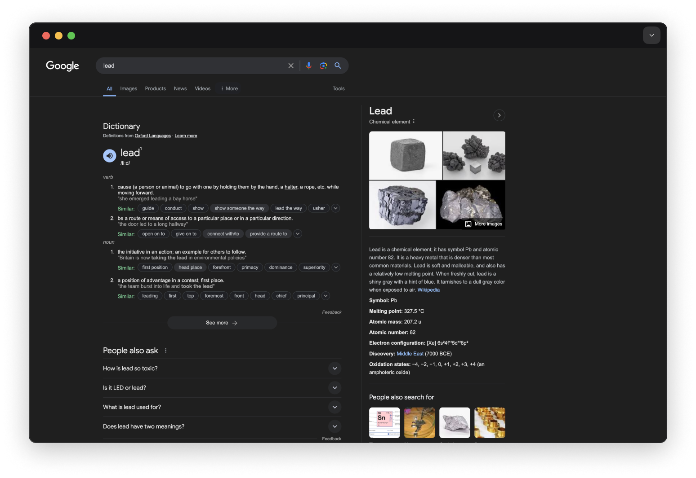

# Hybrid search

Full-text search and vector search find different things, and the two together usually rank better than either alone. This page compares them on one dataset, then fuses their rankings with `search::rrf` and related helpers.

## Vector search vs full-text search

SurrealDB supports [full-text search](../full-text-search/overview.md) and Vector Search. Full-text search (FTS) involves indexing documents using an [FTS index](../../../reference/query-language/statements/define/indexes.md#full-text-search-fulltext-index) that makes use of an [analyzer](../../../reference/query-language/statements/define/analyzer.md) that breaks down text using [tokenizers](../../../reference/query-language/statements/define/analyzer.md#tokenizers) and [filters](../../../reference/query-language/statements/define/analyzer.md#filters).



The image above is a Google search for the word “lead”, a word with more than one definition (and pronunciation!). Lead can mean 'taking initiative', as well as the chemical element with the symbol 'Pb'.

Consider this in the context of a database of liquid samples which note down harmful chemicals that are found in them.

In the example below, we have a table called `liquids` with a `sample` field and a `content` field. Next, we can define a [full-text index](../../../reference/query-language/statements/define/indexes.md#full-text-search-fulltext-index) on the `content` field by first defining an analyzer called `liquid_analyzer`. We can then [define an index](../../../reference/query-language/statements/define/indexes.md) on the content field in the liquid table and set our [custom analyzer](../../../reference/query-language/statements/define/analyzer.md) (`liquid_analyzer`) to search through the index.

Then, using the select statement to retrieve all the samples containing the chemical lead will also bring up samples that mention the word `lead`.

[▶ Open in Surrealist](https://app.surrealdb.com/mini?query=--%20Insert%20a%20sample%20%26%20content%20field%20into%20a%20liquids%20table%0AINSERT%20INTO%20liquids%20%5B%0A%20%20%20%20%7Bsample%3A%27Sea%20water%27%2C%20content%3A%20%27The%20sea%20water%20contains%20some%20amount%20of%20lead%27%7D%2C%0A%20%20%20%20%7Bsample%3A%27Tap%20water%27%2C%20content%3A%20%27The%20team%20lead%20by%20Dr.%20Rose%20found%20out%20that%20the%20tap%20water%20in%20was%20potable%27%7D%2C%0A%20%20%20%20%7Bsample%3A%27Sewage%20water%27%2C%20content%3A%20%27High%20amounts%20of%20a%20were%20found%20in%20Sewage%20water%27%7D%0A%5D%3B%0A--%20Define%20an%20analyzer%20for%20the%20liquid%20table%20and%20an%20index%20on%20the%20content%20field%20with%20the%20analyzer%0ADEFINE%20ANALYZER%20liquid_analyzer%20TOKENIZERS%20blank%2Cclass%2Ccamel%2Cpunct%20FILTERS%20snowball%28english%29%3B%0ADEFINE%20INDEX%20liquid_content%20ON%20liquids%20FIELDS%20content%20FULLTEXT%20ANALYZER%20liquid_analyzer%20BM25%20HIGHLIGHTS%3B%0A--%20Retrieve%20all%20the%20samples%20containing%20the%20chemical%20lead%20will%20also%20bring%20up%20samples%20that%20simply%20mention%20the%20word%20lead%0ASELECT%0A%20%20sample%2C%0A%20%20content%0AFROM%20liquids%0AWHERE%20content%20%400%40%20%27lead%27%3B)

If you read through the content of the tap water sample, you’ll notice that it does not contain any lead in it but it has the mention of the word `lead` under “The team lead by Dr. Rose…” which means that the team was guided by Dr. Rose.

The search pulled up both the records although the tap water sample had no lead in it. This example shows us that while full-text search does a great job at matching query terms with indexed documents, on its own it may not be the best solution for use cases where the query terms have deeper context and scope for ambiguity.

For vector-side retrieval on the same example, see [Similarity search](similarity-search.md).

## Hybrid search functions

As mentioned above, full-text search and vector search can both be used in SurrealDB. In addition, some functions exist inside the [`search::`](../../../reference/query-language/functions/database-functions/search.md) namespace that take both full-text and vector arguments in order to produce a single unified output.

Here is an example of one of them called [`search::rrf()`](../../../reference/query-language/functions/database-functions/search.md#searchrrf) which does this using an algorithm called reciprocal rank fusion.

```surql
-- Sample data --
CREATE test:1 SET text = "Graph databases are great.", embedding = [0.10, 0.20, 0.30];
CREATE test:2 SET text = "Relational databases store tables.", embedding = [0.05, 0.10, 0.00];
CREATE test:3 SET text = "This document mentions graphs.", embedding = [0.20, 0.10, 0.25];

-- Analyzer used by the full‑text index
DEFINE ANALYZER simple TOKENIZERS class, punct FILTERS lowercase, ascii;

-- Full‑text index
DEFINE INDEX idx_text
  ON TABLE test FIELDS text FULLTEXT ANALYZER simple BM25;
```

**HNSW (in-memory)**

```surql
DEFINE INDEX idx_embedding
    ON TABLE test 
    FIELDS embedding 
    HNSW DIMENSION 3 DIST COSINE;
```

**DISKANN (on-disk)**

*Since v3.1.0*

```surql
DEFINE INDEX idx_embedding
    ON TABLE test 
    FIELDS embedding 
    DISKANN DIMENSION 3 DIST COSINE TYPE F32;
```

For very large embedding sets that do not fit comfortably in RAM, prefer DISKANN. It is **not available on WASM** builds.

```surql
-- Query vector (whatever your embedding model produced for "graph databases")
LET $qvec = [0.12, 0.18, 0.27];

-- Vector search: top 2 nearest neighbours
LET $vs = SELECT id FROM test  WHERE embedding <|2,100|> $qvec;

-- Full‑text search: top 2 lexical matches
LET $ft = SELECT id, search::score(1) as score FROM test
          WHERE text @1@ 'graph' ORDER BY score DESC LIMIT 2;

-- Fuse with Reciprocal Rank Fusion (k defaults to 60 if omitted)
search::rrf([$vs, $ft], 2, 60);
```

> [!NOTE]
> On a small dataset the lexical half of a hybrid query can contribute membership without contributing order. BM25 clamps the weight of any term appearing in half or more of the indexed documents to zero, so `search::score` returns `0` for every match and the `ORDER BY score DESC` above has nothing to sort on. Reciprocal rank fusion then folds in an arbitrary ordering of the matched records. See [why a score can be 0](../full-text-search/scoring-and-ranking.md#why-a-score-can-be-0).
