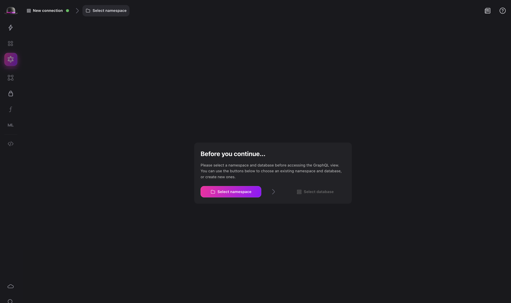
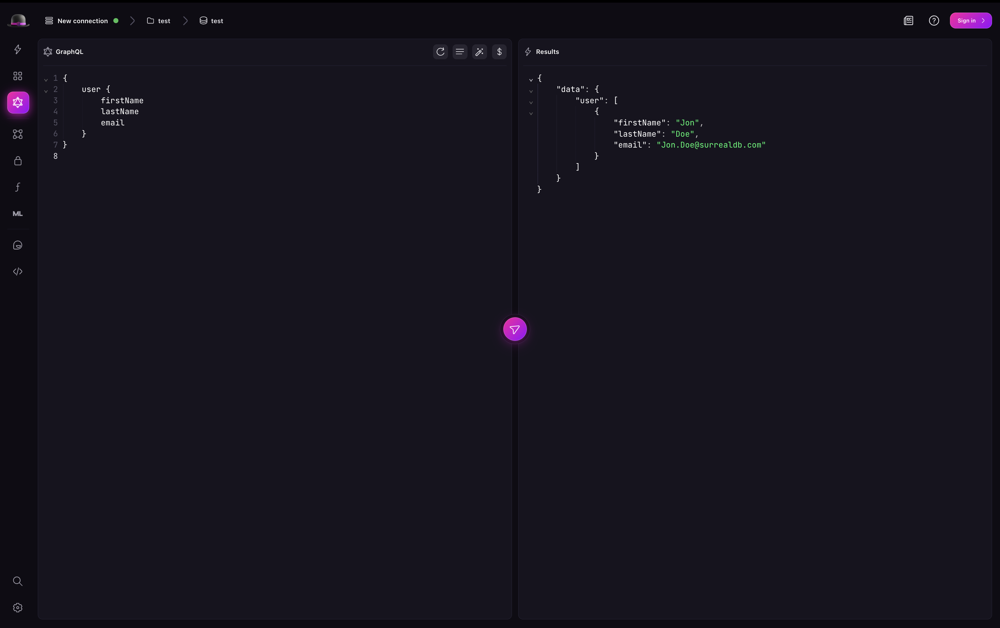
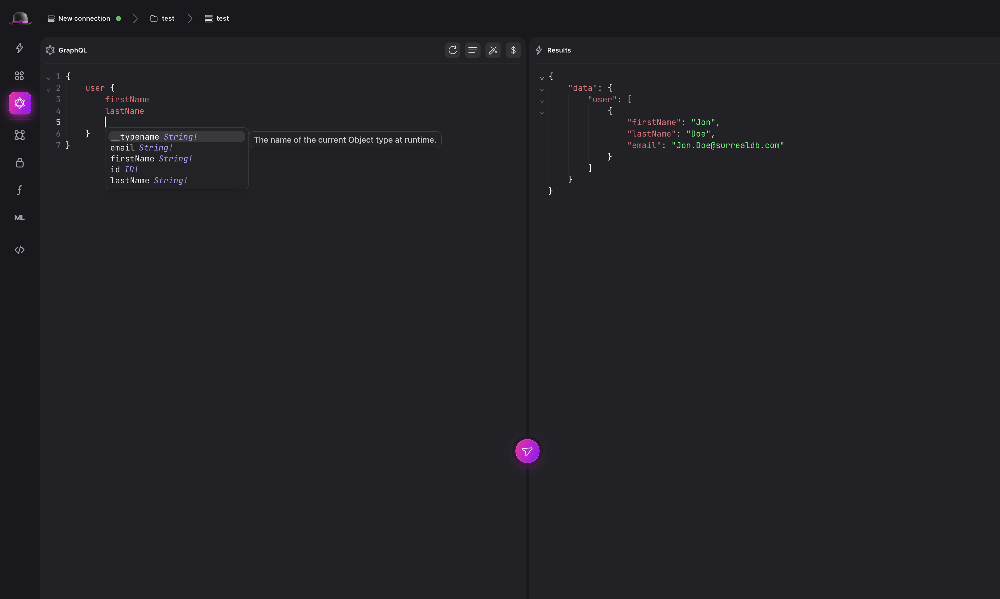

# GraphQL via Surrealist

The GraphQL query view in [Surrealist](https://app.surrealdb.com/query) provides syntax highlighting, query validation, and real-time execution, with results displayed as the JSON structure returned by GraphQL.

## Getting started

Before you can start making queries, you need to start SurrealDB with the GraphQL module enabled. You can do this by starting a new instance of SurrealDB with the [`surreal start`](../../../reference/cli/surrealdb-cli/commands/start.md) command.

**macOS**

```bash
surreal start --log debug --user root --password secret
```

**Windows**

```bash
surreal start --log debug --user root --password secret
```

After starting the SurrealDB instance, you can navigate to the Surrealist to start a new connection.

### Start a new connection

In the top left corner of the Surrealist, start a new connection. Ensure that the connection information is the same as the one you used to start the SurrealDB instance. In the example above we have set the user to `root` and the password to `secret`.

> [!IMPORTANT]
> Querying via GraphQL is not supported in the Surrealist sandbox.

Learn more about starting a connection in the [Surrealist documentation](../../../explore/surrealist/getting-started.md).

### Setting a namespace and database

Before you can start writing queries, you need to set the [namespace and database](../../../concepts.md#namespaces-and-databases) you want to use. For example, you can set the namespace to `test` and the database to `test`. This will set the namespace and database for the current connection.

Additionally, you can start [a serving in Surrealist](../../../explore/surrealist/concepts/local-database-serving.md) which also enables GraphQL automatically, starting a server on `http://localhost:8000` by default for a root user with username and password `root`.



### Preparing your database

Next, use the [SurrealQL query editor](../../../explore/surrealist/concepts/sending-queries.md) to create some data. For example, you can create a new `user` table with fields for `firstName`, `lastName`, and `email` and add a new user to the database.

In order to allow querying the created table using GraphQL, you will need to explicitly enable GraphQL using the [`DEFINE CONFIG`](../../../reference/query-language/statements/define/config.md) statement. This will allow you to query the table using GraphQL on a per-database basis.

This must be followed by statements to explicitly define the resources to query. That is, you must use the [`DEFINE TABLE` statement](../../../reference/query-language/statements/define/table.md) to define the table, and [`DEFINE FIELD` statement](../../../reference/query-language/statements/define/field.md) to define the fields for the table. This is because GraphQL differs from SurrealDB itself in requiring resources to be defined before they can be used.

```surql title="Creating a user table"

DEFINE TABLE user SCHEMAFULL;

-- Enable GraphQL for the user table.
DEFINE CONFIG GRAPHQL AUTO;

-- Define some fields. Not strictly necessary for
-- SurrealDB itself, but required for GraphQL
DEFINE FIELD firstName ON TABLE user TYPE string;
DEFINE FIELD lastName ON TABLE user TYPE string;
DEFINE FIELD email ON TABLE user TYPE string
  ASSERT string::is_email($value);
DEFINE INDEX userEmailIndex ON TABLE user FIELDS email UNIQUE;

-- Create a new User
CREATE user CONTENT {
    firstName: 'Jon',
    lastName: 'Doe',
    email: 'Jon.Doe@surrealdb.com',
};
```

## Write your first GraphQL query

After you have created some data, you can start writing GraphQL queries. You can use the [Surrealist GraphQL editor](../../../explore/surrealist/concepts/sending-queries-with-graphql.md) to write your GraphQL queries.

For example, to query the `person` table for all records, you can write the following GraphQL query:

```graphql
{
    user {
        firstName
        lastName
        email
    }
}
```



And to get the person with the email "Jon.Doe@surrealdb.com", you can write the following GraphQL query:

```graphql
{
    user(filter: {email: {eq: "Jon.Doe@surrealdb.com"}}) {
        firstName
        lastName
    }
}
```

Surrealist will automatically validate the query and provide you with the results.

## Introspection

Surrealist also supports introspection with GraphQL. This means that you can query the database and Surrealist will automatically infer the type of the data you are querying. For example, if you query the `user` table for all records, Surrealist will automatically infer the type of the data to be `user`.



## Learn more

To learn more about the GraphQL view in Surrealist, check out the [Surrealist documentation](../../../explore/surrealist/index.md).
