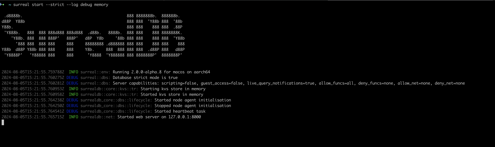
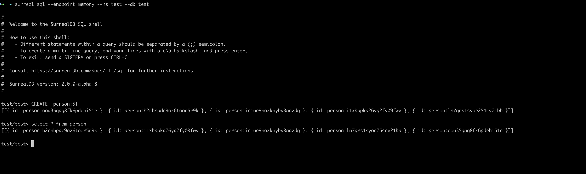

# SurrealQL via CLI

To get started, [install the SurrealDB CLI](../../../../reference/cli/surrealdb-cli/overview.md) on your local machine.

## Getting started

After installing the SurrealDB CLI, you can start writing SurrealQL queries by running the [`surreal start`](../../../../reference/cli/surrealdb-cli/commands/start.md) command in your terminal. You can also add the `--help` flag to view the available options and commands.

To start a SurrealDB server, run the surreal start command, using the options below. This example serves the database at the default location (http://localhost:8000), with a username and password.

```bash
surreal start --user root --pass secret
```

The server is actively running, and can be left alone until you want to stop hosting the SurrealDB server.



## Running queries

Open a second terminal and connect with [`surreal sql`](../../../../reference/cli/surrealdb-cli/commands/sql.md). You can stay in the interactive REPL, or pipe a one-shot query.

To open a REPL:

```bash title="Start a SurrealDB shell (local endpoint)"
surreal sql --endpoint http://localhost:8000 --ns main --db main --user root --pass secret --pretty
```

```bash title="Start a SurrealDB shell (in-memory)"
surreal sql --endpoint memory --ns main --db main --user root --pass secret --pretty
```

To run a simple `SELECT` without staying in the REPL:

**Bash**

```bash
echo 'SELECT * FROM person;' | surreal sql --endpoint http://localhost:8000 --ns main --db main --user root --pass secret --pretty --hide-welcome
```

**PowerShell**

```powershell
'SELECT * FROM person;' | surreal sql --endpoint http://localhost:8000 --ns main --db main --user root --pass secret --pretty --hide-welcome
```



## Learn more

Learn more about the available commands and options in the [SurrealDB CLI documentation](../../../../reference/cli/surrealdb-cli/overview.md).
