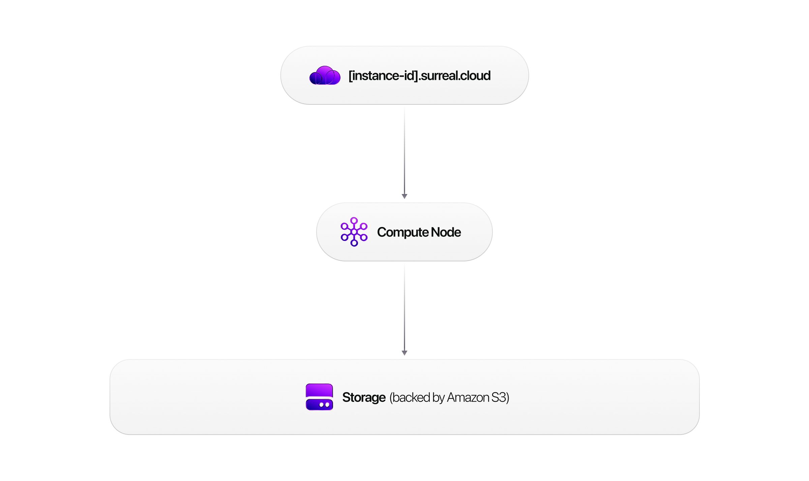

# Cloud management

This section covers the day-to-day management of a SurrealDB Cloud deployment. If you are setting up Cloud for the first time, start with the [getting started guide](../../build/deployment/surrealdb-cloud/getting-started/index.md) and [connecting](../../build/deployment/surrealdb-cloud/connecting/index.md) pages instead.

Topics covered here include:

- [Instance management](instance-management.md) — creating, pausing, resuming, and deleting instances.
- [Scaling](scaling.md) — adjusting compute and storage to match your workload.
- [Network access](network-access.md) — IP allowlisting, VPC peering, and PrivateLink configuration.
- [Backups & recovery](backups-and-recovery.md) — automated backups, retention policies, and point-in-time restore.
- [Monitoring & logs](monitoring-and-logs.md) — dashboards, metrics, and log access.
- [Organisations & users](organisations-and-users.md) — team management, roles, and invitations.
- [Billing & support](billing-and-support.md) — plans, invoices, and support channels.
- [AWS Marketplace](aws-marketplace.md) — subscribing to SurrealDB Cloud through AWS Marketplace.
