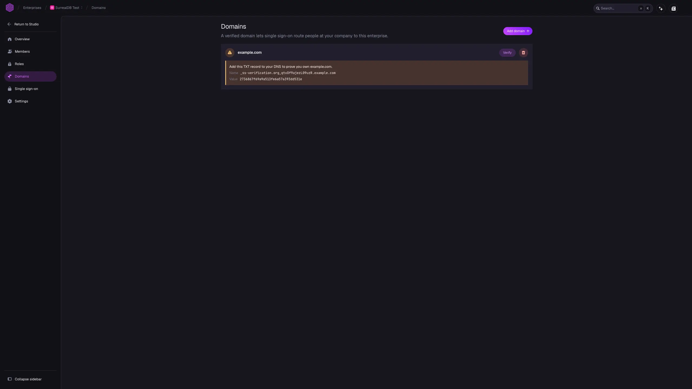

# Single sign-on

Single sign-on lets people at your company sign in to SurrealDB with the credentials they already hold, instead of creating a SurrealDB account of their own.

Sign-in is routed by email domain. A person enters their email address, SurrealDB matches the domain against the connections you have configured, and sends them to your identity provider to authenticate. Your identity provider decides whether they may sign in, and returns them to SurrealDB.

Three things must be in place before anyone is routed, and each has a step below:

1. A **domain** you have verified, which proves your company owns the email addresses.
2. A **connection** to your identity provider, which holds the credentials and endpoints.
3. A **route** from the domain to the connection, which ties the two together.

> [!IMPORTANT]
> A connection without a routing domain does nothing. You must specify which domain(s) you want to have routed to each identity provider connection under each of their settings.

> [!WARNING]
> Signing in through a single sign-on connection creates a new SurrealDB account for each connection, separate from any account the person already has with the same email address. Organisation memberships stay with the original account, so a person who was already a member of an organisation must be invited again before their single sign-on account can access it.

## Step 1: Verify an email domain

A verified domain is what lets single sign-on recognise your company's email addresses. Add the domain your company's addresses use, then prove you own it with a DNS record.

1. Open **Domains** in your enterprise.
2. Select **Add domain**.
3. Enter the domain, for example `example.com`.
4. Select **Add domain** to save it.

Studio then shows a DNS record for the domain. Add that record to your DNS, with the name and value exactly as shown, and then:

1. Wait for the record to propagate.
2. Select **Verify** beside the domain.

The domain is marked as verified when the record is found. If it is not found yet, Studio says so and you can try again. DNS changes can take a while to reach every resolver, so a verification that fails immediately after you add the record is worth repeating later.

Removing a domain stops any connection routing it from matching that domain and people will no longer be routed to your identity provider.

## Step 2: Add a connection

A connection holds the credentials and endpoints of your identity provider. Select your identity provider from the grid below for detailed instructions on how to set it up.

- **[Google Workspace](google-workspace.md)** — Google Apps
- **[Microsoft Entra ID](microsoft-entra-id.md)** — Azure Active Directory
- **[Okta](okta.md)** — Okta Workforce
- **[ADFS](adfs.md)** — Active Directory Federation Services
- **[PingFederate](ping-federate.md)** — Ping Identity
- **[Keycloak](keycloak.md)** — Keycloak SAML
- **[SAML](saml.md)** — Generic SAML 2.0
- **[OpenID Connect](openid-connect.md)** — Generic OIDC

Use **SAML** or **OpenID Connect** when your identity provider is not listed by name. Most identity providers speak one of the two, and a generic connection reaches the same result as a named one. The named entries exist to label the fields in the words your provider uses.

## Step 3: Route domains to the connection

Routing decides who is sent to the connection.

1. Open the connection from the **Single sign-on** list.
2. Under **Sign-in domains** on the **Sign-on** tab, select the verified domains to route.
3. Select **Save changes**.

People with an email address at those domains are then sent to this connection when they sign in. Only verified domains can be selected, so complete step 1 first.

You can route more than one domain to each connection, which suits a company that holds several email domains. Route each domain to the connection that authenticates it.

## Step 4: Choose the applications

> [!NOTE]
> All applications are disabled by default. You must enable each application you want your users to be able to use before they can be redirected to your identity provider page to sign in there.

A connection can be limited per SurrealDB application rather than all of them. Trying to sign in to an application that doesn't have any identity providers enabled for their domain will push them to sign in with a normal SurrealDB account and **will not** be redirected to your identity provider.

## After single sign-on is working

People at a routed domain are sent to your identity provider whenever they sign in. Their membership then comes from your identity provider, and you grant their access inside SurrealDB with [roles](../roles.md).

The [Members](../members.md) page will automatically show members that have signed in through an identity provider that you own but will not have any permissions unless they are granted to them. To prevent users from being added automatically, you must manage access externally via your identity provider.

To let your identity provider create, update and deactivate these accounts for you, turn on [SCIM provisioning](../scim-provisioning.md) for the connection. A person you deactivate in your identity provider then loses access to SurrealDB too.

## Related pages

- **[Members](../members.md):** Who belongs to the enterprise, and how they get there.
- **[Roles](../roles.md):** What a member may administer once they have signed in.
- **[SCIM provisioning](../scim-provisioning.md):** Keep accounts in step with your identity provider.
- **[Accounts and sign-in](../../organisations/sign-in.md):** Signing in without an enterprise.
