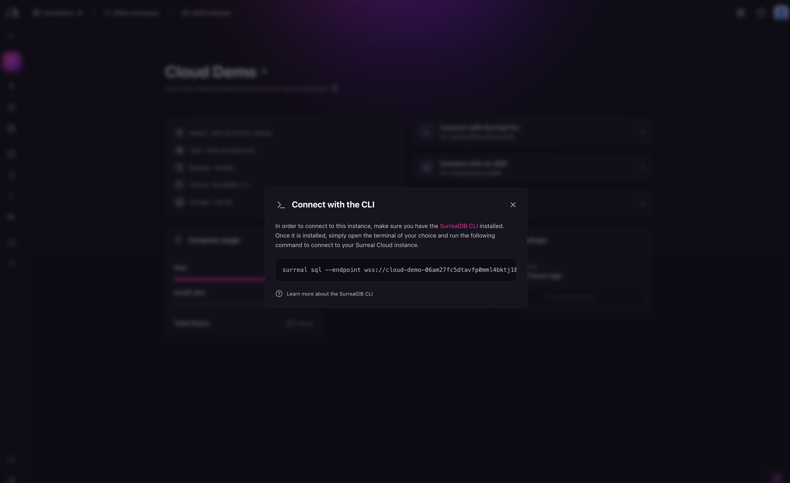

# Connect via CLI

Open an interactive SurrealQL shell against an instance with the [SurrealDB CLI](../../../reference/cli/surrealdb-cli/overview.md).

Use the shell for ad-hoc queries, for checking a schema definition, and for scripting a one-off change.

## Prerequisites

Install the CLI. See the [installation guide](../../../running/installation/index.md). It is a single executable and does not need a local server.

## Open a shell

[`surreal sql`](../../../reference/cli/surrealdb-cli/commands/sql.md) connects to the endpoint and opens a prompt:

```bash title="Connect to an instance"
surreal sql \
  --endpoint wss://<endpoint> \
  --ns main --db main \
  --token <token>
```

The **Connect** menu of the instance in [SurrealDB Studio](https://app.surrealdb.com) generates this command with your endpoint and token filled in.



The `--token` value is a JSON Web Token that authenticates the session. Treat it as a credential, because it grants whatever the authenticating user or access method grants. Keep it out of shell history and out of committed scripts. Where a script needs a token, mint one at runtime with `surrealctl instance token` rather than store it.

You can authenticate with `--user` and `--pass` instead if the instance has a system user defined. See [DEFINE USER](../../../reference/query-language/statements/define/user.md).

## Next steps

- **[SurrealDB CLI](../../../reference/cli/surrealdb-cli/overview.md):** every command and flag.
- **[surrealctl](../../surrealctl/instances.md):** the management-plane CLI. `surrealctl instance sql` opens the same shell against a named instance without you supplying an endpoint, and calls `surreal` to do it.
