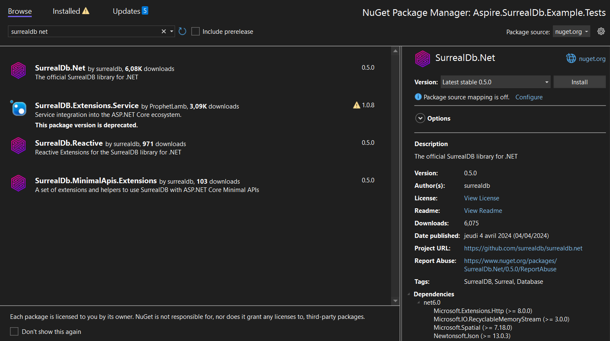

# Installation

Before you can use this SDK in your .NET applications regardless of your environment, you need to install and import it into your project.
The steps below show how to install and import it.

## Install the SDK

- Create a new project using your favorite IDE (Visual Studio, JetBrains Rider, etc...) 
- or use an existing template from the `dotnet new` command.

Once ready, add the SurrealDB SDK to your dependencies.

  
**.NET CLI**

```bash
dotnet add package SurrealDb.Net
```

  
**PackageReference**

*(latest)*'
/>

  

Alternatively, you can install the SDK via the NuGet user interface provided in your IDE.
Here is an example within Visual Studio:



## Initialise the SDK

The SDK's initialisation may vary depending on the context of your project.

The de facto initialisation method is to create and [consume a SurrealDbClient created manually](core/create-a-new-connection.md).
Most .NET projects provide a way to configure services using [Dependency Injection](core/dependency-injection.md), which is the recommended way to use the SDK in your application.
