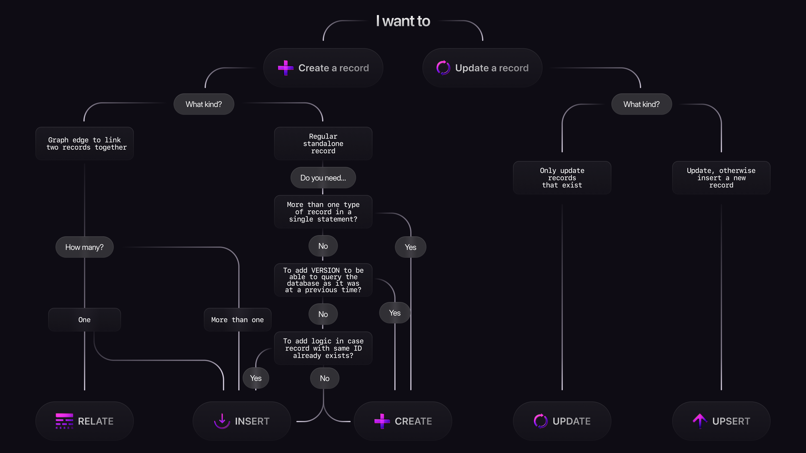

# Statements

SurrealDB provides statements to configure resources, control execution flow, and read or write data. The categories below group them by role.

## Types of statements

SurrealDB has a large variety of statements. They can be divided into three types:

* Statements that define and access database resources,
* Statements used for control flow and handling manual transactions,
* Statements used in the context of queries, usually in CRUD (create, read, update, delete) operations.

### Database resource statements

These statements pertain to defining, removing, altering, and rebuilding database resources. They are:

* [`DEFINE`](define/overview.md) statements to define database resources,
* [`ALTER`](alter/index.md) statements to alter certain resources,
* [`REMOVE`](remove.md) statements to remove resources,
* [`REBUILD`](rebuild.md) to rebuild an index,
* [`ACCESS`](access.md) to manage access grants.

Some other statements pertain to using defined resources. They are:

* [`USE`](use.md) to move from one namespace or database to another,
* [`INFO`](info.md) statements to see the definitions for resources,
* [`SHOW`](show.md) to see the changefeed for a table or database.

### Control flow statements

These statements are used to describe how query execution should progress.

Some control flow statements only pertain to manual transactions. While all statements in SurrealDB are conducted inside their own transaction, these statements can be used to manually set up a larger transaction composed of multiple statements. They are:

* [`BEGIN`](begin.md) to begin a manual transaction,
* [`COMMIT`](commit.md) to commit a transaction,
* [`CANCEL`](cancel.md) to cancel a transaction.

Other control flow statements are used in the same manner as in other programming languages. They are:

* [`FOR`](for.md) to begin a for loop,
* [`CONTINUE`](continue.md) to continue to the next iteration of a loop,
* [`BREAK`](break.md) to break out of a for loop, internal scope, function, etc.,
* [`IF` and `ELSE`](if-else.md) to describe what to do depending on a condition,
* [`SLEEP`](sleep.md) to halt all execution for a certain length of time,
* [`RETURN`](return.md) to break and return a value,
* [`THROW`](throw.md) to cancel execution and return an error.

### Query statements

These statements are used to execute queries, most often but not always in the context of a CRUD operation.

The statements that pertain to the handling of records are:

* [`CREATE`](create.md) to create one or more records of one or more types of tables,
* [`INSERT`](insert.md) to create one or more regular records or graph edges,
* [`RELATE`](relate.md) to create a single graph edge between two records,
* [`UPDATE`](update.md) to update records,
* [`UPSERT`](upsert.md) to update a record and create a new one if it does not exist,
* [`SELECT`](select.md) to select records (but also ad-hoc values),
* [`LIVE SELECT`](live-select.md) to stream all the changes to a table,
* [`DELETE`](delete.md) to delete one or more records,
* [`KILL`](kill.md) to cancel a `LIVE SELECT`.

The other statements used when executing a query are:

* [`LET`](let.md) to assign a value to a parameter for later use,
* [`RETURN`](return.md) when used in front of a value or expression, in which case it has no effect but is often used for readability.

The following flowchart can be used to get a sense of when it makes sense to use `CREATE`, `INSERT`, `UPDATE`, `UPSERT`, and `RELATE`.



## Statement parameters

A number of parameters prefixed with `$` are automatically available within a statement that provide access to relevant context inside the statement. These are known as reserved variable names. For example:

* [$before](../language-primitives/parameters.md#before-after) and [$after](../language-primitives/parameters.md#before-after) can be accessed in statements that mutate values to see the values before and after an update,
* [$session](../language-primitives/parameters.md#session) provides context on the current session,
* [$parent](../language-primitives/parameters.md#parent-this) provides access to the value in a primary query while inside a subquery.

For a full list of these automatically generated parameters, see the [parameters](../language-primitives/parameters.md#reserved-variable-names) page.

## Output when resource not defined

*Since v3.0.0*

Many but not all statements in versions before 3.0 returned an empty array when a resource was not defined.

```surql
SELECT * FROM person;
DELETE person;
REMOVE TABLE person;
```

```surql title="Output before 3.0"
-------- Query 1 --------

[]

-------- Query 2 --------

[]

-------- Query 3 --------

"The table 'person' does not exist"
```

All statements return an error if this is the case, making it clear that the resource is not defined as opposed to defined and empty.

```surql
SELECT * FROM person;
DELETE person;
```

```surql title="Output"
-------- Query --------

"The table 'person' does not exist"

-------- Query --------

"The table 'person' does not exist"
```

However, statements that create a resource will not return an error unless the [database is defined](define/database.md) as `STRICT`. Instead, they will automatically define the needed table (and even use the [`$session`](../../../learn/security/authentication/authentication.md#session) parameter to define the database and namespace if necessary) so that the query will work.

Note the output of the following queries, in which the value `[]` is returned after deleting the records of a defined table to show that zero records were returned. However, the final `REMOVE TABLE` statement returns a simple `NONE` to indicate that the statement succeeded.

```surql
SELECT * FROM person; -- Error
DELETE person;        -- Error
CREATE person:one;    -- Succeeds
DELETE person;        -- Empty array
REMOVE TABLE person;  -- NONE
```

The following chart can help to remember which output to expect depending on your SurrealDB version and database strictness.

| Example of statement  | STRICT database      | Non-STRICT database behavior (default)                     | Behavior in versions < 3.0       |
|-----------------------|----------------------|------------------------------------------------------------|----------------------------------|
| CREATE / UPDATE       | Error if not defined | Succeeds (defines table, database, namespace if necessary) | Identical                        |
| SELECT / DELETE       | Error if not defined | Returns error if table not defined                         | Empty array if table not defined |
