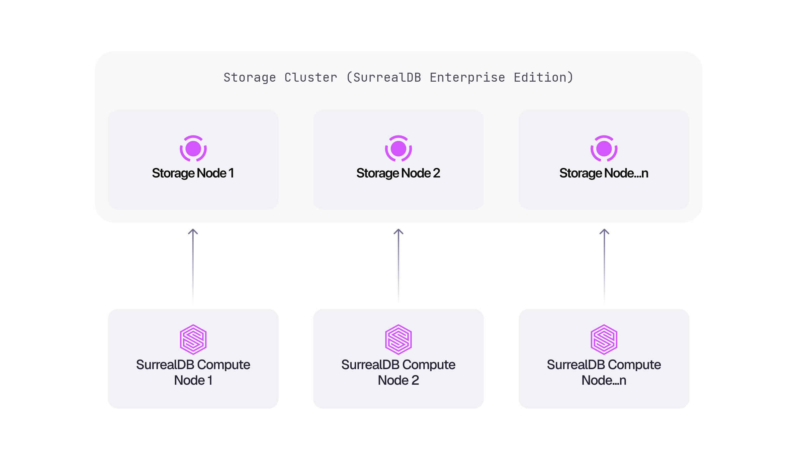

# Run a multi-node cluster

Multi-node SurrealDB requires **shared distributed storage** - a backend that every query node can reach with transactional consistency. A single RocksDB file on one server (or one Kubernetes pod) is **not** a multi-node cluster; it is the [single-node, on-disk](file-backed.md) model.

Because compute and storage are separate layers, query nodes hold no data of their own. Every node reads and writes through the same storage cluster, so nodes can join or leave without data being redistributed, and that is what makes horizontal scaling and high availability possible.

## Managed clusters

The [Scale](https://surrealdb.com/pricing/scale) plan on [managed instances](../manage/instances/index.md) runs multi-node clusters on distributed storage with replication and consensus. SurrealDB operates the storage layer, so a cluster is provisioned and resized from the Cloud dashboard, or from a script with [`surrealctl`](../reference/cli/surrealctl/overview.md).

## Self-hosted clusters

[SurrealDB Enterprise](https://surrealdb.com/enterprise) covers self-hosted multi-node clusters, and ships the Kubernetes operator and runbooks for running the storage layer yourself. See [Managed Kubernetes](../manage/self-hosted/managed-kubernetes.md) for how this maps onto Amazon EKS, Google GKE, and Azure AKS.

## Single-node deployments

Where one node is enough, [file-backed storage](file-backed.md) covers an on-disk server, and [Deploy on Kubernetes](../manage/self-hosted/kubernetes.md) covers a single SurrealDB pod with RocksDB on a persistent volume. [Deployment models](../manage/self-hosted/deployment-models.md) compares the options side by side.

For the flags accepted when starting a server, see the [`surreal start`](../reference/cli/surrealdb-cli/commands/start.md) reference.
