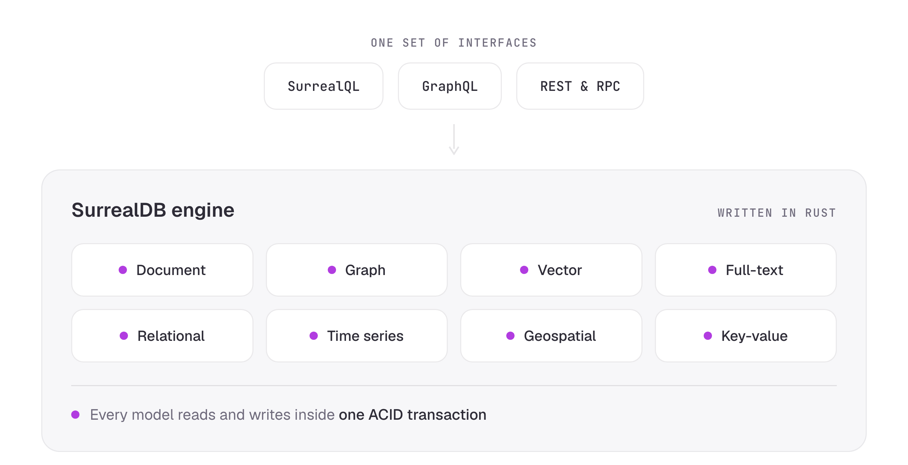

# What is SurrealDB

SurrealDB is a [multi-model database](/blog/what-are-multi-model-databases) written in Rust. One engine stores documents, graphs, vectors, text, time series, geospatial values and relational tables, and one query language reads and writes across all of them inside a single transaction.

The platform has two products, and both run on the same engine:

- **SurrealDB** is the database. You design the schema, and you choose how strictly to define it.
- **[SurrealDB Agent Memory](https://surrealdb.com/docs/agent-memory)** is a memory and knowledge layer for AI agents, built on top of that database.

This page covers the main capabilities of both. If you would rather start writing queries, go to [Sample queries](learn/querying/surrealql/sample-queries.md). If you want to run the database first, go to [Running SurrealDB](running/overview.md).

## One engine for every data model

Most applications hold more than one shape of data. A product catalogue is document-shaped, its recommendations are graph-shaped, its search spans text and vectors, and its billing is relational. SurrealDB serves all of those shapes from one engine, so a query can cross from a document to a graph edge to a vector index and back.

| Model | What it gives you |
| --- | --- |
| [Document](learn/data-models/document/overview.md) | Records with nested objects and arrays, at any depth. |
| [Graph](learn/data-models/graph/overview.md) | Typed edges between records, recursive traversal, and data stored on the edge itself. |
| [Vector](learn/data-models/vector-search/overview.md) | HNSW indexes with cosine, Euclidean and Manhattan distance. |
| [Full-text](learn/data-models/full-text-search/overview.md) | Configurable analysers, BM25 scoring and highlighting. |
| [Time series](learn/data-models/time-series/overview.md) | Ordered record IDs and range reads over time windows. |
| [Geospatial](learn/data-models/geospatial/overview.md) | GeoJSON-style points, lines, polygons and collections. |
| [Relational](explore/tutorials/tutorials/define-a-schema.md) | Defined tables, typed fields, assertions and views. |

Because the models share one storage layer, a write that touches a record, its relations and its embeddings commits together. See [Architecture](learn/data-models/architecture.md) for how the engine is put together.

## One query language

[SurrealQL](learn/querying/surrealql/what-is-surrealql.md) keeps the shape of SQL and adds the traversals, similarity functions and nested access the other models need. If you already write `SELECT`, `CREATE`, `UPDATE` and `DELETE`, you can start straight away, then pick up arrow syntax for graph paths and dot notation for nested fields.

Schema strictness is yours to set. A schemaless table accepts any record, which suits early development. A [schemafull](learn/data-models/document/schema-modes.md) table stores only the fields you define, with types and assertions enforced on write. You can tighten a table later without rewriting the data.

Three other interfaces reach the same data. [GraphQL](learn/querying/graphql/overview.md) schemas are generated from your tables, the [REST API](reference/rest-api/index.md) covers queries and key-value access over HTTP, and [`DEFINE API`](reference/query-language/statements/define/api.md) publishes your own HTTP endpoints written in SurrealQL.

## Search and retrieval in one query

Retrieval for AI applications usually needs more than one signal. SurrealDB runs those signals together:

- **Vector similarity** over HNSW indexes, for meaning.
- **Full-text search** with BM25 scoring, for wording.
- **Graph traversal** across typed edges, for connection.
- **[Hybrid search](learn/data-models/vector-search/hybrid-search.md)** that fuses text and vector results with reciprocal rank fusion.

A single statement can find semantically similar documents, walk to the entities they mention, and filter on a structured field, without a second store or a second round trip. This is the basis of the [RAG and Graph RAG patterns](learn/data-models/vector-search/rag-architecture-patterns.md) documented for SurrealDB.

## Real-time by default

[Live queries](learn/querying/real-time/live-queries.md) let a client subscribe to a filtered set of records and receive changes as they happen. [Table events](reference/query-language/statements/define/event.md) fire on create, update and delete, and [`ASYNC` events](reference/query-language/statements/define/event.md#async-events) run after commit for work that should not hold up the write.

The database is your event source and your source of truth at once, which keeps reactive features close to the data they react to.

## ACID transactions across every model

Each statement runs in its own transaction by default, and [`BEGIN`](reference/query-language/statements/begin.md) starts a manual transaction spanning as many statements, tables and models as you need. Every transaction runs under [snapshot isolation](learn/querying/concepts-and-guides/transactions.md#snapshot-isolation), the one isolation level SurrealDB offers, with write conflicts detected at commit.

The guarantee holds on every storage engine and every deployment model, from an embedded in-memory database to a distributed cluster. See [Transactions](learn/querying/concepts-and-guides/transactions.md) for the isolation semantics and the retry behaviour they imply.

## Runs where your application runs

SurrealDB ships as a single Rust binary and separates compute from storage. The same database therefore runs inside your application, on one server, or across a cluster.

- **[Embedded](build/embedding/index.md)** in a Rust, Go, JavaScript, Python or .NET application, in memory or on disk, and in the browser through WebAssembly and IndexedDB.
- **[Single node](running/file-backed.md)** on RocksDB, which suits development and smaller production workloads.
- **[Distributed](manage/self-hosted/deployment-models.md)** across many compute nodes on shared storage, with automatic sharding and read replicas.
- **[Managed](manage/instances/index.md)** on SurrealDB Cloud, which runs the infrastructure, the backups and the scaling for you.

Moving between them does not change your queries. See [Deployment models](manage/self-hosted/deployment-models.md) for the trade-offs of each.

## Secure and multi-tenant by design

SurrealDB can sit behind a backend service or accept connections straight from a frontend, because access control reaches down to individual fields.

- **[Namespaces and databases](learn/data-models/architecture.md#system-structure)** separate organisations, teams and environments, with no limit on either.
- **[Role-based access](reference/query-language/statements/define/access/index.md)** applies at root, namespace and database level.
- **[Record access](reference/query-language/statements/define/access/record.md)** authenticates your end users against your own tables.
- **[Table and field permissions](learn/security/index.md)** decide what each subject may read and write.
- **JWT and third-party authentication** cover the common OAuth providers and signing algorithms.

Encryption in transit and at rest, audit logging, SOC 2 Type 2, ISO 27001, Cyber Essentials Plus and GDPR compliance apply to the managed service. See [Security](learn/security/index.md) for the full picture.

## Memory for AI agents

An agent starts each session with nothing. SurrealDB Agent Memory gives it durable memory instead: a layer that turns conversations, documents and connected systems into structured, time-aware facts, then retrieves them on demand.

The layer is built around six ideas:

- **[Typed memory](https://surrealdb.com/docs/agent-memory/memory-and-knowledge)** distinguishes episodes, identity, knowledge, context, instructions and uncertainty.
- **A knowledge graph** stores entities as nodes and typed relationships as edges.
- **Hybrid recall** fuses meaning, wording, connection and recency in one ranker.
- **Tiered queries** keep cheap questions cheap.
- **[Provenance and time](https://surrealdb.com/docs/agent-memory/mental-model/two-layer-architecture)** record where each fact came from and when it held, so a superseded belief is end-dated rather than overwritten.
- **Autonomous understanding** improves the memory between conversations through reflection and consolidation.

Every read, decision and write commits inside one SurrealDB transaction, so documents, relations, embeddings and retrieval traces stay consistent with each other. Start with [What is SurrealDB Agent Memory?](https://surrealdb.com/docs/agent-memory/welcome/what-is-surrealdb-agent-memory).

## Extend the database itself

Logic that belongs next to the data can live in the database:

- **[Custom functions](learn/querying/concepts-and-guides/custom-functions.md)** in SurrealQL, for repeated or complicated expressions.
- **[JavaScript functions](reference/query-language/scripting/overview.md)**, each running in its own isolated context.
- **[WebAssembly modules](learn/extensions/index.md)** written in Rust, compiled to WASM and loaded at runtime.
- **[SurrealML](explore/ml-models/index.md)** models trained in PyTorch, TensorFlow or Sklearn and executed through an ONNX runtime.
- **[Buckets](reference/query-language/statements/define/bucket.md)** for files on disk, in memory, or in S3, Google Cloud Storage and Azure Blob Storage.
- **[MCP](agents/index.md)** for connecting coding agents such as Claude Code, Cursor and VS Code directly to a database.

## In production

SurrealDB runs at scale in organisations including:

- **Samsung Ads**, for knowledge graphs in advertising analytics.
- **Verizon**, for a generative AI assistant used by field technicians.
- **Tencent**, for infrastructure monitoring, after consolidating nine tools into one.
- **PolyAI**, for low-latency RAG across voice AI experiences.
- **SiteForge**, to shorten its development cycle and reduce backend API usage.

More detail is on the [case studies page](/casestudies), and the complete capability list is on the [features page](/features).

## Where next

- **[Sample queries](learn/querying/surrealql/sample-queries.md)** — Run your first SurrealQL queries against a live instance.
- **[Running SurrealDB](running/overview.md)** — Start the database in memory, on disk, in Docker, or in the browser.
- **[Architecture](learn/data-models/architecture.md)** — How the engine separates compute from storage, and how a database is structured.
- **[Agent Memory](https://surrealdb.com/docs/agent-memory)** — Give your agents durable, queryable memory built from your own data.
