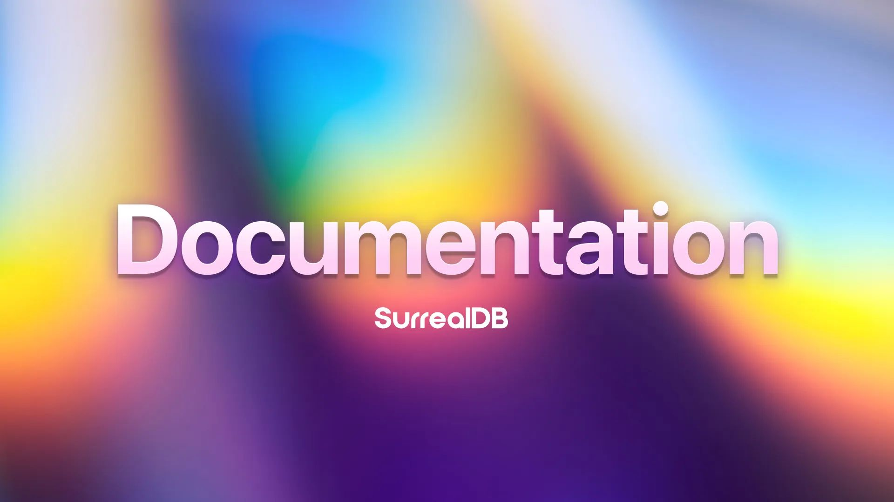

# Documentation is live

We’re happy to announce that our SurrealDB Documentation is LIVE! Installation, setup, datatypes, querying, connectivity, advanced functionality. It's all here - /docs/.

If you find any bugs, or have any ideas then let us know on [GitHub Discussions](https://github.com/surrealdb/surrealdb/discussions) and [GitHub issues](https://github.com/surrealdb/surrealdb/issues).
