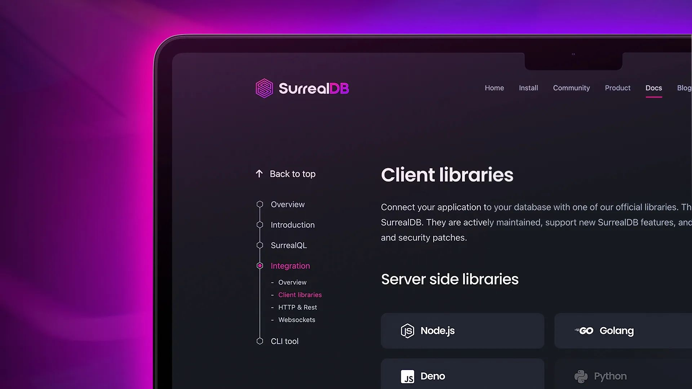

# Client libraries live!

We’re happy to announce that initial server side documentation for Node.js, Golang and Deno, along with client side documentation for JavaScript is [LIVE HERE](/docs/surrealdb/integration/sdks)!

If you find any bugs, or have any ideas then let us know on [GitHub Discussions](https://github.com/surrealdb/surrealdb/discussions) and [GitHub issues](https://github.com/surrealdb/surrealdb/issues).
