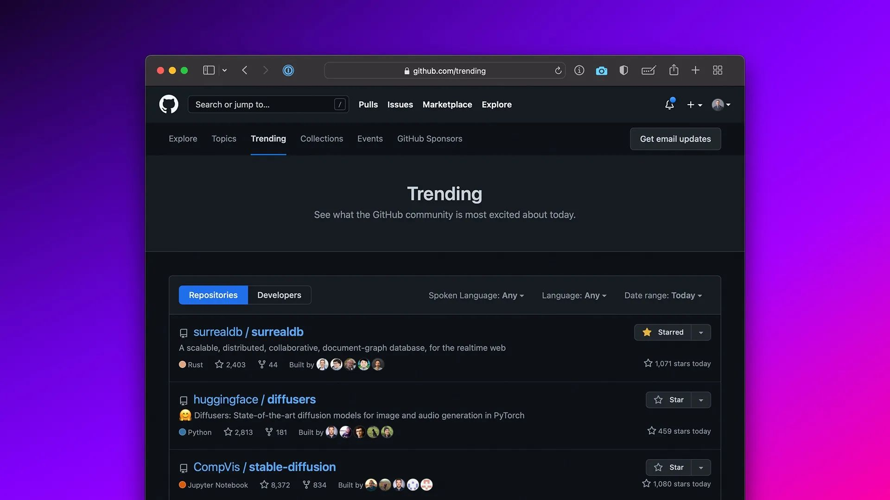

# No. 1 GitHub trending repository!

Absolutely shocked and honoured to reach the No. 1 trending public repository on GitHub worldwide. Thank you to everyone who has shown interest in SurrealDB and helped us reach 2500 GitHub stars! Just 2 brothers with a dream - we have some really big plans for SurrealDB, and this is just the beginning!

- No. 4 on Hacker News
- No. 1 on Reddit’s 'Programming' subreddit 🔥 'Hot' list
- No. 1 on Reddit’s 'Rust' subreddit 🔥 'Hot' list
- No. 1 trending repository on GitHub worldwide

Thank you so, so much! ❤️

[https://github.com/trending](https://github.com/trending)
