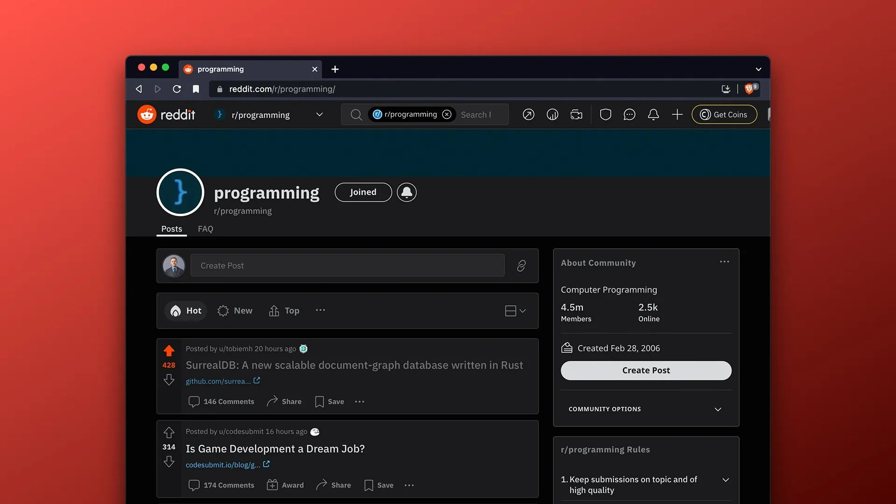

# No. 1 on Reddit's Programming subreddit 🔥 'Hot' list

Thank you for all the comments, feedback and support on the SurrealDB post on [Reddit's 4.5 million member-strong Programming subreddit](https://www.reddit.com/r/programming/comments/wuu6xj/surrealdb_a_new_scalable_documentgraph_database). We are honoured to have made No. 1 on the [🔥 'Hot' list](https://www.reddit.com/r/programming).
