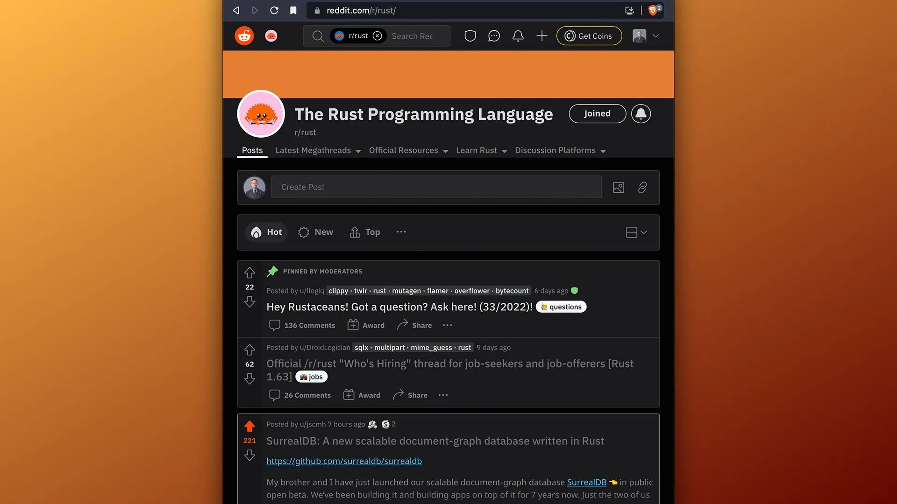

# SurrealDB on Reddit Rust

Thank you for all the comments, feedback and support on the SurrealDB post on [Reddit's Rust subreddit](https://www.reddit.com/r/rust). We are honoured to have made the 🔥 'Hot' list.
