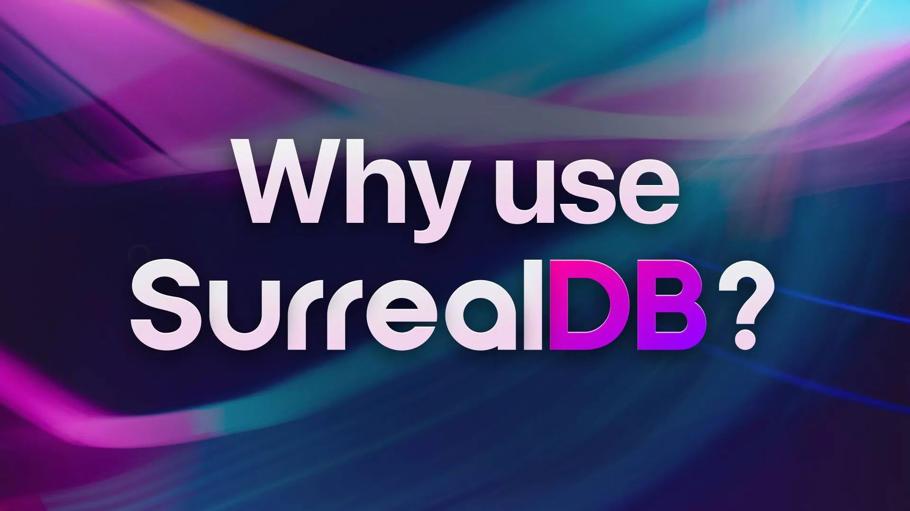
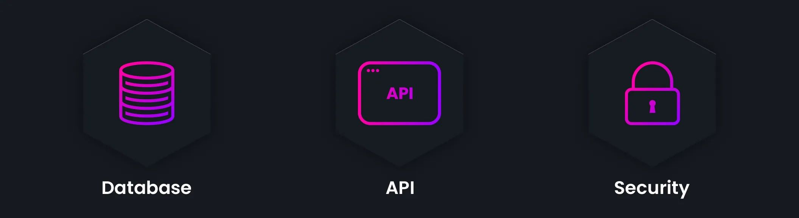
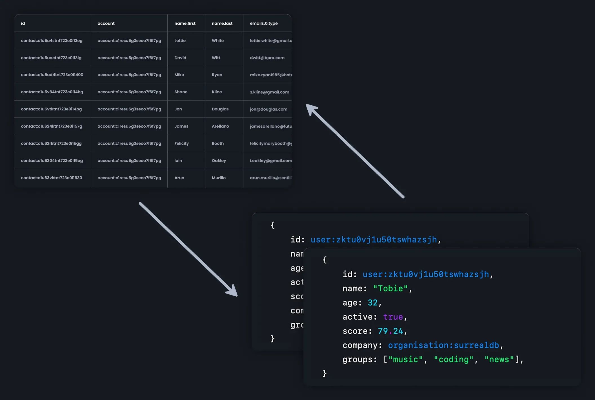
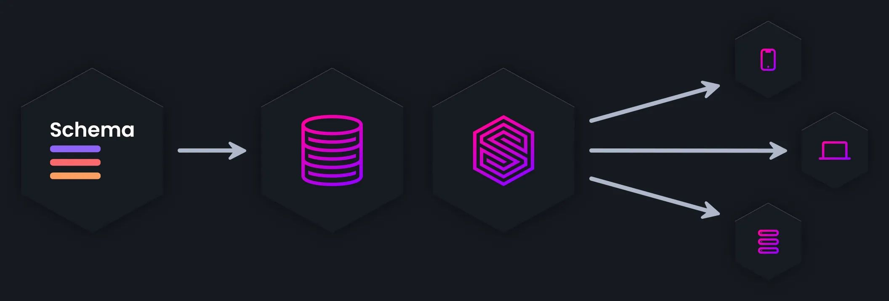
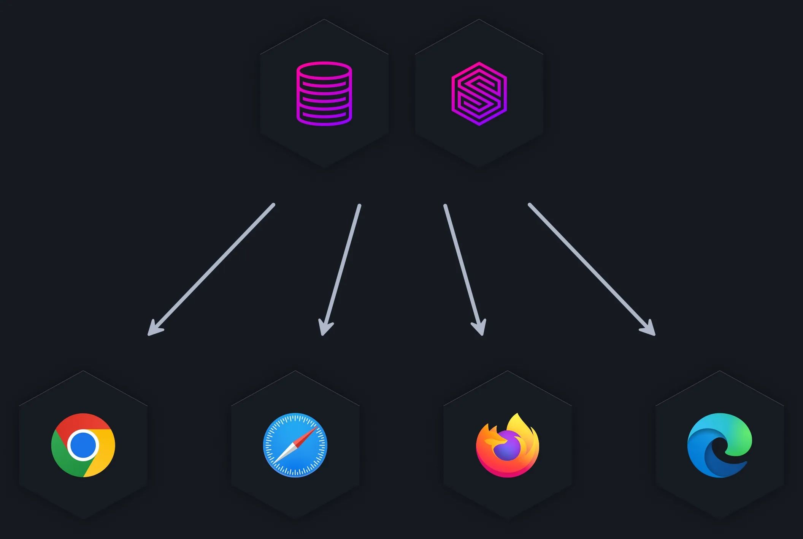
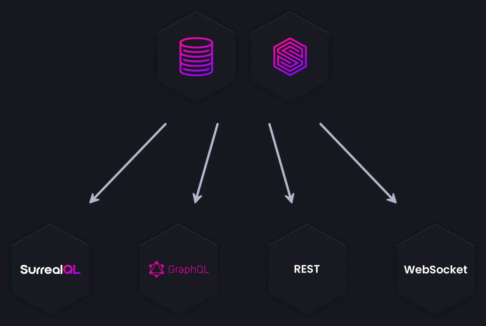
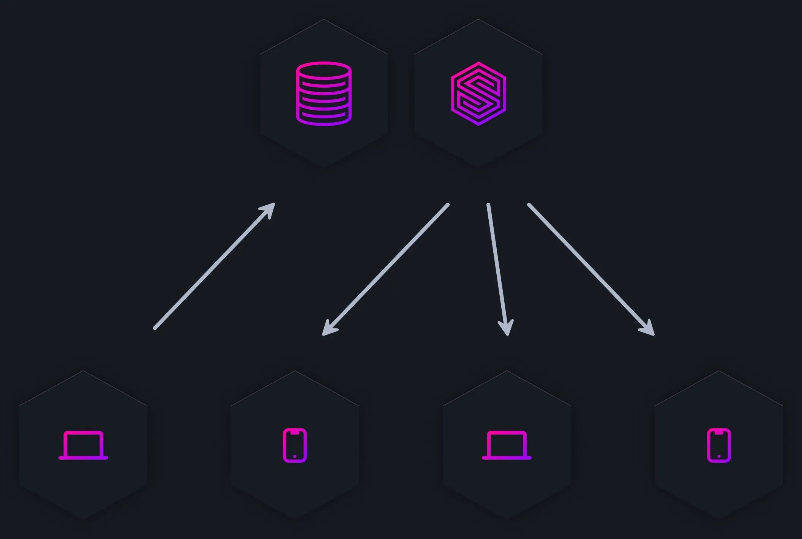
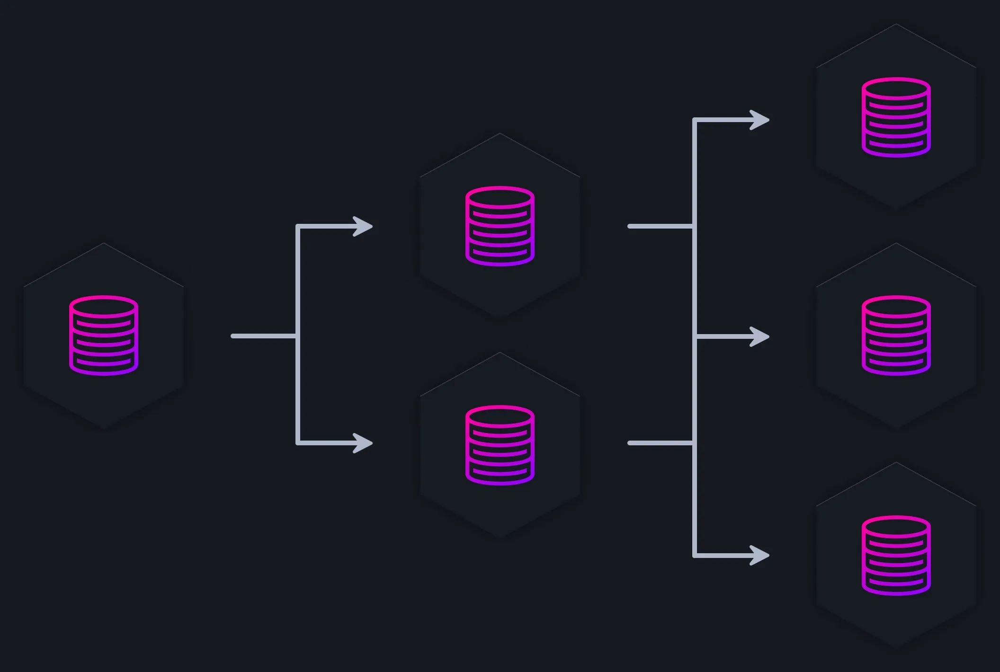
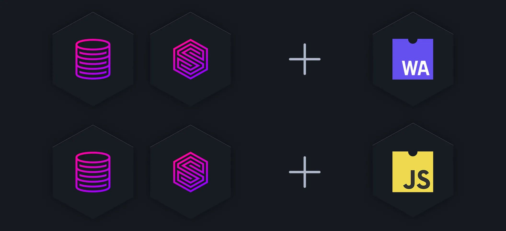
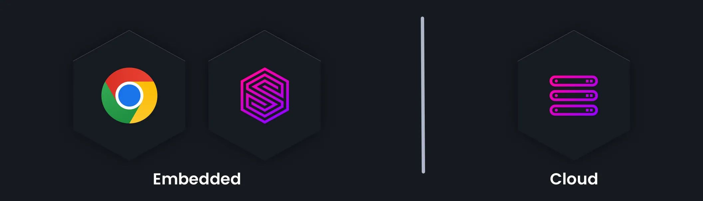

# Why use SurrealDB?

SurrealDB is an innovative NewSQL cloud database, suitable for serverless applications, jamstack applications, single-page applications, and traditional applications. It is unmatched in its versatility and financial value, with the ability for deployment on cloud, on-premise, embedded, and edge computing environments. Here are a few of the benefits.

## Database, API, and permissions

#### Database, realtime API layer, and security permissions all-in-one

SurrealDB combines the database layer, the querying layer, and the API and authentication layer into one platform. Advanced table-based and row-based customisable access permissions allow for granular data access patterns for different types of users. There's no need for custom backend code and security rules with complicated database development.

## Multi-model database

#### Tables, documents, and graph. Store and model your data in any way.

As a multi-model database, SurrealDB enables developers to use multiple techniques to store and model data, without having to choose a method in advance. With the use of tables, SurrealDB has similarities with relational databases, but with the added functionality and flexibility of advanced nested fields and arrays. Inter-document record links allow for simple to understand and highly-performant related queries without the use of JOINs, eliminating the N+1 query problem.

## Inter-document links

#### Advanced inter-document relations and analysis. No JOINs. No pain.

With full graph database functionality SurrealDB enables more advanced querying and analysis. Records (or vertices) can be connected to one another with edges, each with its own record properties and metadata. Simple extensions to traditional SQL queries allow for multi-table, multi-depth document retrieval, efficiently in the database, without the use of complicated JOINs and without bringing the data down to the client. Inter-document links

## Simple schema definition

#### Simple schema definition for frontend and backend development

With SurrealDB, specify your database and API schema in one place, and define column rules and constraints just once. Once a schema is defined, database access is automatically granted to the relevant users. No more custom API code, and no more GraphQL integration. Simple, flexible, and ready for production in minutes not months.

## Connect from the browser

#### Connect and query directly from web-browsers and client devices

Connect directly to SurrealDB from any end-user client device. Run SurrealQL queries directly within web-browsers, ensuring that users can only view or modify the data that they are allowed to access. Highly-performant WebSocket connections allow for efficient bi-directional queries, responses and notifications.

## Flexible querying

#### Query the database with the tools you want

Your data, your choice. SurrealDB is designed to be flexible to use, with support for SurrealQL, GraphQL (coming soon), CRUD support over REST, and JSON-RPC querying and modification over WebSockets. With direct-to-client connection with in-built permissions, SurrealDB speeds up the development process, and fits in seamlessly into any tech stack.

## Realtime live queries

#### Realtime live queries and data changes direct to application

SurrealDB keeps every client device in-sync with data modifications pushed in realtime to the clients, applications, end-user devices, and server-side libraries. Live SQL queries allow for advanced filtering of the changes to which a client subscribes, and efficient data formats, including DIFFing and PATCHing enable highly-performant web-based data syncing.

## Scale effortlessly

#### Scale effortlessly to hundreds of nodes for high-availability and scalability

SurrealDB can be run as a single in-memory node, or as part of a distributed cluster - offering highly-available and highly-scalable system characteristics. Designed from the ground up to run in a distributed environment, SurrealDB makes use of special techniques when handling multi-table transactions, and document record IDs - with no use of table or row locks.

## Embedded functions

#### Extend your database with JavaScript and WebAssembly functions

Embedded JavaScript functions allow for advanced, custom functionality, with computation logic being moved to the data layer. This improves upon the traditional approach of moving data to the client devices before applying any computation logic, ensuring that only the necessary data is transferred remotely. These advanced JavaScript functions, with support for the ES2020 standard, allow any developer to analyse the data in ever more simple-yet-advanced ways.

## Embedded or distributed

#### Designed to be embedded or to run distributed in the cloud

Built entirely in Rust as a single library, SurrealDB is designed to be used as both an embedded database library with advanced querying functionality, and as a database server which can operate in a distributed cluster. With low memory usage and cpu requirements, the system requirements have been specifically thought through for running in all types of environment.

[SurrealDB's vision is to be the world’s go-to database for building applications](/blog/why-surrealdb-is-the-future-of-database-technology-an-in-depth-look), a platform where developers don’t have to think about their backend architecture, when what they really want is to focus on their apps, simplifying the landscape for developers and ensuring that the world’s data can be accessed in even more simple ways.

Please give SurrealDB a follow on [Linkedin](https://www.linkedin.com/company/surrealdb), star us on [GitHub](https://github.com/surrealdb/surrealdb), follow us on [Twitter](https://twitter.com/SurrealDB), join us on [Discord](https://discord.gg/surrealdb), and check out our [website](/). If you have any questions about installing, starting or using SurrealDB, or you have an idea for a feature you would love to see in SurrealDB, let us know on [GitHub Discussions](https://github.com/surrealdb/surrealdb/discussions) and [GitHub issues](https://github.com/surrealdb/surrealdb/issues). We shall appreciate it immensely.
