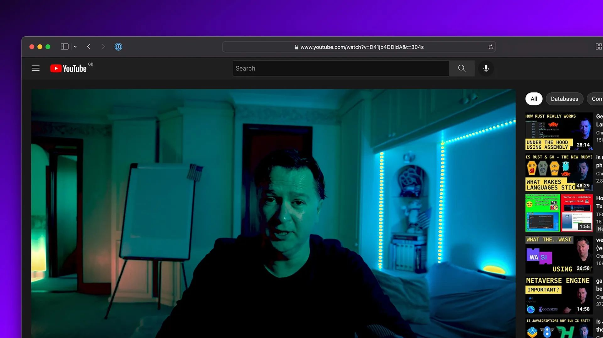

# Getting started with SurrealDB

Thank you very much to Chris Hay, CTO at IBM iX for his excellent, thorough video on SurrealDB. We are looking forward to the sequel!

[YouTube: D41jb4DDIdA](https://www.youtube.com/watch?v=D41jb4DDIdA)

[https://youtu.be/D41jb4DDIdA](https://youtu.be/D41jb4DDIdA)
