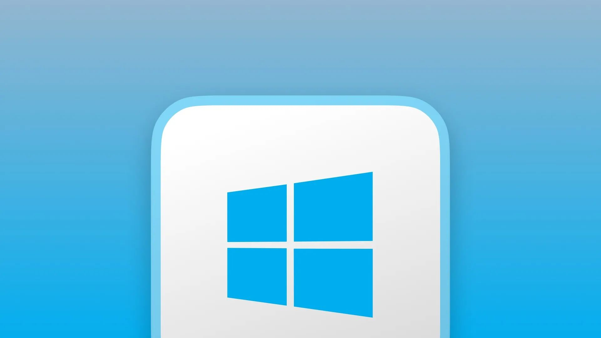

# Just released SurrealDB for Windows!



The easiest and preferred way to get going with SurrealDB on Windows is to install and use the SurrealDB command-line tool. Run the following command in your terminal and follow the on-screen instructions.

```cli
iwr https://windows.surrealdb.com -useb | iex
```
