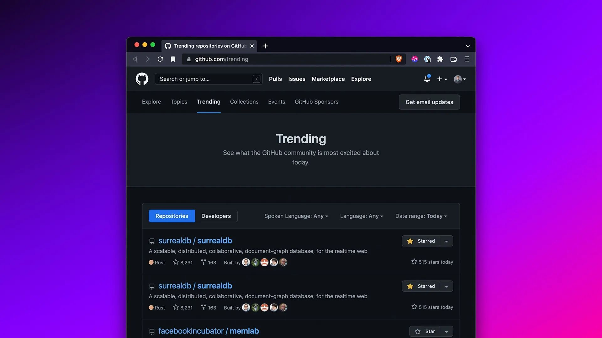

# We think we have broken GitHub...

Thank you once again for all the love and support over the last 24 hours! SurrealDB is currently the No. 1 📈 AND No. 2 📈 trending public repository on GitHub worldwide! We think we have broken GitHub 😵!

[https://github.com/trending](https://github.com/trending)
