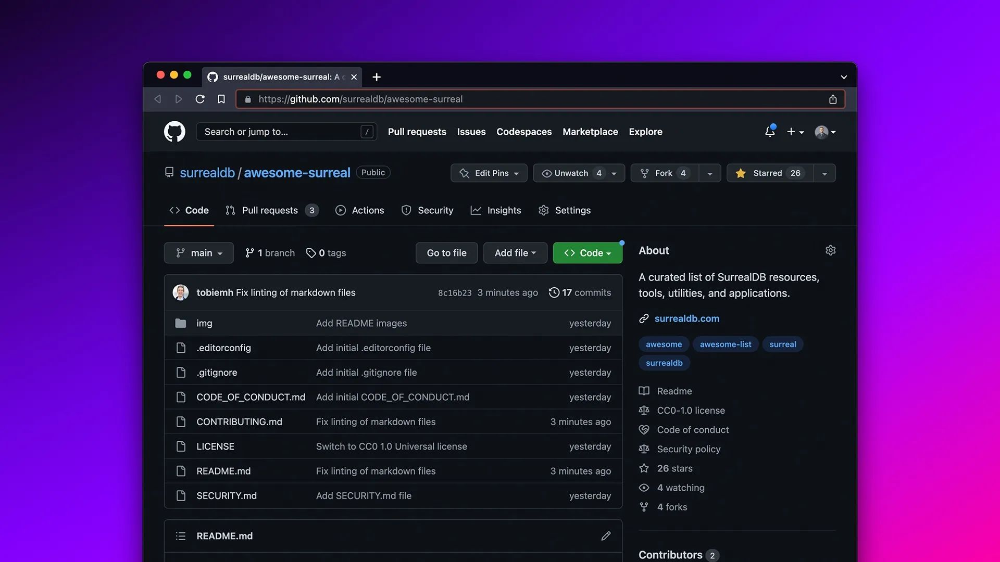

# New 'Awesome SurrealDB' repo!

We have created an ['Awesome SurrealDB'](https://github.com/surrealdb/awesome-surreal) repo. Please suggest any libraries, tools, tutorials or videos there by submitting a pull request!
