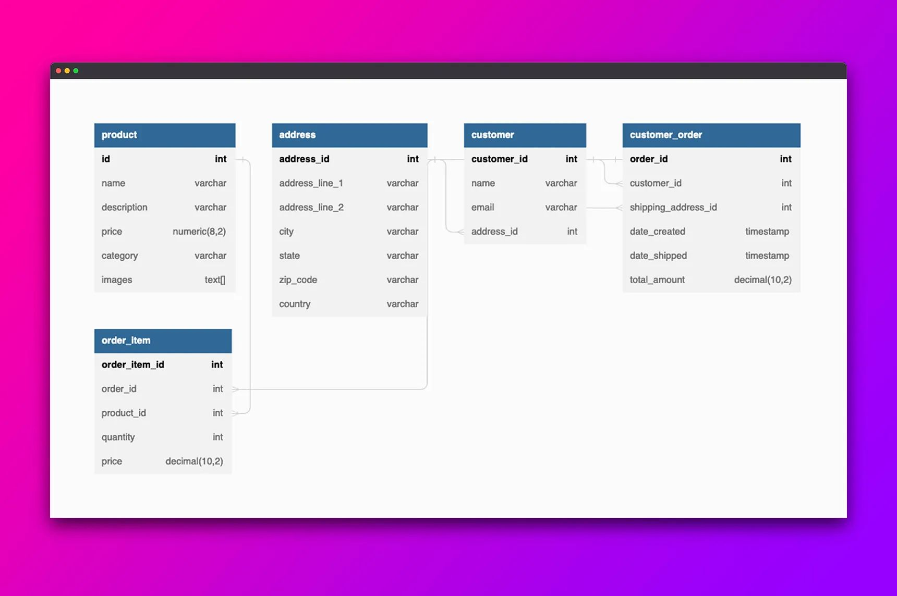

# Understanding SurrealQL and how it is different from PostgreSQL


PostgreSQL has been around for a while now and is the go-to choice for applications that need reliability, performance and scalability. It's an open-source, SQL database used by lots of big companies and startups, from web apps to scientific research. But as more complex apps need to be built, the limitations of traditional SQL databases are showing. One of the main issues developers come up against with Postgres is writing complex joins. It's even tricky for experienced SQL programmers.

## Introduction to SurrealDB and its history

SurrealDB has an SQL-style query language called SurrealQL which is a powerful database query language closely resembling traditional SQL, but with slight differences and improvements. In this article, we will explore the similarities and differences between PostgreSQL and SurrealQL. We will also see how SurrealQL can overcome some of the limitations that relational databases have. Consider this as a guide for every developer coming with a PostgreSQL background to understand SurrealQL better rather than a step-by-step tutorial.

Before we get started, here are some basic concepts you should know about SurrealQL.

You can use the `SELECT`, `CREATE`, `UPDATE`, `DELETE`, `RELATE` and `INSERT` statements to query and manipulate data in SurrealDB. You can also retrieve data using dot notation`.` , array notation `[]`, and graph semantics ->.

SurrealQL allows records to link to other records and travel across all embedded links or graph connections as required.

You can read more about it and see all other features by visiting [the features page](/features#surrealql).

## Building an e-commerce platform

In this blog, we'll be studying an e-commerce platform built using PostgreSQL and SurrealQL side by side.

An e-commerce application needs a special schema that can handle product variations, pricing tiers, and customer details. While e-commerce databases can be successfully built using relational databases the schema can be complex with numerous tables and joins in order to maintain the transactional data.

Below is the relational schema of a lightweight e-commerce platform that we will be building. Our platform has a limited scope with only 3 customers and a couple of products so we can focus on each query and compare it with SurrealQL to understand how it's different.



## Data Manipulation and Querying

This is how we `INSERT` data in a table in PostgreSQL vs in SurrealDB.

Manipulation and querying of data in SurrealQL is done using the SELECT, CREATE, UPDATE, and DELETE statements. These enable selecting or modifying individual records, or whole tables. Each statement supports multiple different tables or record types at once.

**PostgreSQL**

```surrealql
INSERT INTO product
    (name, description, price, category, images, options)
    VALUES
    ("Shirt", "Slim fit", 6, "clothing", ARRAY["image1.jpg", "image2.jpg", "image3.jpg"])
;
```

**SurrealQL**

```surrealql
CREATE product CONTENT {
    name: 'Shirt',
    id: 'shirt',
    description: 'Slim fit',
    price: 6,
    category: 'clothing',
    images: ['image1.jpg', 'image2.jpg', 'image3.jpg']
};
```

If you were to use SurrealDB in a strictly SCHEMAFULL approach, you can define a schema similar to PostgreSQL. You can find a detailed explanation of defining tables in SurrealDB by viewing the [`DEFINE TABLE` statement documentation](/docs/surrealql/statements/define/table).

But in the SCHEMALESS approach, you also have the option to quickly get started without having to define every column. In SurrealDB we can define relationships between entities directly. We do not need to know about foreign keys and neither do we have to write logic about how to store them.

## PostgreSQL schema for remaining tables.

We need more tables to store the metadata about our e-commerce database in Postgres. These tables aren't required in SurrealDB because we follow the `vertex` -> `edge` -> `vertex` or `noun` -> `verb` -> `noun` convention to store metadata.

```surrealql
-- Product Table.
CREATE TABLE product (
    id SERIAL PRIMARY KEY,
    name TEXT,
    description TEXT,
    price NUMERIC(8,2),
    category TEXT,
    images TEXT[]
);

-- Customer's Address.
CREATE TABLE address (
    address_id INT PRIMARY KEY,
    address_line_1 VARCHAR(255),
    address_line_2 VARCHAR(255),
    city VARCHAR(255),
    state VARCHAR(255),
    zip_code VARCHAR(255),
    country VARCHAR(255)
);

-- Customer Table.
CREATE TABLE customer (
    customer_id INT PRIMARY KEY,
    name VARCHAR(255),
    email VARCHAR(255),
    address_id INT,
    FOREIGN KEY (address_id) REFERENCES address(address_id)
);

-- Order details
CREATE TABLE customer_order (
    order_id INT PRIMARY KEY,
    customer_id INT,
    shipping_address_id INT,
    total_amount DECIMAL(10,2),
    FOREIGN KEY (customer_id) REFERENCES customer(customer_id),
    FOREIGN KEY (shipping_address_id) REFERENCES address(address_id)
);

-- Product details in an order
CREATE TABLE order_item (
    order_item_id INT PRIMARY KEY,
    order_id INT,
    product_id INT,
    quantity INT,
    price DECIMAL(10,2),
    FOREIGN KEY (order_id) REFERENCES customer_order(order_id),
    FOREIGN KEY (product_id) REFERENCES product(id)
);
```

## Let's populate our database

The insert statement in SurrealQL is similar to the one used in Postgres. However, SurrealQL has an UPDATE statement that can do the same job as Postgres' ALTER statement. Additionally, you can easily add data and columns in SurrealDB without altering the schema, which is possible because SurrealDB can function either as a schemafull or schemaless structure. In this particular example, we are following a schemaless approach, which means that adding a column will not alter the underlying schema of the e-commerce platform.

Let us add an options column to our product table.

**PostgreSQL**

```surrealql
ALTER TABLE product ADD COLUMN options jsonb[];

INSERT INTO product
    (name, description, price, category, images, options)
    VALUES
    (
        'Shirt', 'Slim fit', 6, 'clothing',
        ARRAY['image1.jpg', 'image2.jpg', 'image3.jpg'],
        ARRAY['{"sizes": ["S", "M", "L"]}', '{"colours": ["Red", "Blue", "Green"]}']::jsonb[]
    )
;
```

**SurrealQL**

```surrealql
INSERT INTO product {
    name: 'Shirt',
    id: 'shirt',
    description: 'Slim fit',
    price: 6,
    category: 'clothing',
    images: ['image1.jpg', 'image2.jpg', 'image3.jpg'],
    options: [
        { sizes: ['S', 'M', 'L'] },
        { colours: ['Red', 'Blue', 'Green'] }
    ]
};
```

Before we start querying our e-commerce database, let's first enter some data in our PostgreSQL reference tables.

```surrealql
INSERT INTO address (address_id, address_line_1, city, state, zip_code, country)
VALUES (1, '123 Main St', 'New York', 'NY', '10001', 'USA');

INSERT INTO address (address_id, address_line_1, city, state, zip_code, country)
VALUES (2, '124 Main St', 'New York', 'NY', '10002', 'USA');

INSERT INTO address (address_id, address_line_1, city, state, zip_code, country)
VALUES (3, '125 Main St', 'New York', 'NY', '10003', 'USA');

INSERT INTO customer (customer_id, name, email, address_id)
VALUES (1, 'Tobie', 'tobie@gmail.com', 1);

INSERT INTO customer (customer_id, name, email, address_id)
VALUES(2, 'Alex', 'alex@example.com', 2);

INSERT INTO customer (customer_id, name, email, address_id)
VALUES (3, 'Pratim', 'pratim@example.com', 3);

INSERT INTO product (name, description, price, category, images, options)
VALUES ('Trousers', 'Pants', 10, 'clothing',
        ARRAY['image1.jpg', 'image2.jpg', 'image3.jpg'],
        ARRAY['{"sizes": ["S", "M", "L"]}',
        '{"colours": ["Red", "Blue", "Green"]}']::jsonb[]);

INSERT INTO product (name, description, price, category, images, options)
VALUES ('Iphone', 'Mobile Phone', 600, 'Electronics',
        ARRAY['image1.jpg', 'image2.jpg', 'image3.jpg'],
        ARRAY['{"sizes": ["Max", "Pro", "SE"]}',
        '{"colours": ["Red", "Blue", "Green"]}']::jsonb[]);

INSERT INTO customer_order (order_id, customer_id, shipping_address_id, total_amount)
VALUES (5, 3, 1, 600);

INSERT INTO order_item (order_item_id, order_id, product_id, quantity, price)
VALUES (6, 5, 1, 1, 600);

INSERT INTO order_item (order_item_id, order_id, product_id, quantity, price)
VALUES (7, 5, 3, 1, 600);
```

Let's insert some data in our SurrealDB tables too!

```surrealql
INSERT INTO customer {
    name: 'Pratim',
    id: 'pratim',
    email: 'abc@gmail.com',
    address: { house_no: '221B', street: 'Baker street', city: 'London', country: 'UK' }
};

INSERT INTO customer {
    name: 'Tobie',
    id: 'tobie',
    email: 'tobie@gmail.com',
    address: { house_no: '221A', street: 'Church street', city: 'London', country: 'UK' }
};

INSERT INTO customer {
    name: 'Alex',
    id: 'alex',
    email: 'alex@gmail.com',
    address: { house_no: '221C', street: 'Pound street', city: 'London', country: 'UK' }
};

INSERT INTO product {
    name: 'Trousers',
    id: 'trousers',
    description: 'Pants',
    price: 10,
    category: 'clothing',
    images: ['image1.jpg', 'image2.jpg', 'image3.jpg'],
    options: [
        { sizes: ['S', 'M', 'L'] },
        { colours: ['Red', 'Blue', 'Green'] }
    ]
};

INSERT INTO product {
    name: 'Iphone',
    id: 'iphone',
    description: 'Mobile phone',
    price: 600,
    category: 'Electronics',
    images: ['image.jpg', 'image1.jpg', 'image4.jpg'],
    options: [
        { sizes: ['Max', 'Pro', 'SE'] },
        { colours: ['Red', 'Blue', 'Green'] }
    ]
};
```

## Retrieving the data

The SELECT statements in SurrealDB are similar to Postgres.

**PostgreSQL**

```surrealql
SELECT * FROM product where id=1;
```

**SurrealQL**

```surrealql
SELECT * FROM product:shirt;
```

The `SELECT` statement will fetch all required details from the product tables. In SurrealDB you can assign a unique id to each product. In case you do not assign it an id, it auto-assigns a unique ID to every record. In PostgreSQL, this can be achieved by using a uuid column and it has to be explicitly mentioned initially.

## The RELATE statement

The RELATE statement can be used to generate graph edges between two records in the database. The graph edges stand for the relationship between two nodes that represent a record. When a customer buys a product SurrealDB relates the customer with the product using the "bought" relation. You can name your relationship whatever you feel fits right. It could also be called "purchased" or "ordered".

```surrealql
RELATE customer:pratim->bought->product:iphone CONTENT {
    option: { Size: 'Max', Color: 'Red' },
    quantity: 1,
    total: 600,
    status: 'Pending',
    created_at: time::now()
};

RELATE customer:pratim->bought->product:shirt CONTENT {
    option: { Size: 'S', Color: 'Red' },
    quantity: 2,
    total: 40,
    status: 'Delivered',
    created_at: time::now()
};

RELATE customer:alex->bought->product:iphone CONTENT {
    option: { Size: 'M', Color: 'Max' },
    quantity: 1,
    total: 600,
    status: 'Pending',
    created_at: time::now()
};

RELATE customer:alex->bought->product:shirt CONTENT {
    option: { Size: 'S', Color: 'Red' },
    quantity: 2,
    total: 12,
    status: 'Delivered',
    created_at: time::now()
};

RELATE customer:tobie->bought->product:iphone CONTENT {
    option: { Size: 'M', Color: 'Max' },
    quantity: 1,
    total: 600,
    status: 'Pending',
    created_at: time::now()
};
```

Let's select all the products bought by a particular customer

**PostgreSQL**

```surrealql
SELECT p.id AS product_id, p.name AS product_name
FROM product p
JOIN order_item oi ON p.id = oi.product_id
JOIN customer_order co ON oi.order_id = co.order_id
JOIN customer c ON co.customer_id = c.customer_id
WHERE c.name = 'Pratim'
ORDER BY p.id;
```

**SurrealQL**

```surrealql
SELECT * FROM customer:pratim->bought;
```

If you notice this is an extremely complex query. One of the most powerful features in SurrealDB is the capability to relate records using graph connections and links. Instead of pulling data from multiple tables and merging that data together, SurrealDB allows you to select related records efficiently without needing to use JOINs.

Here's what you get when you fire the above SurrealQL query

```surrealql
[
    {
        "created_at": "2023-03-28T07:39:56.946636Z",
        "id": "bought:n88e3cuery13jfqhq4lh",
        "in": "customer:pratim",
        "option": {
            "Color": "Red",
            "Size": "S"
        },
        "out": "product:Shirt",
        "quantity": 2,
        "status": "Delivered",
        "total": 40
    },
    {
        "created_at": "2023-03-28T07:36:41.091383Z",
        "id": "bought:odadlqf1cv2970qvb8cx",
        "in": "customer:pratim",
        "option": {
            "Color": "Red",
            "Size": "Max"
        },
        "out": "product:Iphone",
        "quantity": 1,
        "status": "Pending",
        "total": 600
    }
]
```

You can also directly fetch the product ids without the metadata with the following query.

```surrealql
SELECT out FROM customer:pratim->bought;
```

```surrealql
[
    {
        "out": "product:Shirt"
    },
    {
        "out": "product:Iphone"
    }
]
```

We can also query the graph edge `bought`

```surrealql
SELECT out FROM bought;
```

```surrealql
[
    {
        "out": "product:Shirt"
    },
    {
        "out": "product:Iphone"
    },
    {
        "out": "product:Iphone"
    },
    {
        "out": "product:Shirt"
    },
    {
        "out": "product:Iphone"
    }
]
```

If you study the queries you will realise that customers Pratim and Alex both bought shirts and an iPhone. We have a new customer Tobie who also buys a shirt. Your e-commerce system wants to recommend Tobie the products that other customers have bought.

How would you do this using Postgres?

To recommend products to Tobie based on what Pratim and Alex have bought, we need to first find out what products Pratim and Alex have purchased and then look for other customers who have purchased the same products.

This query first selects all the products bought by Pratim and Alex, then filters out the products already bought by Tobie. The resulting list includes the product_id and product_name of the items to be recommended to Tobie.

```surrealql
SELECT DISTINCT p.id AS product_id, p.name AS product_name
FROM product p
JOIN order_item oi ON p.id = oi.product_id
JOIN customer_order co ON oi.order_id = co.order_id
JOIN customer c ON co.customer_id = c.customer_id
WHERE c.name IN ('Pratim', 'Alex') AND p.id NOT IN (
    SELECT p2.id
    FROM product p2
    JOIN order_item oi2 ON p2.id = oi2.product_id
    JOIN customer_order co2 ON oi2.order_id = co2.order_id
    JOIN customer c2 ON co2.customer_id = c2.customer_id
    WHERE c2.name = 'Tobie'
)
ORDER BY p.id;
```

Are you with me or is your head spinning? Let's try to do this in SurrealQL now.

```surrealql
SELECT array::distinct(<-bought<-customer->bought->product.*) AS purchases
FROM product:shirt;
```

```surrealql
[
    {
        "purchases": [
            {
                "category": "clothing",
                "description": "Slim fit",
                "id": "product:shirt",
                "images": [
                    "image1.jpg",
                    "image2.jpg",
                    "image3.jpg"
                ],
                "name": "Shirt",
                "price": "6"
            },
            {
                "category": "Electronics",
                "description": "Mobile phone",
                "id": "product:iphone",
                "images": [
                    "image.jpg",
                    "image1.jpg",
                    "image4.jpg"
                ],
                "name": "Iphone",
                "options": [
                    {
                        "sizes": [
                            "Max",
                            "Pro",
                            "SE"
                        ]
                    },
                    {
                        "colours": [
                            "Red",
                            "Blue",
                            "Green"
                        ]
                    }
                ],
                "price": 600
            }
        ]
    }
]
```

Here we are selecting all unique values from the array of products that have been bought by the customers who have also bought a shirt.

But what if you do not want the common product i.e. shirt to be recommended? You can use the [SurrealQL operator](/docs/surrealql/operators) `NOTINSIDE` from SurrealQL to manipulate the data.

```surrealql
SELECT array::distinct(<-bought<-customer->bought->(product WHERE id NOTINSIDE [product:shirt])) as products
FROM product:shirt;
```

```surrealql
[
    {
        "products": [
            "product:iphone"
        ]
    }
]
```

## Conclusion

In this blog post, we saw how SurrealDB can make it easier for you to structure and query your database compared to PostgreSQL. With SurrealDB you can truly have the best of both databases while not compromising on security and flexibility. SurrealDB has a lot of features like real-time queries with highly efficient related data retrieval, advanced security permissions for multi-tenant access, and support for performant analytical workloads to offer. You can read more about them [here](/features).

## Next Steps

If you haven't started with SurrealDB yet, you can get started by visiting [the install page](/install). Drop your questions on our [Discord](https://discord.gg/surrealdb) and don't forget to star us on [GitHub](https://github.com/surrealdb/surrealdb).
