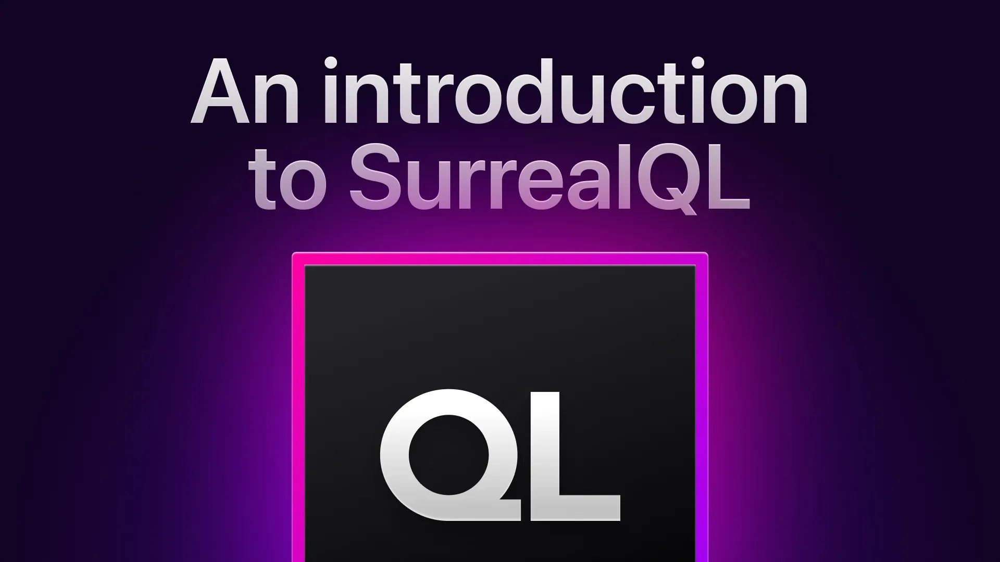

# All About SurrealQL

This week's SurrealDB Stream focused on SurrealQL with co-founder Tobie Morgan Hitchcock, Data Evangelist Alexander Fridriksson and Software Engineer Micha de Vries: Why is SurrealQL a SQL-like language vs a custom language like MongoQL or Cypher? A brief history of SQL and why we have deviated from the ANSI SQL standard. Demos of the fundamentals of SurrealQL and some advanced concepts. Questions from the community about SurrealDB and SurrealQL.

[YouTube: mF-CpMEB6gg](https://www.youtube.com/watch?v=mF-CpMEB6gg)
