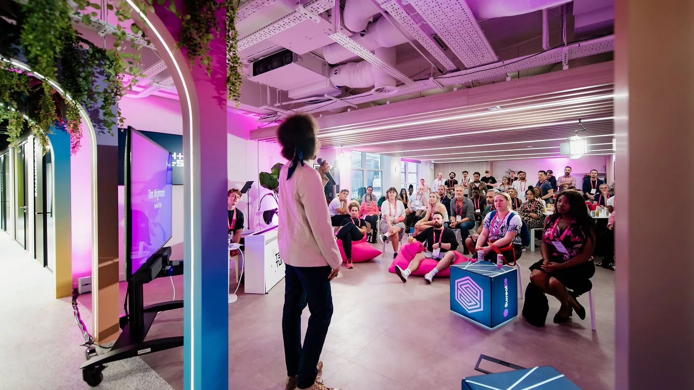
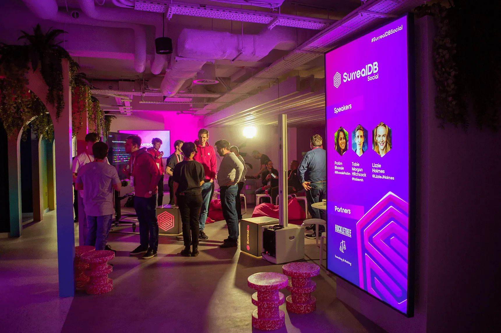
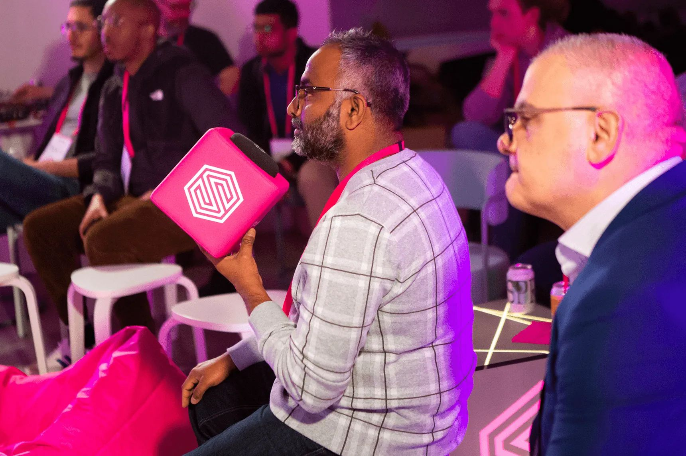
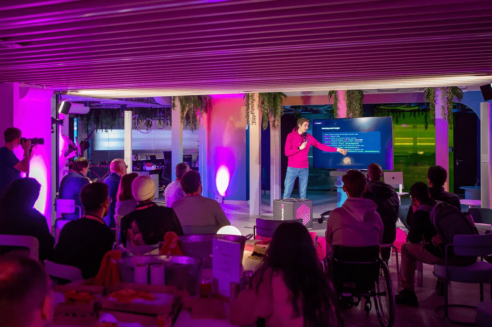

# Rounding up May with SurrealDB Social

Whether you've just discovered SurrealDB or are an early adopter, you're invited to our monthly tech meetup SurrealDB Social at Huckletree, Oxford Circus. This month’s focus is on Live Queries, with talks from Hugh Kaznowski and CEO Tobie Morgan Hitchcock. In addition, the night will also include a live Q&A, plus food, drink and fun and games.

📣 Talks by the SurrealDB team

😆 Informative, inclusive and fun!

🍕 Delicious bites - Pizza Pilgrims, 🥗 Kaleido Rolls and 🍦ice cream

🍹Tasty drinks - including boozy and alcohol-free options, sponsored by Something & Nothing

Tickets are limited, RSVP [here](https://www.eventbrite.co.uk/e/surrealdb-social-live-queries-tech-meetup-tickets-620821061507).

