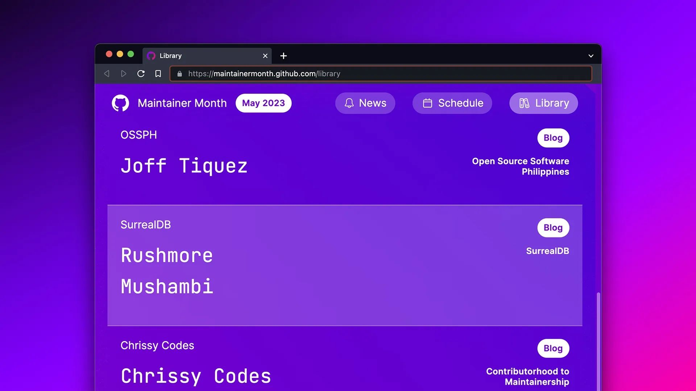

# Thank you GitHub for the feature!

Thank you GitHub for the [feature](https://maintainermonth.github.com/library) on the Maintainer Month Library! 🎉

As part of our efforts to celebrate #MaintainerMonth 2023, we had a chat with one of our maintainers here at SurrealDB, Rushmore Mushambi. Rushmore is one of our senior software engineers. He maintains our Rust API layer and WebAssembly library. He is also our first engineering hire, joining SurrealDB in January.

View our [maintainer month 2023 blog](/blog/maintainer-month-2023-behind-the-scenes-with-rushmore-mushambi) to read the full interview.
