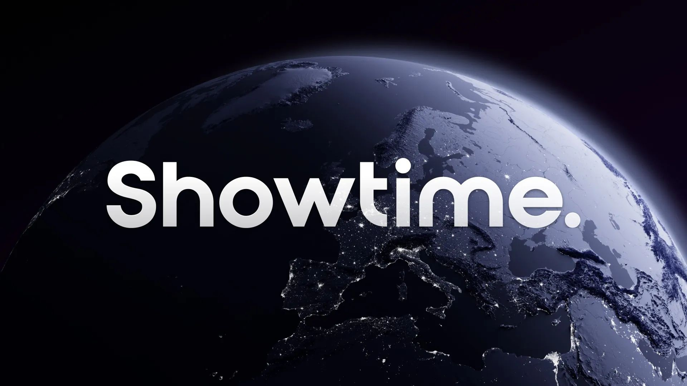

# Announcing SurrealDB World

Over the past six months, we have been forging ahead with SurrealDB, and now we are delighted to announce SurrealDB World conference, which will take place on September 13 2023 in London, UK.

Join us as we unveil our latest innovations alongside some exciting announcements which will undoubtedly shape the future of the database industry. Gain valuable insights from industry experts and leaders, and connect and collaborate with a diverse community of tech professionals.

Register now at [SurrealDB.World](https://surrealdb.world) for your free online experience, or register your interest for a free in-person conference ticket to the most exciting tech event of the year. Spaces are limited, so we encourage you to register early.

We look forward to seeing you at the event!

The SurrealDB Team
