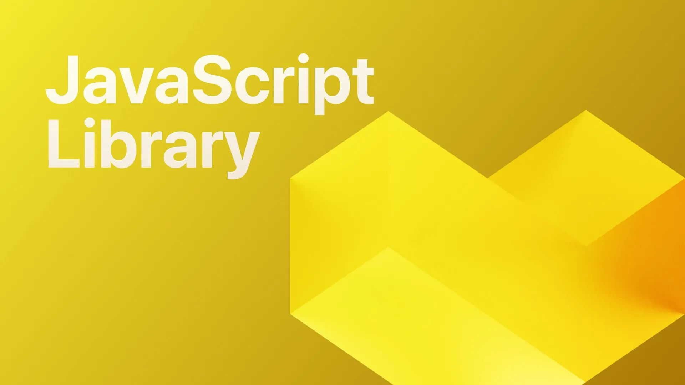

# JavaScript Library with Micha & Tobie

This week we're focusing on SurrealDB's JavaScript Library. Join Micha and Tobie as they chat about recent updates and highlights, and showcase how to use live queries and the WASM library.

[YouTube: aShsslTeKl4](https://www.youtube.com/watch?v=aShsslTeKl4)
