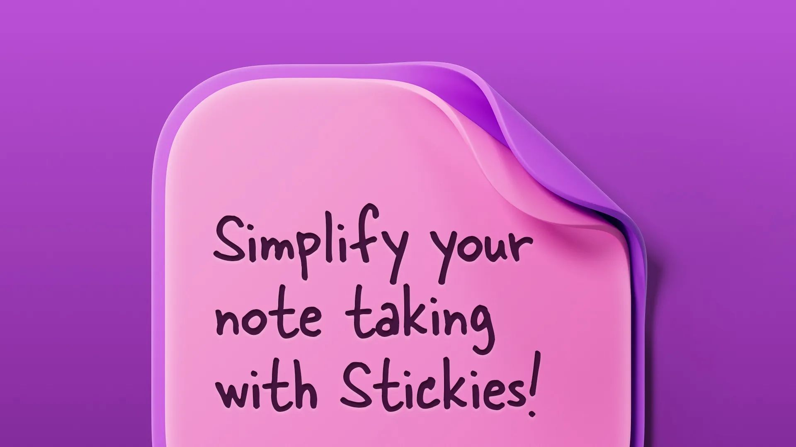
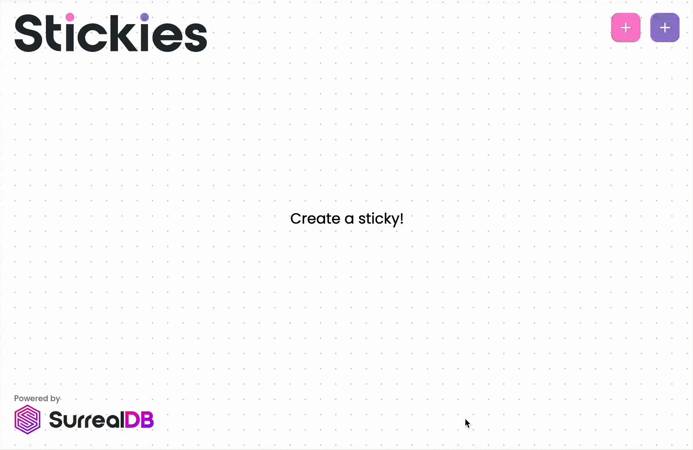
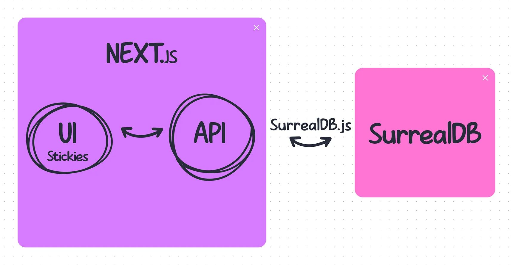
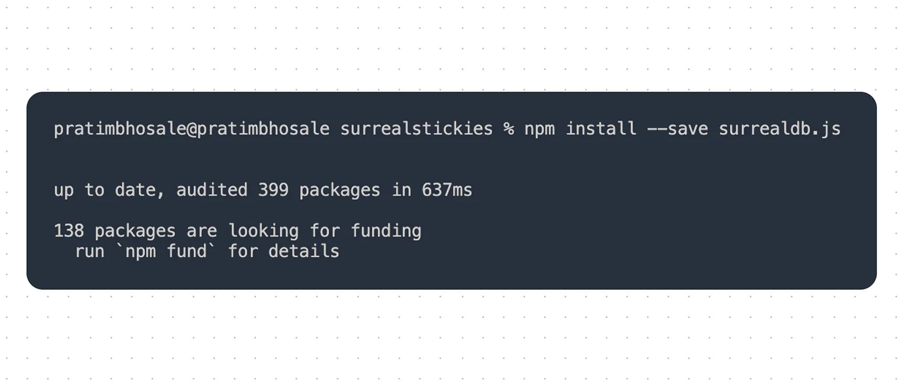
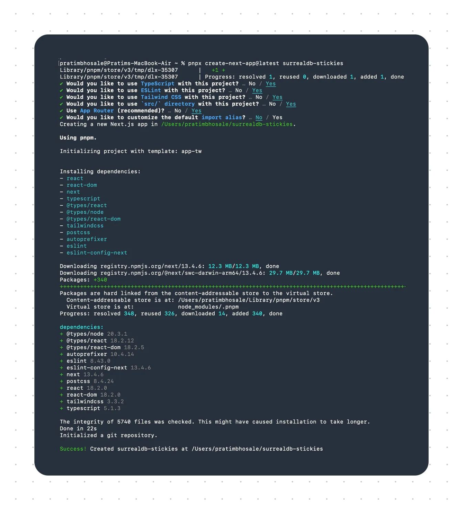
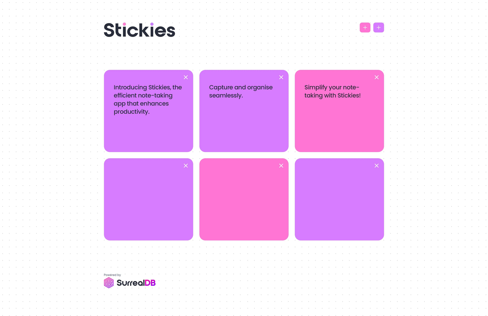

# Tutorial: Build a Notes App with Next.js, Tailwind and SurrealDB



SurrealDB is a multi-model cloud database, suitable for serverless applications, jamstack applications, single-page applications, and traditional applications. SurrealDB supports SQL querying from client devices, GraphQL, ACID transactions, WebSocket connections, structured and unstructured data, graph querying, full-text indexing, and geospatial querying. In this guide, you'll learn how to implement a simple full-stack note-taking application called Surreal Stickies using:

[SurrealDB](/install): for our database operations [Next.js](https://nextjs.org/docs/getting-started/installation): for building our server-rendered React application [SWR](https://swr.vercel.app): for reactive data fetching [Tailwind](https://tailwindcss.com/docs/installation): for styling our application

With Surreal Stickies, you can add, update and delete notes at your convenience. You can create two types of stickies - a purple one and a pink one.

This is how our notes app will look once we build it.



## Architecture



## Prerequisites

Before you begin this tutorial you'll need the following:

a. [SurrealDB](/install) installed on your machine. ( Make sure you upgrade to the latest version if you already have SurrealDB installed on your machine) b. [Node.js](https://nodejs.org/en/download) installed locally on your computer c. A basic understanding of Next.js and Tailwind d. One of the following package managers: [npm](https://nodejs.org/en/download), [pnpm](https://pnpm.io/installation) or [yarn](https://classic.yarnpkg.com/lang/en/docs/install/#debian-stable)

## Step 1: Install the SurrealDB library

The [SurrealDB](/docs/sdk/javascript) driver for JavaScript enables simple and advanced querying of a remote database from a browser or from server-side code. All connections to SurrealDB are made over WebSockets, and automatically reconnect when the connection is terminated.

Install the SurrealDB library using `npm`:

```syntax
npm install --save surrealdb.js
```

Alternatively, you can install the SurrealDB library using `yarn` :

```syntax
yarn add surrealdb.js
```

Or `pnpm`:

```javascript
pnpm install surrealdb.js
```



🎉 Congratulations on completing the installation! 🎉

Let’s proceed to Step 2: Set up your Next.js project!

## Step 2: Set up your Next.js project.

#### Open your terminal and run the following command to create a new Next.js application:

```cli
pnpx create-next-app@latest surrealdb-stickies
```

It will also install all the necessary dependencies that are needed for a Next.js application.

Here’s a snapshot of how your project setup will look like:



For the complete setup, copy the package.json from the GitHub [repo](https://github.com/timpratim/surrealstickies/blob/122100e9b0bd58ee28fc3d859351673f22391827/package.json) of this application and paste it into your package.json

This sets up the scripts you'll use to develop, build, and run your application. It also includes scripts for TypeScript and ESLint for linting.

`dev`: This is the main development command that runs the SurrealDB server and the Next.js development server concurrently. `dev:surreal`: This starts the SurrealDB server. `dev:next`: This starts the Next.js development server. `build`: This builds the application for production. `start`: This starts the built application. `ts`: This runs TypeScript in watch mode. `lint`: This uses ESLint to analyse your code for errors

🎉 Congratulations on Setting up your Next.js Project! 🎉

Let’s proceed to Step 3: Building the CRUD APIs!

## Step 3: Building the CRUD APIs

Surreal Stickies can create, view, update and delete notes. Each of these functionalities essentially leverages the CRUD operations (Create, Read, Update, and Delete) provided by SurrealDB.

For the sake of modularity and clear separation, we will create two `route.ts` files which will include the code for our CRUD methods. One will be in our `sticky` directory and the other will be inside our `id` directory which will mimic our API path You can directly navigate to the [route.ts](https://github.com/surrealdb/examples/blob/main/notes-app/src/app/api/sticky/route.ts) file from the repo in order to refer to the `GET` and `POST` methods which do not need the `id` of the stickies. The other [route.ts](https://github.com/surrealdb/examples/blob/main/notes-app/src/app/api/sticky/%5Bid%5D/route.ts) file can be found here.

Let’s get to work now 🛠

#### Creating a New Sticky Note

When a user clicks on the purple `+` button, Surreal Stickies calls the `POST` method with the required details. The API route will then create a new record in SurrealDB by using the `surreal.create()` method from the _surrealdb.js_ library.

##### Syntax:

```javascript
async db.create<T>(thing, data)
```

```javascript
export async function POST(request: Request) {
    const sticky = (await request.json()) as Pick<Sticky, 'color' | 'content'>;
    const error = validateSticky(sticky);
    if (error) return error;

    // We extract the properties so that we don't pass unwanted properties to the sticky record
    const { content, color } = sticky;
    const created = new Date();
    const updated = created;
    const result = await surreal.create('sticky', {
        content,
        color,
        created,
        updated,
    });
    return NextResponse.json({
        success: true,
        sticky: result[0],
    });
}
```

A query similar to query below will be executed in your database:

```javascript
CREATE sticky CONTENT {
  color: 'purple',
  content: '',
  created: '2023-06-19T15:37:10.106Z',
  updated: '2023-06-19T15:37:10.106Z'
};
```

In our example, we create an empty sticky by default and populate its content with the `UPDATE` method. This prevents rendering issues on the frontend.

#### Updating a Sticky Note

When the user wishes to edit a sticky note, Surreal Stickies uses the `PATCH` API route. The `surreal.merge` function enables the application to merge new data with existing records in SurrealDB.

##### Syntax

```javascript
async db.merge<T>(thing, data)
```

Modifies all records in a table, or a specific record, in the database.

In our stickies app, once the ID and the sticky are validated by the `validateId` and `validateSticky` functions, we merge only the new changes in our note.

```javascript
export async function PATCH(
    request: Request,
    { params }: { params: { id: string } }
) {
    const { id, ...validation } = validateId(params.id);
    if (validation.error) return validation.error;

    const sticky = (await request.json()) as Partial<
        Pick<Sticky, 'color' | 'content'>
    >;

    const error = validateSticky(sticky);
    if (error) return error;

    const update: Partial<Sticky> = { updated: new Date() };
    if (sticky.color) update.color = sticky.color;
    if (sticky.content) update.content = sticky.content;

    const result = await surreal.merge(`sticky:${id}`, update);
    return NextResponse.json({
        success: true,
        sticky: result[0],
    });
}
```

A query similar to query below will be executed in your database:

```surrealql
UPDATE sticky:tq5uwwob82bgm5qq60gz MERGE {
    color: 'purple',
    content: 'SurrealDB is a multi-model database',
    updated: '2023-06-19T15:17:15.442Z'
};
```

#### Retrieving All Sticky Notes

When the user opens the application or hits a 'refresh' button, the application needs to display all the sticky notes. To do this, the application calls the GET method which retrieves all sticky notes from the backend. This method is also called when a new note is added or an existing note is deleted or updated, and the UI needs to reflect these changes by fetching the updated list of all sticky notes.

```javascript
export async function GET() {
    // Custom select query for ordering
    const result = await surreal.query(
        'SELECT * FROM sticky ORDER BY updated DESC'
    );
    return NextResponse.json({
        success: true,
        stickies: result?.[0]?.result ?? [],
    });
}
```

The following query will be executed in your database whenever you load the page, create/update/delete a sticky or when you refocus the window.

```surrealql
SELECT * FROM sticky ORDER BY updated DESC
```

#### Deleting a Sticky Note

When the user clicks on the `X` button, the `DELETE` method is called.

##### Syntax:

```javascript
async db.delete<T>(thing)
```

It validates the `id` from the request parameters and subsequently uses `surreal.delete` to erase the corresponding record from SurrealDB.

```javascript
export async function DELETE(
    request: Request,
    { params }: { params: { id: string } }
) {
    const { id, ...validation } = validateId(params.id);
    if (validation.error) return validation.error;

    const result = await surreal.delete(`sticky:${id}`);
    return NextResponse.json({
        success: true,
        sticky: result[0],
    });
}
```

The following query will be executed in your database when you click on the `X` button:

```javascript
DELETE * FROM sticky:gp4u59t5wlo0vre5d96j;
```

Now that we are done with the major parts of the backend we will move towards the front end.

As mentioned earlier you can find the complete code of Surreal Stickies [here](https://github.com/surrealdb/examples/tree/main/notes-app). Please refer to it to successfully include all the components required to build the backend.

🎉 Congratulations on Building the CRUD API! 🎉

Let’s proceed to Step 4: Building the Frontend!

## Step 4: Building the User Interface

Now that we are ready with our backend, let's build the frontend or user interface for our application.

#### Set up the base layout for our application:

The first thing we'll do is set up our base layout for our application using Next.js and Tailwind CSS. In the file `src/app/layout.tsx`, we establish the root layout of our application which includes a navbar, the main content of our page, and a footer.

```javascript


// ...

export default function RootLayout({
    children,
}: {
    children: React.ReactNode;
}) {
    return (
        <html lang='en'>
            <body
                className={cn(
                    'flex h-screen flex-col bg-dots',
                    poppins.className
                )}
            >
                
                    <Navbar />
                    {/* We use the content of the page to grow so that the footer is always down the bottom */}
                    {children}
                    <Footer />
                
            </body>
        </html>
    );
}
```

This `div` element \`\` is applying multiple CSS classes provided by Tailwind CSS to control the layout and styling of its content and make our application responsive & mobile friendly.

#### Creating API Calls:

After setting up our layout, we need to create API calling functions that will interact with our backend. These functions are created in the `src/lib/modifiers.ts` file and include methods to fetch, create, update, and delete stickies.

Here's the code snippet for `createSticky` function:

```javascript
export async function createSticky(
    payload: Pick<Sticky, 'color' | 'content'>
): Promise<{
    success: boolean;
    sticky?: Sticky;
}> {
    return await (
        await fetch('/api/sticky', {
            method: 'post',
            headers: {
                'Content-Type': 'application/json',
            },
            body: JSON.stringify(payload),
        })
    ).json();
}
```

#### Creating Hooks:

After defining our API calling functions, we need to create hooks that will use these functions and manage the state in our components. These hooks are created in the `src/lib/hooks.ts` file. Here's an example with the `useCreateSticky` hook:

```javascript
export const useCreateSticky = () =>
    useSWRMutation(
        `/api/sticky`,
                // The typing looks more complex than it is
                // We essentially grab the types of the first argument
                // of the createSticky function so we can pass it on
        (_, { arg }: { arg: Parameters<typeof createSticky>[0] }) =>
            createSticky(arg)
    );
```

These hooks use the `useSWR` and `useSWRMutation` hooks from the SWR library for data fetching and mutation. SWR provides a lot of useful features like caching, automatic revalidation, and error retries, which make it easier to manage the server state in a React application.

In this application we give every SWR hook the same unique key. This will cause the list of stickies to automatically refresh once we use the create, update or delete hooks.

#### Creating the Home Component:

Now, we're ready to build our `Home` component which is the main page of our application. In this component, we use the hooks we’ve just defined previously to fetch, create, and render stickies. We also handle user interactions like creating a new sticky or displaying an error message.

```javascript
export default function Home() {
    // Used purely for loading state and automatic refetching.
    // The actual stickies are delivered through the stickies store for local updates when the user makes a change.
    const { error, isLoading } = useStickies();
    const { stickies } = useStickiesStore();
    const sorted = Object.values(stickies).sort(
        (a, b) => b.updated.getTime() - a.updated.getTime()
    );

    const message =
        sorted.length == 0 ? (
            'Create a sticky!'
        ) : error ? (
            <span className="text-red-500">
                <b>An error occured:</b> {error}
            </span>
        ) : undefined;

    return isLoading ? (
        
            <h1 className="flex items-center gap-4 text-2xl">
                <Loader2 className="animate-spin" />
                Loading stickies
            </h1>
        
    ) : message ? (
        
            <h1 className="text-2xl">{message}</h1>
        
    ) : (
        
            {sorted.map(({ id, content, color }) => (
                <Sticky key={id} id={id} color={color} content={content} />
            ))}
        
    );
}
```

Once you have all the components built, you can run the application on localhost.

The following command will start your SurrealDB server and build your application concurrently.

```javascript
pnpm dev
```

🎉 Congratulations on Building the Frontend & Completing this tutorial! 🎉


## Summary

In this tutorial, we took a deep dive into the building blocks of a real-world sticky note application built with SurrealDB, Next.js, and Tailwind CSS. We looked at two main parts of the application: Building the CRUD APIs in the backend and the User Interface in the front end.

The backend was set up with the help of Surrealdb.js and Next.js. We went through the built-in functions provided by Surrealdb.js to query the database. All the functions we used here are explained in depth in the [documentation](/docs/sdk/javascript). We built API routes using these functions to handle specific CRUD operations on the sticky notes in the SurrealDB database.

On the front end, we used Next.js to create our app and its parts. We managed the app's state and its interactions with the APIs using hooks for different tasks, like retrieving the sticky notes, adding new ones, updating them, and deleting them.

Finally, we used Tailwind CSS to design our app, making it easy and enjoyable for users to use. With all these parts working together, our app successfully lets users make, see, edit, and delete sticky notes.

## Conclusion



The Notes App showed us a very simple and straightforward implementation of SurrealDB. SurrealDB is a powerful database capable of replacing the complete backend with inbuilt features like multi-tenancy, indexing, live queries, custom functions and many more.

In this tutorial we only touched on a fraction of what makes SurrealD the ultimate multi-model database. To find out more see you can check out the [SurrealDB features](/features) or our [GitHub repo](https://github.com/surrealdb/surrealdb).
