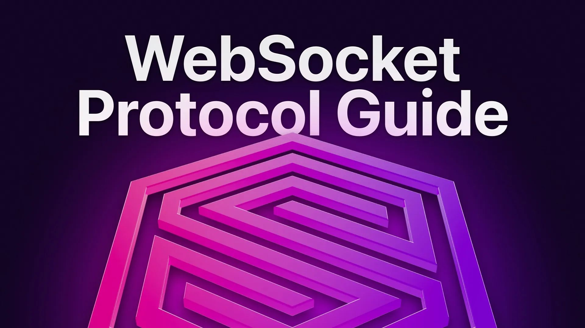

# WebSocket Protocol Guide

We've published a WebSocket Protocol Guide!

This allows for easy bi-directional communication with SurrealDB. If you're excited about Live Queries, [check this out](/docs/surrealdb/integration/rpc).
