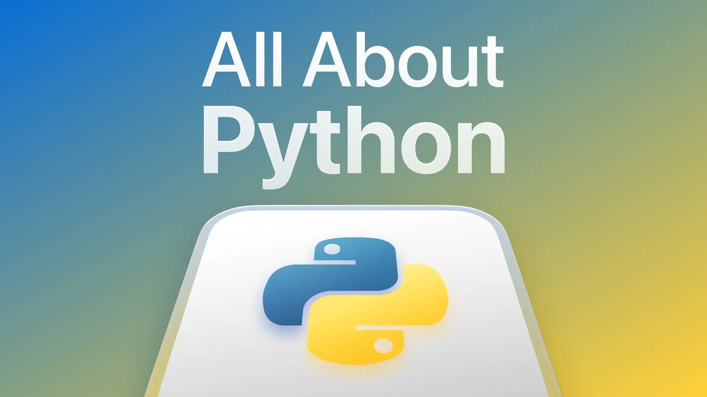

# All About Python

This stream is all about Python, where we'll cover the why and the how of using it with SurrealDB. You'll learn all about the design decisions for the Rust rewrite and see demos of how to get up and running as well as deploying a Flask app in Docker.

Featuring:

Maxwell Flitton, Senior Software Engineer

Alexander Fridriksson, Data Evangelist

Tobie Morgan Hitchcock, Co-Founder & CEO

[YouTube: Bv5h4uehxPI](https://www.youtube.com/watch?v=Bv5h4uehxPI)
