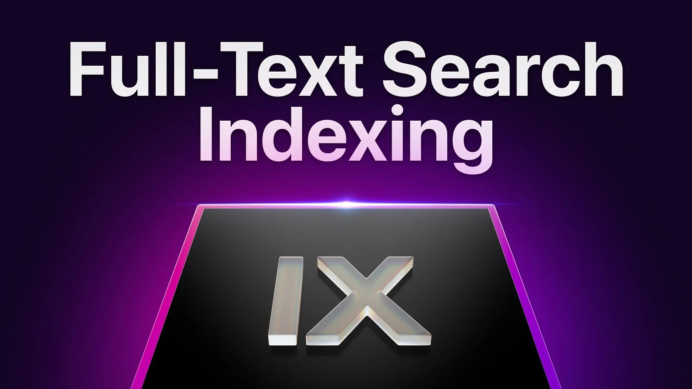

# Full-Text Search Indexing

Join Senior Software Engineer, Emmanuel Keller and co-founder and CEO Tobie Morgan Hitchcock as we dive into the innovative roadmap of SurrealDB. Featuring our newly implemented primary versions of secondary indexing and full-text search capabilities, we'll share insights into operational mechanics, scalability, and future SurrealDB enhancements.

[YouTube: b_HVN87Wwg0](https://www.youtube.com/watch?v=b_HVN87Wwg0)
