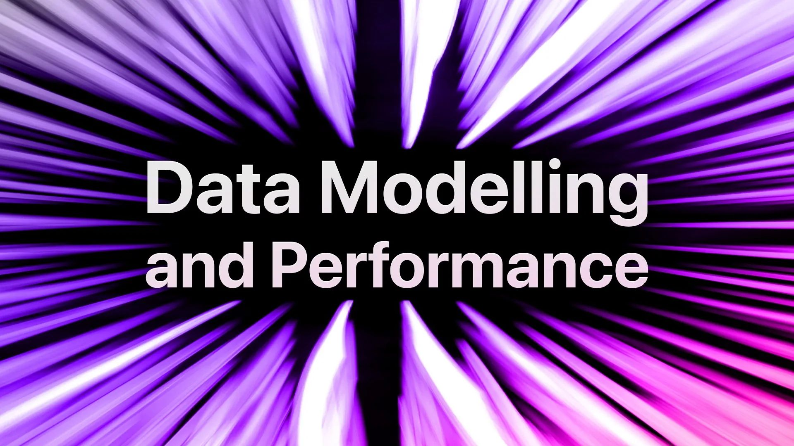

# Data Modelling and Performance

As SurrealDB is a multi-model database, you have a lot of options for how to model your data. In this stream, we'll take a practical look into different approaches to data modelling and discuss use cases, pros, cons and performance implications.

Featuring:

Alexander Fridriksson, Data Evangelist

Micha de Vries, Software Engineer

Tobie Morgan Hitchcock, Co-Founder & CEO

[YouTube: CEtsOEKwRqQ](https://www.youtube.com/watch?v=CEtsOEKwRqQ)
