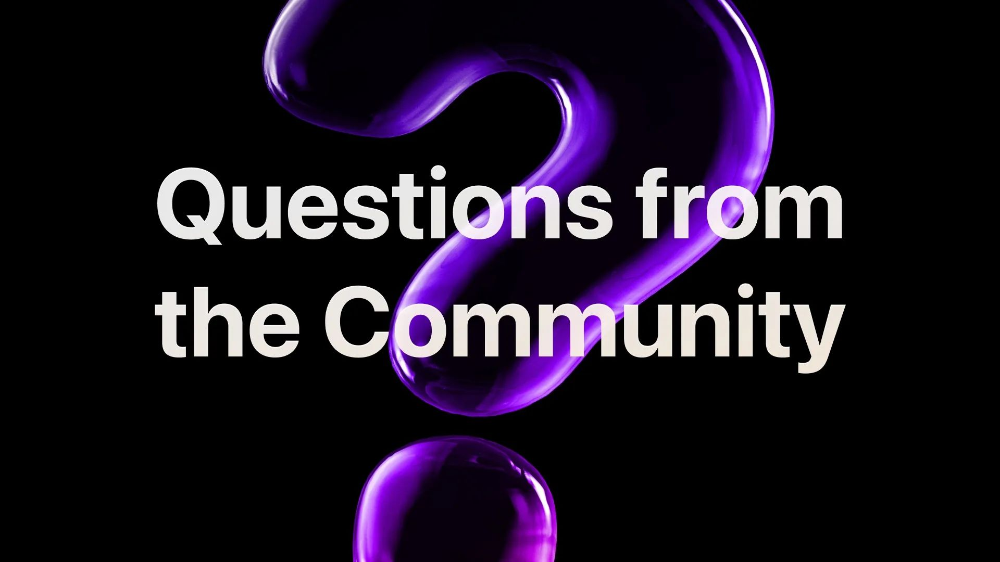

# Questions from the Community

For this stream we’ll cover a variety of topics raised by our community including data modelling in SurrealDB, performance, transactions and more. It’s also your opportunity to ask questions live during the stream.

Featuring:

Alexander Fridriksson, Data Evangelist

Micha de Vries, Software Engineer

Tobie Morgan Hitchcock, Co-Founder & CEO

[YouTube: kAPGH_C2BAE](https://www.youtube.com/watch?v=kAPGH_C2BAE)
