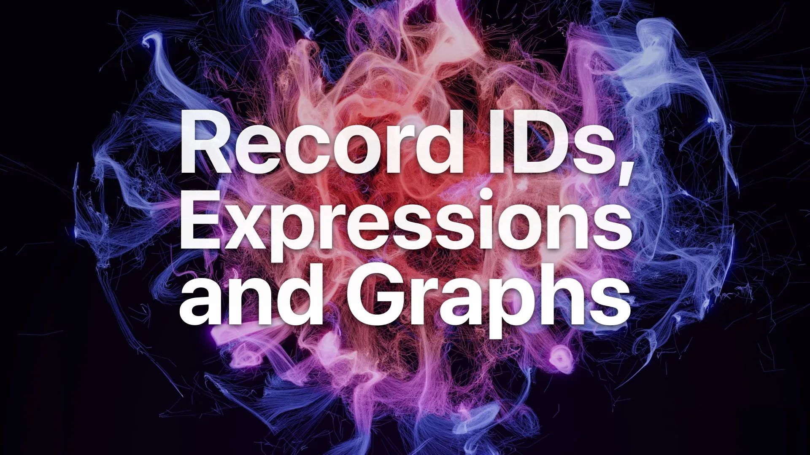

# Record IDs, Expressions and Graphs

Join us for our 10th live stream as we talk practically about how record IDs help us with connecting data through record links and graph relations and how it can be used to simplify your CRUD operations through simple and advanced expressions.

Featuring:

Alexander Fridriksson, Data Evangelist

Micha de Vries, Software Engineer

Tobie Morgan Hitchcock, Co-Founder & CEO

[YouTube: VFXXEn40GCA](https://www.youtube.com/watch?v=VFXXEn40GCA)
