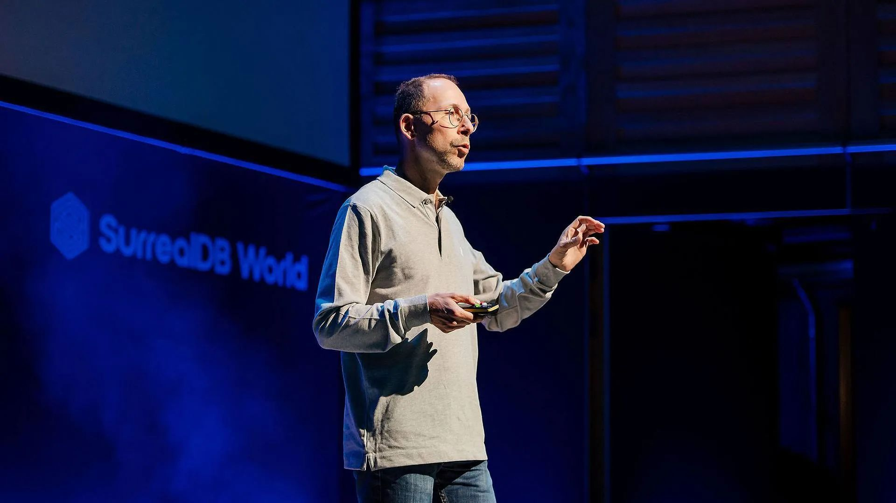
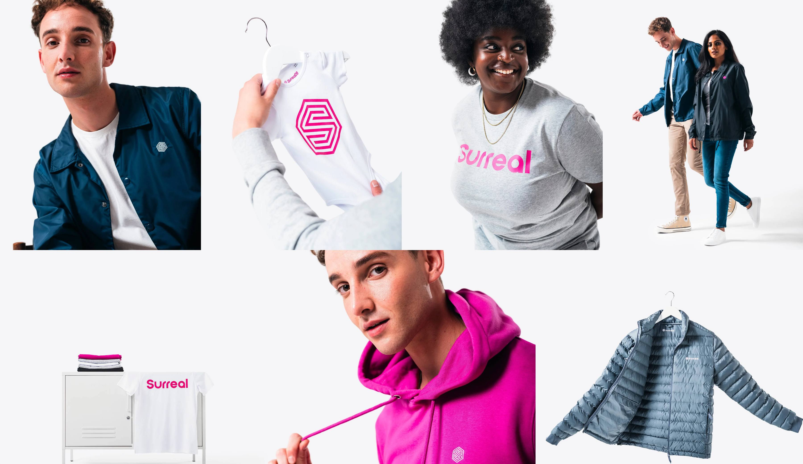

# SurrealDB World 2023 - A Recap

Two weeks ago at [SurrealDB World 2023](https://surrealdb.world), our first-ever user conference, we launched [SurrealDB 1.0](/blog/announcing-surrealdb-1-0)! We were thrilled to see an amazing response to the event, with over 300 people attending in person and more than 2,000 online.

Our open-source developers, customers, and partners are a lively and enthusiastic community. We were thrilled to have the opportunity to engage with them and celebrate our journey together at SurrealDB World 2023. In case you missed the event, here is a recap of what happened.

## SurrealDB - A Step Ahead

Early on, in the Keynote, Tobie, CEO and Founder of SurrealDB, spoke about his vision and narrated how this is “a step ahead” into a Surreal World of redefining the Database industry.

He also introduced several beta and stable features that are now available for developers to try out, such as [SurrealQL](/docs/surrealql), [Live Queries](/features), [Change Feeds](/features), [Full-text Search](/features), [Vector Search](/docs/surrealql/functions/database/vector), and [SurrealML](/features)!

These features were previously released in beta versions and are now part of SurrealDB's stable release. You can watch the summary video below to learn about all the important announcements made during the keynote.

<vid> </vid>

## SurrealDB - The Path to Intelligence

Databases are central to managing data infrastructure. Over time, various software systems have been developed to cater to diverse use cases such as search and machine learning. SurrealDB aims to revolutionise this paradigm, and demonstrate a future where developers can effortlessly manage and communicate with different software systems from the same Data layer.

Our Senior Software Engineer, Emmanuel, explains how we enable indexing on a table and use tokenisers and analyzers to support 17 languages within the same data system.

<vid> </vid>

Our Senior Software Engineer, Maxwell, talked about creating a machine learning model inside SurrealDB, loading the necessary data, and seamlessly starting inference, within the database, close to where data resides.

<vid> </vid>

## Insightful discussion on databases with Kelsey Hightower

We want to make SurrealDB World a place for networking and insightful discussions on Data and its applications. We’re glad to have Kelsey Hightower, to have an inspirational, engaging discussion with the community and Tobie with respect to Data platforms.

A few interesting points:

- Kubernetes represents a consolidation of a lot of ideas into one singular system, and how the same trend is being carried over to the data layer.
- The snippet of logic that enables the business, needs to be a first-class versioned artifact so that it becomes easy to manage the Database system as a whole.

The entire discussion is filled with interesting anecdotes from Tobie and Kelsey. Do watch the full discussion below:

<vid> </vid>

## SurrealDB - driven by Community

The community is at the heart of SurrealDB. We have experienced remarkable growth across all our community channels, starting from our initial outreach on platforms such as Hacker News, Indie Hackers, Reddit, and more. Our focus has always been on listening to the community. Our Developer Relations Manager, Naiyarah, and Data Evangelist, Alexander, from the Community team explain how the community has been instrumental in shaping SurrealDB right from its inception, and we’re taking this to the next level by expanding our community in-person and online!

<vid> </vid>

## SurrealDB - a superpower for your applications

A developer conference is never complete without a live demo and answering questions from developers.

At the conference, our Developer Advocate, Pratim, and Software Engineer, Micha, live-coded a web application with SurrealDB, and extended [this tutorial](/blog/tutorial-build-a-notes-app-with-next-js-tailwind-and-surrealdb) to show Graph Relations, Live Queries, and Authentication in the new SurrealDB 1.0.

They demonstrated how developers could utilise SurrealQL and the new Live Queries feature to build a secure notes app that shows updates in real-time.

In case you missed it, the video below includes all the highlights. Our co-founders, Tobie and Jaime, also hosted an Ask-Me-Anything session with the attendees. They answered insightful questions such as 'Why is SurrealDB brilliant?' in the simplest terms possible. Be sure to watch until the end to catch a funny analogy that explains it all!

<vid> </vid>

As discussed in the beginning, a user conference is also a place for networking and insightful discussions. In parallel to the main stage, had a [podcast studio](https://surrealdb.world/studio) where we hosted our amazing guests to cover topics like the [Impact of AI on Databases](https://vimeo.com/865684651), [evolution of Databases](https://vimeo.com/865589395), [Unlocking the potential of health data research](https://vimeo.com/865665735), and several Community spotlights including: [Surrealist App](https://vimeo.com/865699002) and becoming a [Code Contributor](https://vimeo.com/865670681). See all this and more at [surrealdb.world/studio](https://surrealdb.world/studio)!

Last but not least, we've launched the [SurrealDB Store](https://surrealdb.store)! We heard you loud and clear - y'all wanted some sweet SurrealDB branded swag, and we're here to deliver. Not only that, but we’re now shipping to over 80 countries worldwide, so you can represent SurrealDB in style. Of course, we couldn't forget about our amazing open-source contributors - you folks are the backbone of what we do, and we're thrilled to be able to serve you too.

We couldn't have done it without you! Thank you so much to all of our amazing users, contributors, and customers for making our user conference such a success. You can find all the replays from the conference at [surrealdb.world](https://surrealdb.world)!

Don't forget to join our lively [community on Discord](https://discord.gg/surrealdb), where we're always happy to chat about data, SurrealDB, our upcoming events, and anything else you might have questions about. We can't wait to see you there!
