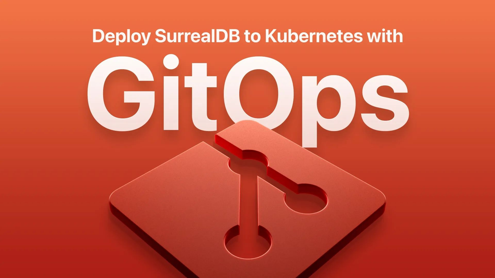

# Deploy SurrealDB to Kubernetes with GitOps - Ryota Sawada (recorded live at SurrealDB Social)

Community Spotlight talk by Ryota Sawada. When trying out SurrealDB on your local machine for the first time, it is extremely simple to get started with its excellent CLI. But when we are ready to adopt it for larger workloads and use cases, how should we look to productionize in a horizontally scalable manner?

SurrealDB documentation covers the HA scenario with TiKV used as the storage backend, but it mainly talks about connecting SurrealDB, and not so much about future upgrades and declarative management.

This talk covers how you can start your cluster using GitOps, and manage all the configuration declaratively.

[YouTube: 04opYXTt3sc](https://www.youtube.com/watch?v=04opYXTt3sc)
