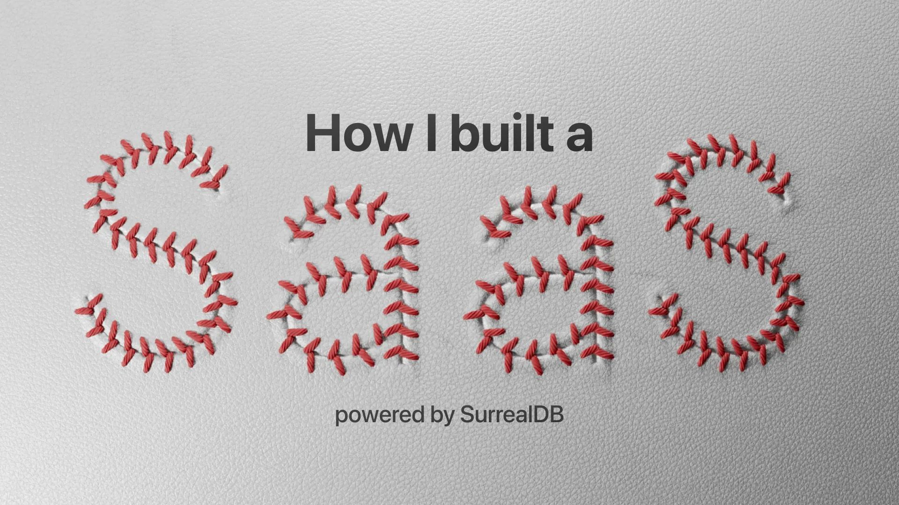

# How I built a SaaS powered by SurrealDB (recorded live at SurrealDB Social)

Join Software Engineer Micha de Vries as he explores his journey as a developer and dives into a practical application of SurrealDB, showcasing his SaaS product PlayrBase, built almost entirely with SurrealDB.

[YouTube: NMcMSqemMo0](https://www.youtube.com/watch?v=NMcMSqemMo0)
