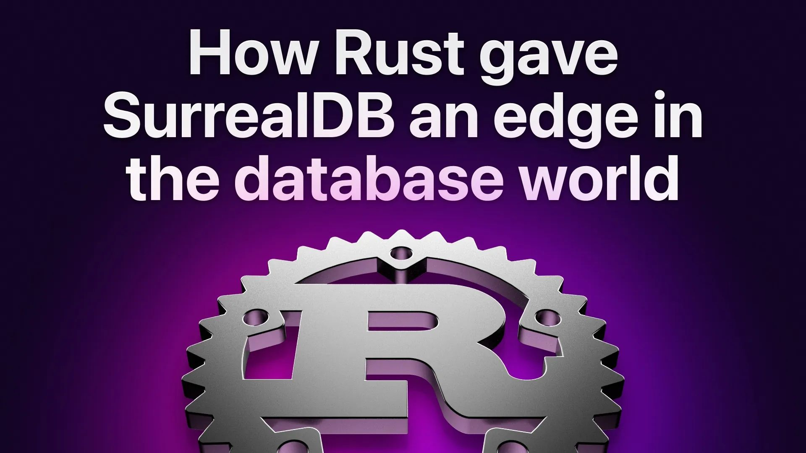

# How Rust gave SurrealDB an edge in the database world

Join Senior Software Engineer, Maxwell Flitton, as he shines a light on how Rust and Async Rust gave SurrealDB an edge in the database world. Maxwell is the author of the Packt books 'Rust web programming', 'Speed up your Python with Rust' and is currently working on the Async Rust book for O’Reilly. He joined the SurrealDB team in the spring of 2023 and is working on embedding ML into the Database.

[YouTube: aLGrBHzK8Do](https://www.youtube.com/watch?v=aLGrBHzK8Do)
