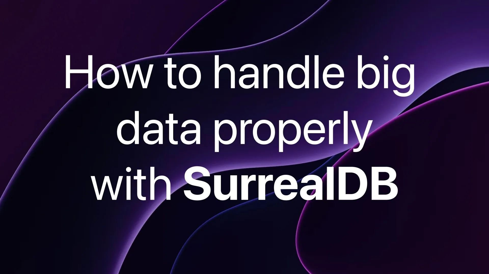

# How to handle big data properly with SurrealDB

Join SurrealDB's co-founder and CEO, Tobie Morgan Hitchcock, and Software Engineer Micha de Vries as we dive into how to handle big data properly with SurrealDB. Ask questions, leave comments, and get involved.

🔍 Focus:

- Time series data and choosing record IDs
- Differences between random record IDs, sequential record IDs, and complex record IDs
- Creating pre-defined aggregate views for handling big data aggregate queries
- Splitting of data across tables and using record links / Pushing data embedded into records
- How searching would be affected depending on the method used

[YouTube: ouDZHbdN5L8](https://www.youtube.com/watch?v=ouDZHbdN5L8)
