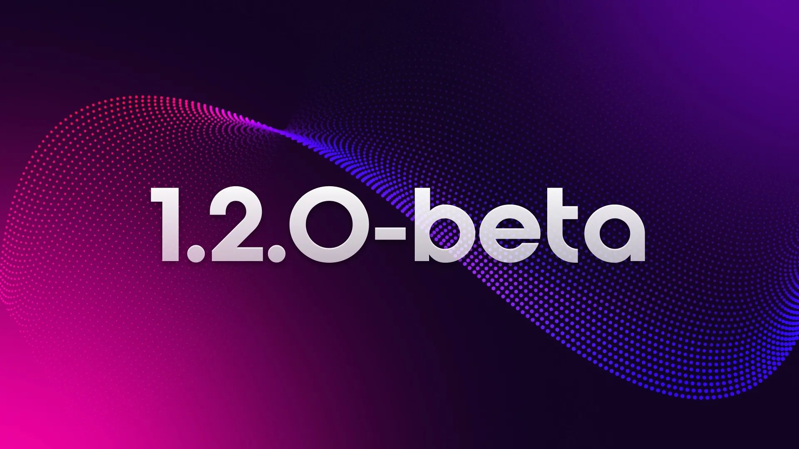

# v1.2.0-beta.1 is live! 🎉

This new release comes with bug fixes, performance improvements, and feature updates to string methods, support for READONLY fields and type support for subfields.

[Learn more here](/releases), and [check out the docs here](/docs/surrealdb).
