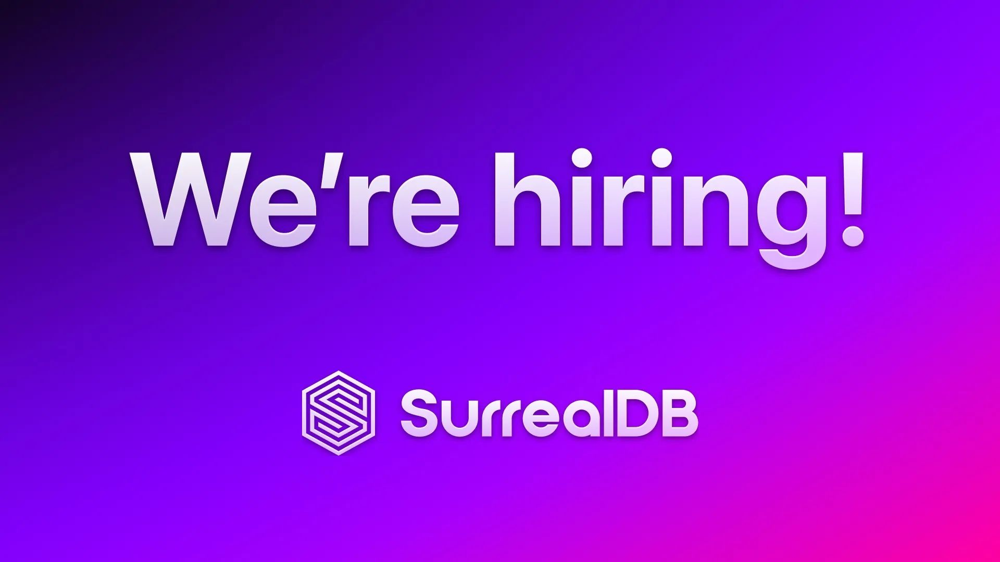

# We're hiring

#### Join us and help build the ultimate database for tomorrow's technology.

At SurrealDB, we're not just a startup; we're a visionary team dedicated to crafting the ultimate database for tomorrow's technology. We're on the lookout for exceptional individuals - those who are passionate about their craft and equally passionate about the team they work with to develop and promote groundbreaking technology.

Are you ready for a role that challenges you and positions you at the cutting edge of database technology? Explore our current opportunities:

- [Senior Software Engineer (EP)](https://surrealdb.pinpointhq.com/?search=Senior+Software+Engineer)
- [Senior Software Engineer (QL)](https://surrealdb.pinpointhq.com/?search=Senior+Software+Engineer)
- [Head of Marketing](https://surrealdb.pinpointhq.com/?search=Head+of+Marketing)
- [Chief Security Officer](https://surrealdb.pinpointhq.com/?search=Chief+Security+Officer)
- [Social Media Manager](https://surrealdb.pinpointhq.com/?search=Social+Media+Manager)
- [Senior Platform Engineer](https://surrealdb.pinpointhq.com/?search=Senior+Platform+Engineer)

Our team at SurrealDB is composed of exceptionally skilled engineers and seasoned leaders with a wealth of experience in databases and cloud services. Our team members have distinguished themselves at globally recognised companies such as AWS, Cloudflare, Elastic, IBM, LinkedIn, Neo4j, Netlify, Redis, Snowflake, Xata, Yahoo, and more.

We offer competitive salaries, comprehensive health benefits, and flexible working arrangements. We're committed to maintaining a healthy work-life balance, providing our employees with the support and flexibility they need to thrive in both their professional and personal lives.

#### [Click here to discover more and apply now at our Careers page](https://surrealdb.pinpointhq.com).
