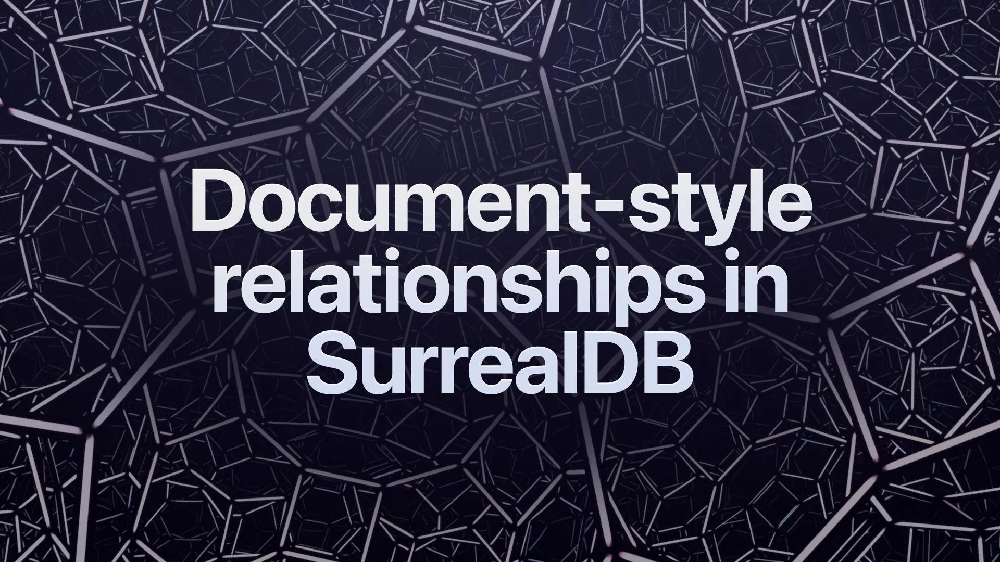

# Document-Style Relationships in SurrealDB

Your feedback matters! We’re introducing short-form video tutorials.

<vid> </vid>

We’ll be putting out a video a week, starting with a 3-part series on relationships in SurrealDB.

Enjoy this first part on document-style relationships, and let us know what you would like to see next.
