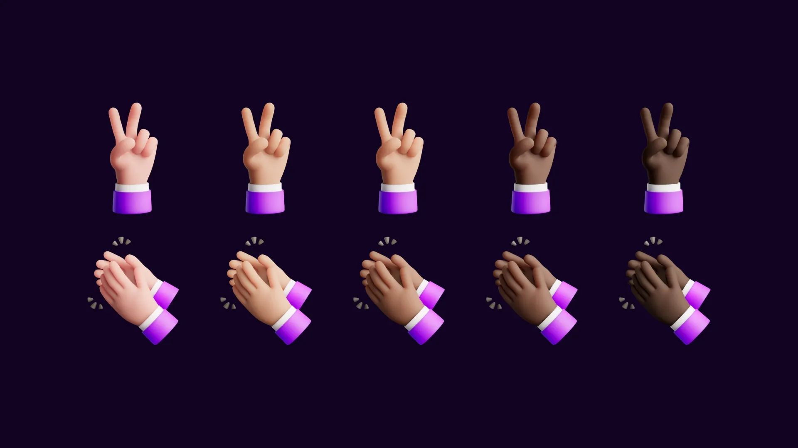
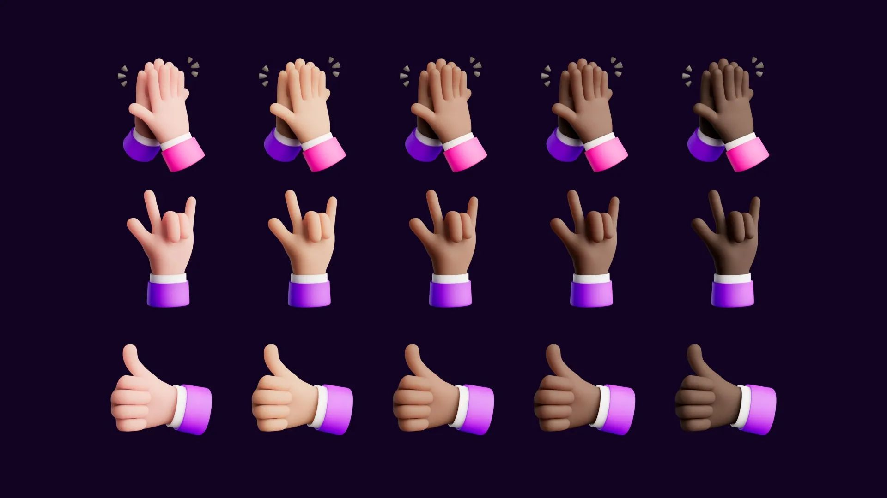
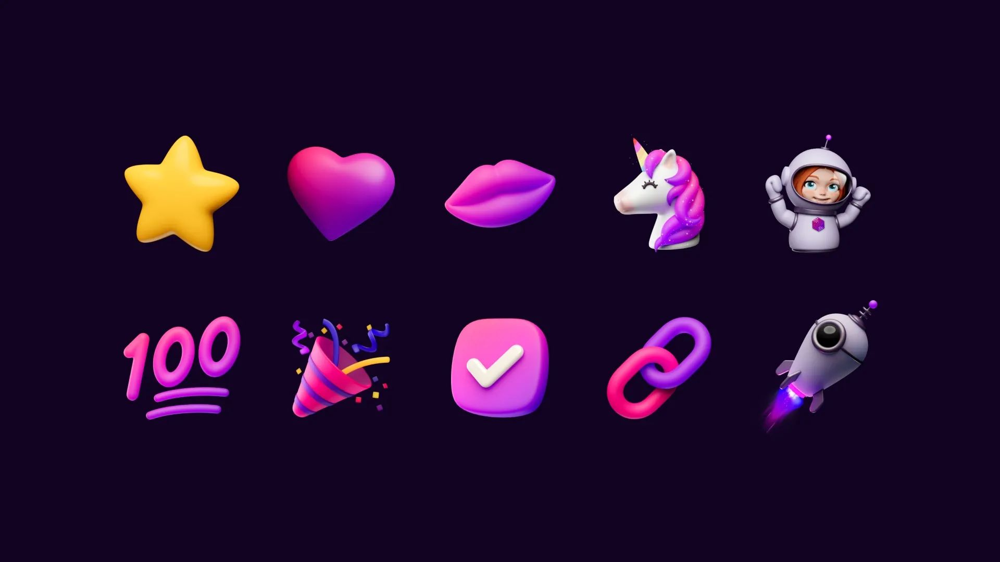
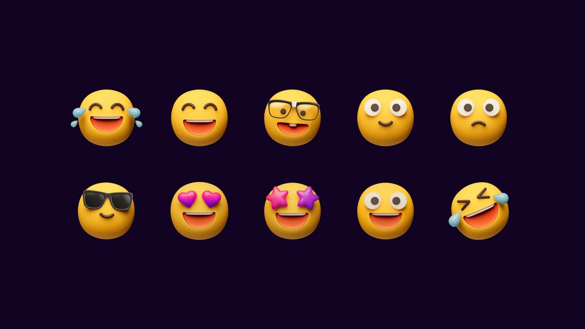

# Introducing SurrealDB's custom emoji pack

If the Internet has enabled us to communicate beyond boundaries in real-time, emojis helped it by making them the universal language of expression. Emojis encapsulate emotions, convey messages, and add depth to our digital interactions.

Today, we're thrilled to unveil an interesting project that marries the power of emojis with the essence of our brand. Say hello to our custom emoji pack - a vibrant collection that embodies our brand identity and invites you to express yourself in new, exciting ways.

At SurrealDB, we are always conscious of our brand identity. We want the Surreal Brand to be:

- Accessible
- Human
- Constructive
- Concise

We have meticulously crafted each one of these emojis that represent various expressions, of course, infused with our brand identity.

At [SurrealDB](/docs/surrealdb/introduction/start), we understand that developers need to work with data in a seamless and efficient way, which is why we're building a platform that is accessible, intuitive, and powerful, just like our custom emojis. We're excited to continue working on the mission, and we can't wait to see you in our [Community Discord](https://discord.gg/surrealdb) and express yourself with the latest emojis. We can't wait to chat with you!
