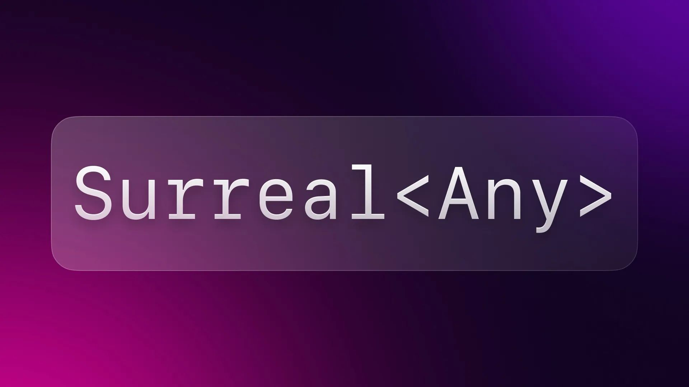
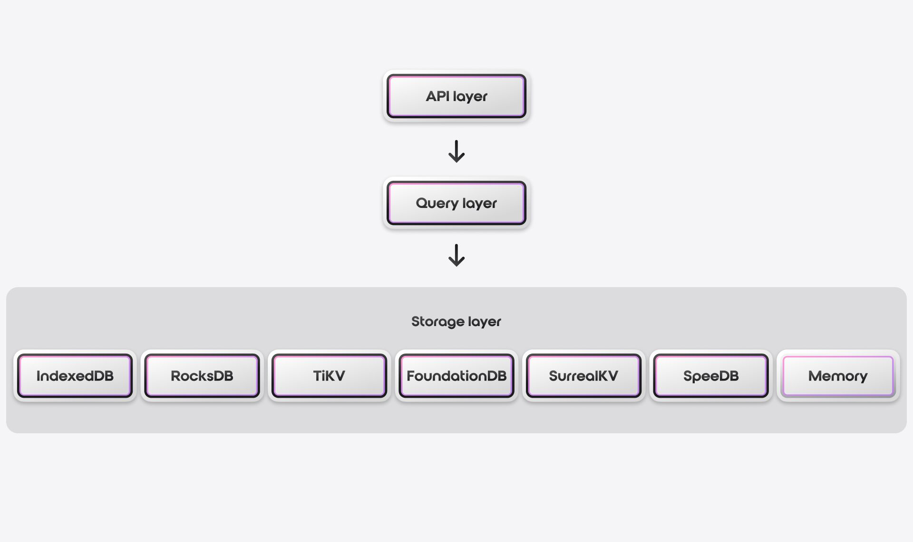

# Introducing Surreal<Any>: Dynamic Support for any Engine in Rust



In this blog, we outline what a `Surreal<Any>` engine is, and how you can use it in your Rust code to select a storage engine dynamically.

## SurrealDB’s Unique Architecture

[SurrealDB’s architecture](/docs/surrealdb/introduction/architecture) is built using a layered approach, with the compute layer being separated from the storage. This means that the database's logic and operations are executed separately from the code that handles the data storage and retrieval. This allows SurrealDB to scale each layer independently. It can handle growing data volumes by adding more storage without affecting the query layer. The unique architecture of SurrealDB gives you the choice of an underlying storage engine for your data.



SurrealDB supports various ways of storing and accessing your data. For storing data we support several key-value stores. These are IndexedDB, RocksDB, TiKV, FoundationDB, SurrealKV( experimental), SpeeDB and an in-memory store. RocksDB and SpeeDB are file-based, single-node key-value stores. TiKV and FoundationDB are distributed stores that can scale horizontally across multiple nodes. The in-memory store does not persist your data. It only stores it in memory.

All these can be embedded in your application, so you don’t need to spin up a SurrealDB server first to use them. We call these **[local engines](https://docs.rs/surrealdb/latest/surrealdb/engine/local/index.html)**.

When you spin up a SurrealDB server externally, you need a remote connection to connect your application with the server. When you access your database via WebSockets or HTTP we call it a **[remote engine](https://docs.rs/surrealdb/latest/surrealdb/engine/remote/index.html).** Does that mean you’d have different implementations to connect to different engines?

## The Power of the Rust SDK

The SurrealDB [Rust SDK](/docs/sdk/rust) is built in a way that abstracts away the implementation details of the engines to make them work in a unified way. All these engines, whether local or remote, work exactly the same way using the same API. The only difference in the API is the endpoint you use to access the engine, and activating any required feature flags. The [surrealdb::engine](https://docs.rs/surrealdb/latest/surrealdb/engine/index.html) module supports local and remote engines. Under the local engine instantiating the different key-value stores would look something like this:

In-memory:

```rust
use surrealdb::engine::local::Mem;
let db = Surreal::new::<Mem>(()).await?;
```

The `local::Mem` engine represents a local in-memory database which does not persist data on shutdown. This is the most common use case for quickly spinning a database or running tests.

RocksDB:

```rust
use surrealdb::engine::local::RocksDb;
let db = Surreal::new::<RocksDb>("path/to/database-folder").await?
```

TiKV:

```rust
use surrealdb::engine::local::TiKv;
let db = Surreal::new::<TiKv>("localhost:2379").await?
```

To dive deeper, see the implementation of all the `structs` under the local engine, on [GitHub](https://github.com/surrealdb/surrealdb/blob/main/lib/src/api/engine/local/mod.rs#L155).

Notice that we provide the URL scheme of the engine we want to use as a type parameter to `Surreal::new`. This allows us to detect, at compile time, whether the engine you are trying to use is enabled. If not, our code won't compile. Under the remote engine, the connection would look like this:

WebSocket Protocol:

```rust
use surrealdb::engine::remote::ws::Ws;
let db = Surreal::new::<Ws>("127.0.0.1:8000").await?;
```

HTTP Protocol:

```rust
use surrealdb::engine::remote::http::Http;
let db = Surreal::new::<Http>("127.0.0.1:8000").await?;
```

The Rust SDK does not care about which key-value store your engine is using internally. As mentioned earlier, the implementation remains the same, and only the endpoint and scheme of the engine changes. This improves the experience of using the SDK many folds as you do not have to worry about the internal workings changing for different engines. To change the engine, you would need to update your code to the new scheme and endpoint you need to use and recompile it. What if you didn’t have to update your code to the new scheme every time?

## Dynamic Support for Any Engine

This is where the [`Any` engine module](https://docs.rs/surrealdb/latest/surrealdb/engine/any/index.html) comes in.`Any` infers the underlying engine based on the URL scheme. Unlike with the typed scheme, the choice of the engine is made at runtime depending on the endpoint you provide as a string. If you use an environment variable to provide this endpoint string, you won't need to change your code to switch engines.

The tradeoff is that you will get a runtime error if you forget to enable the engine you want to use when compiling your code. On the other hand, this decouples your application from the engine you are using and makes it possible to use whichever engine SurrealDB supports by simply changing the features specified in your `Cargo.toml` file or supplying the cargo features via the command line before compiling. For example, to build with RocksDB, you would have to use this command

```cli
cargo build --features surrealdb/kv-rocksdb
```

Here’s an example of using the `surrealdb::engine::any` module in your rust code which prints the version of SurrealDB as an output.

```rust
use std::env;
use surrealdb::engine::any;
use surrealdb::engine::any::Any;
use surrealdb::opt::Resource;
use surrealdb::Surreal;

#[tokio::main]
async fn main() -> Result<(), Box<dyn std::error::Error>> {
    // Use the endpoint specified in the environment variable or default to `memory`.
    // This makes it possible to use the memory engine during development but switch it
    // to any other engine for deployment.
    let endpoint = env::var("SURREALDB_ENDPOINT").unwrap_or_else(|_| "memory".to_owned());

    // Create the Surreal instance. This will create `Surreal<Any>`.
    let db = any::connect(endpoint).await?;

    // Specify the namespace and database to use
    db.use_ns("namespace").use_db("database").await?;
    // Use the database like you normally would.
    let version = db.version().await?;
    println!("version: {}", version);

    Ok(())
}
```

As mentioned earlier, if the engine was not enabled in your `Cargo.toml` file you can enable it while compiling the app.

```cli
cargo build --features surrealdb/kv-rocksdb
```

After building the app you can directly run the binary.

```cli
./target/debug/app-name
```

As we did not specify the endpoint while running the app, it runs in memory mode. If you want to run your application using RocksDB, you can export the environment variable `SURREALDB_ENDPOINT` and run the binary.

```rust
SURREALDB_ENDPOINT= "rocksdb:/path/to/database/folder"
./target/debug/app-name
```

You do not have to build the app again. You can find more examples around the module [here](https://github.com/surrealdb/surrealdb/tree/main/lib/examples).

## Use Cases for `Surreal<Any>`

One of the common use cases we see is using SurrealDB as an embedded database using RocksDB as the local engine. This is a preferred way to boost the performance of your application when all you need is a single node. The downside of this approach is that RocksDB is not written in Rust so you may need to install some external dependencies on your development machine to successfully compile it. This process can also get trickier on Windows.

Overall, by using `Surreal<Any>`, you can have a better developer experience and avoid the overhead of resource-intensive compilation that some key-value stores come along with. You now have the option and flexibility to develop using an in-memory engine, but deploy using your preferred key-value store. This means that in scenarios where you develop your application on Windows but need to deploy it on a Linux machine using RocksDB, as an example, you can completely avoid having to build RocksDB on Windows and can test and develop your app using the in-memory engine on Windows.

## Staying True to Our Promise

The motto of SurrealDB is to help developers develop more easily, build faster and scale quicker. The `Surreal<Any>` engine is a testament to this motto. The engine gives developers the liberty to choose how they want to develop their applications using the Rust SDK while avoiding the overhead of resource-intensive compilation.

You can get started with SurrealDB by visiting [the install page](/install). To learn more about the SurrealDB Rust SDK, check out the [SurrealDB crate](https://docs.rs/surrealdb/latest/surrealdb) and our [documentation](/docs/surrealdb/embedding/rust) and, If you like digging deep and understanding the internals of the Rust SDK, we also have a [YouTube video](https://www.youtube.com/watch?v=NPGAmGJv7j0) explaining it alongside our [GitHub repository](https://github.com/surrealdb/surrealdb).
