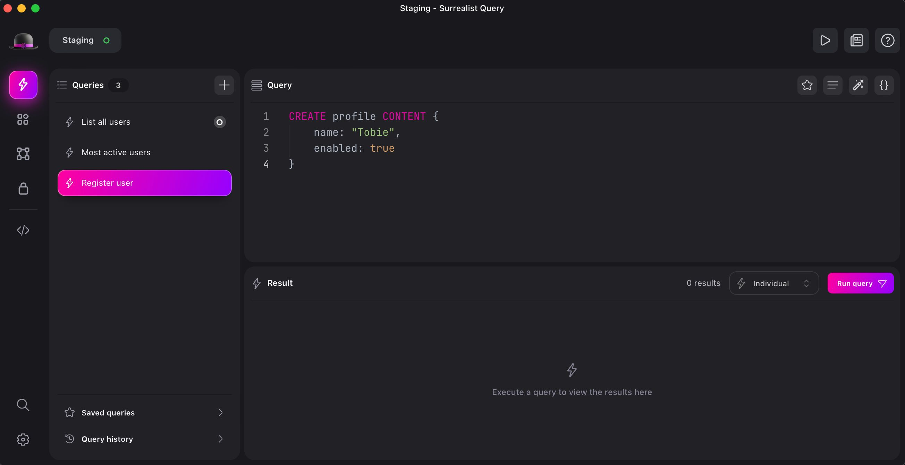
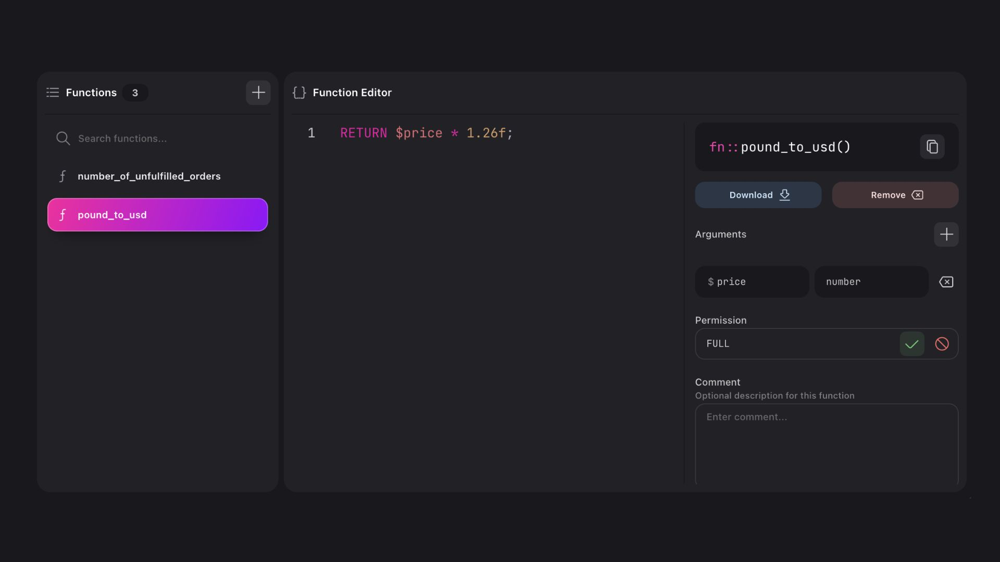
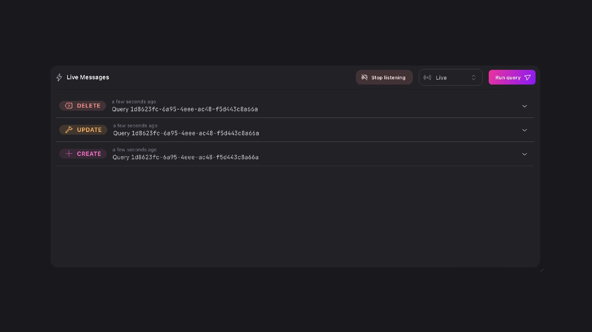
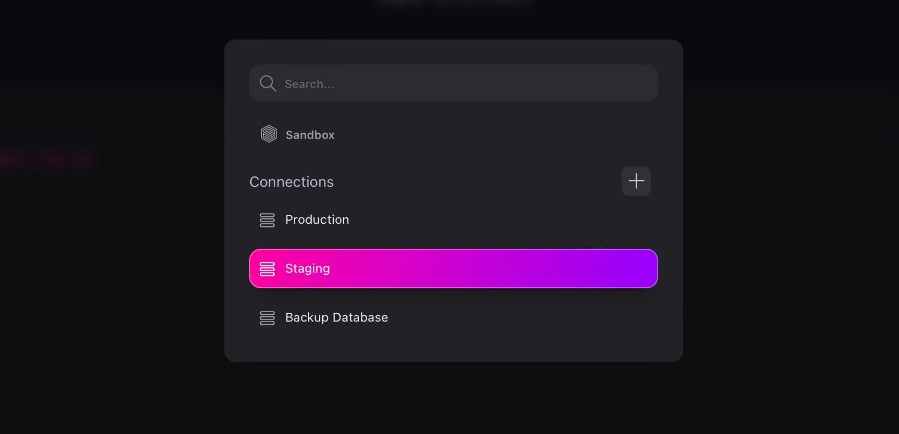
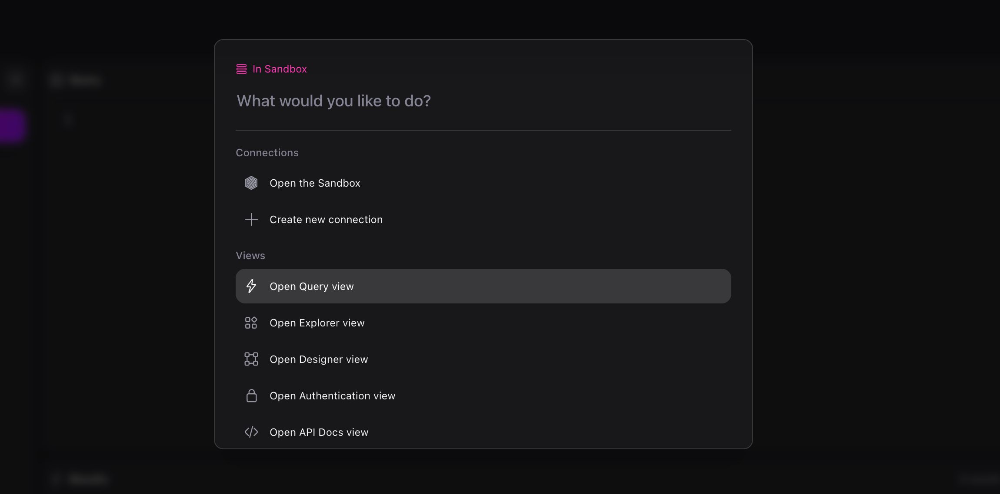

# Surrealist 2.0

An important part of each database is the ability to easily and effortlessly control each aspect of the database. While this may appear trivial at first, it actually encompasses a wide set of different tasks. For example you might be in need of testing your queries, visualising and managing user access to your data, or editing your stored procedures. For this reason Surrealist has officially joined SurrealDB as the official management interface.

## Introducing Surrealist

Surrealist is a graphical management interface for SurrealDB. It offers a wide set of features such as a query playground, record explorer, schema designer, and more. While it originally started as a community project, Surrealist has now joined the SurrealDB ecosystem as the official graphical management solution. Together with this exciting news we have also released Surrealist 2.0, a complete overhaul of the interface focusing on workflow improvements, new functionality, and improved SurrealDB integration. You can learn more by visiting [our brand new Surrealist page](/surrealist) on surrealdb.com

## Getting started

The easiest way to get started with Surrealist is using the web app available at [https://app.surrealdb.com.](https://app.surrealdb.com.) While the web app offers most of the functionality found within the Surrealist desktop app, for the complete Surrealist experience you can download the desktop app [here](https://github.com/surrealdb/surrealist/releases).

Once you are ready to jump in and explore the features of Surrealist, the easiest way to start is to enter the sandbox. Within this sandbox environment you can start interacting with SurrealDB without installing a SurrealDB database locally. Additionally, all data will be cleaned up once you exit Surrealist, making it the perfect place to experiment with SurrealDB.

## Surrealist 2.0

As mentioned above, this announcement also marked the release of Surrealist 2.0. While this update contains many exciting new features, we will dive into some of the more exciting changes and explore what this means for your SurrealDB workflow.

### Redesigned user experience

Surrealist has received a complete makeover and redesign in order to improve and simplify the user experience. While Surrealist feels largely the same as the previous version, you will notice many improvements made to streamline the workflow. As part of this redesign certain functionality has been updated, such as making it easier to jump into the sandbox, simplify the management of connections, improve the organising of query tabs, and much more.

### Functions, models, and docs

We have introduced new views you can use to effortlessly manage schema-based functions (stored procedures), upload and list out your SurrealML models, and generate personalised API documentation. Going forward we will continue to introduce new views so you can effortlessly interact with every facet of SurrealDB.

### Live query rework

The previous Live Query view has been replaced in favour of a new, easier to use live query inbox conveniently integrated directly into the Query View. Simply execute a live query in any request and switch to the Live results mode to view a stream of incoming messages. Active subscriptions will now be managed automatically for you, making it a breeze to test and iterate your live queries.

### Connection overhaul

The connections list has also received a major overhaul to further aid with the management of multiple databases. You’ll now be able to jump into the sandbox at all times with a single click, as you will no longer have to define a connection before using it. Additionally, environments have been replaced with the more lightweight and easier to use connection templates, useful for people managing many related databases.

### Powerful navigation

You can use the new Command Palette, accessible using `ctrl + K`/`cmd + K`, to quickly perform any action or navigate to any desired menu at light speed. The Command Palette supports full keyboard navigation, provides an intelligent search, and displays recent searches. You can also find the new Command Palette in the redesigned sidebar.

## Heading into the future

The response to Surrealist 2.0 has been no less than heartwarming, and changes are being made at a record pace. That combined with our own long-term vision for Surrealist means that you can expect frequent updates and enhancements to arrive over the coming months. Additionally, if you would like to contribute to the future of Surrealist yourself please visit [our GitHub repository](https://github.com/surrealdb/surrealist). Whether you are reporting an issue, suggesting new functionality, or submitting changes, you are always welcome to join in and contribute to Surrealist.
